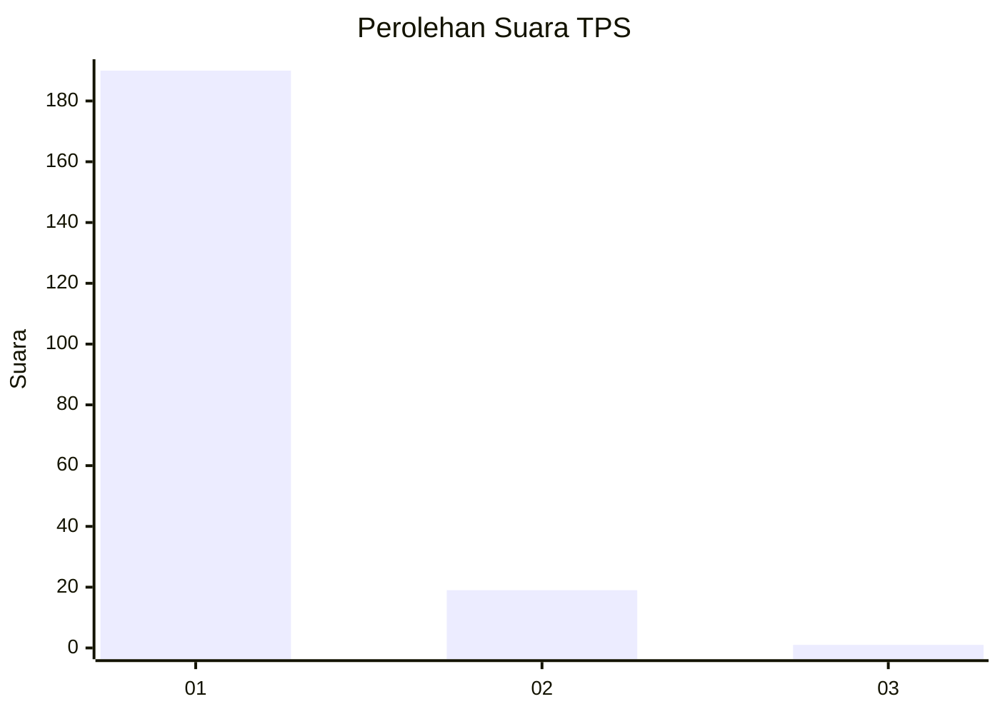
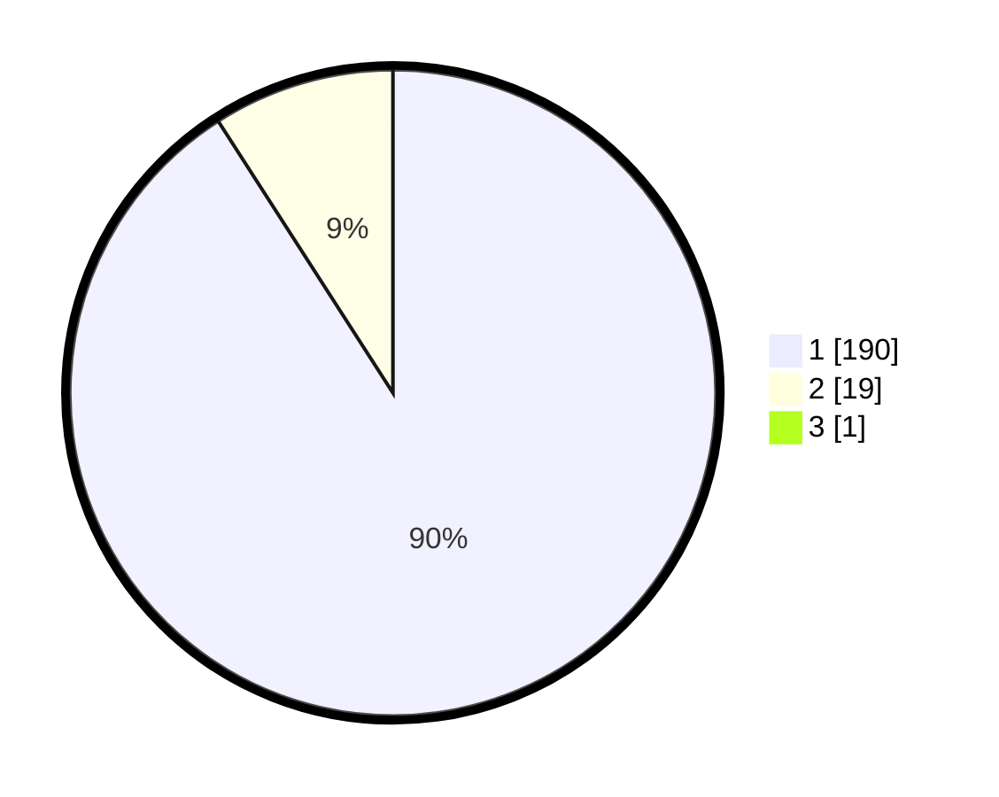

# Hasil

## Grafik

## Tabel

| No. | Nama Paslon    | Suara | Suara (raw) | Persentase |
|:--- |:-------------- | -----:| -----------:| ----------:|
| 1   | ANIES MUHAIMIN | 190   | [190][p-1]  | 90,48      |
| 2   | PRABOWO GIBRAN | 19    | [19][p-2]   | 9,05       |
| 3   | GANJAR MAHFUD  | 1     | [1][p-3]    | 0,48       |

[p-1]: https://github.com/gigit-pemilu/pemilu-2024-11-aceh/blob/main/pilpres/hitung-suara/sub/11-aceh/sub/71-kota-banda-aceh/sub/05-lueng-bata/sub/2008-lamdom/sub/007-tps/sub/paslon-1.txt
[p-2]: https://github.com/gigit-pemilu/pemilu-2024-11-aceh/blob/main/pilpres/hitung-suara/sub/11-aceh/sub/71-kota-banda-aceh/sub/05-lueng-bata/sub/2008-lamdom/sub/007-tps/sub/paslon-2.txt
[p-3]: https://github.com/gigit-pemilu/pemilu-2024-11-aceh/blob/main/pilpres/hitung-suara/sub/11-aceh/sub/71-kota-banda-aceh/sub/05-lueng-bata/sub/2008-lamdom/sub/007-tps/sub/paslon-3.txt

## Foto C Plano

https://sirekap-obj-formc.kpu.go.id/a7cb/pemilu/ppwp/11/71/05/20/08/1171052008007-20240221-215306--a8e12059-d11b-45a6-8312-b39bc64a263d.jpg

https://sirekap-obj-formc.kpu.go.id/a7cb/pemilu/ppwp/11/71/05/20/08/1171052008007-20240221-215557--4ece381c-c836-4c69-8c27-76c57639c8fd.jpg

https://sirekap-obj-formc.kpu.go.id/a7cb/pemilu/ppwp/11/71/05/20/08/1171052008007-20240221-215711--b23240b6-ead6-48af-af1e-61ab4574ecf6.jpg

## Metadata

| Key        | Value               |
| ---------- | ------------------- |
| Time Stamp | 2024-02-24 22:31:28 |

