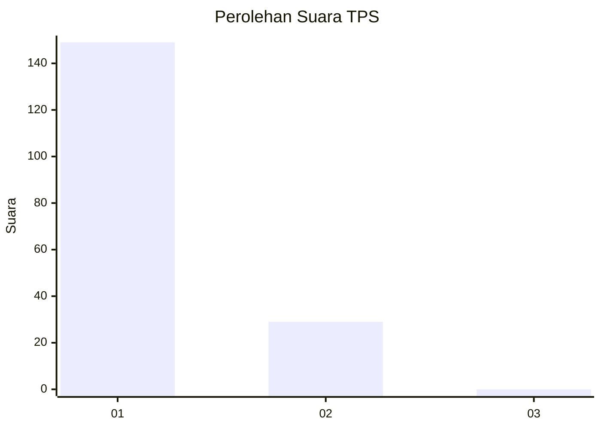
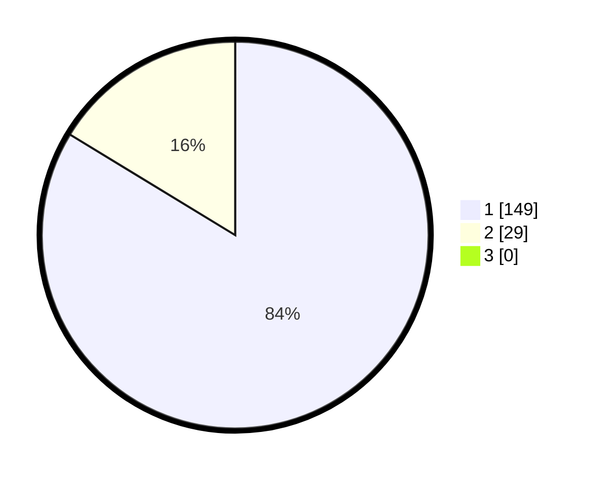

# Hasil

## Grafik

## Tabel

| No. | Nama Paslon    | Suara | Suara (raw) | Persentase |
|:--- |:-------------- | -----:| -----------:| ----------:|
| 1   | ANIES MUHAIMIN | 149   | [149][p-1]  | 83,71      |
| 2   | PRABOWO GIBRAN | 29    | [29][p-2]   | 16,29      |
| 3   | GANJAR MAHFUD  | 0     | [0][p-3]    | 0,00       |

[p-1]: https://github.com/gigit-pemilu/pemilu-2024-11-aceh/blob/main/pilpres/hitung-suara/sub/11-aceh/sub/71-kota-banda-aceh/sub/05-lueng-bata/sub/2009-lampaloh/sub/002-tps/sub/paslon-1.txt
[p-2]: https://github.com/gigit-pemilu/pemilu-2024-11-aceh/blob/main/pilpres/hitung-suara/sub/11-aceh/sub/71-kota-banda-aceh/sub/05-lueng-bata/sub/2009-lampaloh/sub/002-tps/sub/paslon-2.txt
[p-3]: https://github.com/gigit-pemilu/pemilu-2024-11-aceh/blob/main/pilpres/hitung-suara/sub/11-aceh/sub/71-kota-banda-aceh/sub/05-lueng-bata/sub/2009-lampaloh/sub/002-tps/sub/paslon-3.txt

## Foto C Plano

https://sirekap-obj-formc.kpu.go.id/e26e/pemilu/ppwp/11/71/05/20/09/1171052009002-20240216-172802--214ac279-461f-4455-969b-1d53a0e1e992.jpg

https://sirekap-obj-formc.kpu.go.id/e26e/pemilu/ppwp/11/71/05/20/09/1171052009002-20240216-220650--8db83e0f-09cb-480d-95d5-10fc36370ebd.jpg

https://sirekap-obj-formc.kpu.go.id/e26e/pemilu/ppwp/11/71/05/20/09/1171052009002-20240216-172934--9133df95-88e5-43dc-964c-1508c02df05c.jpg

## Metadata

| Key        | Value               |
| ---------- | ------------------- |
| Time Stamp | 2024-02-17 10:30:03 |

## DATA PEMILIH TETAP

Jumlah pemilih dalam DPT: **11**.
 * L: **21**.
 * P: **10**.

## DATA PENGGUNA HAK PILIH

Jumlah pengguna hak pilih dalam DPT: **811**.
 * L: **1**.
 * P: **810**.

Jumlah pengguna hak pilih dalam DPTb: **0**.
 * L: **0**.
 * P: **10**.

Jumlah pengguna hak pilih dalam DPK: **0**.
 * L: **0**.
 * P: **0**.

Jumlah pengguna hak pilih: **182**.
 * L: **82**.
 * P: **100**.

## JUMLAH SUARA SAH DAN TIDAK SAH

JUMLAH SELURUH SUARA SAH: **178**.

JUMLAH SUARA TIDAK SAH: **4**.

JUMLAH SELURUH SUARA SAH DAN SUARA TIDAK SAH: **182**.

