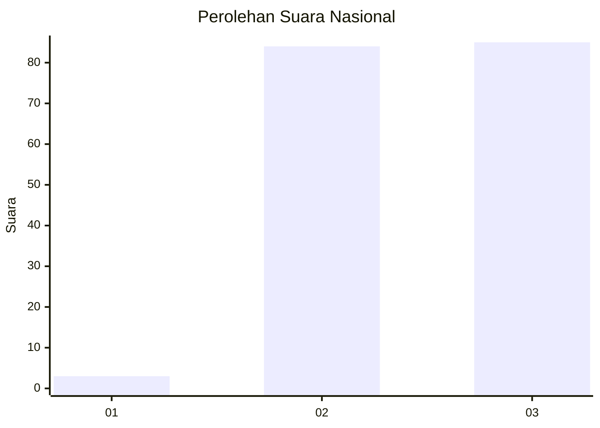
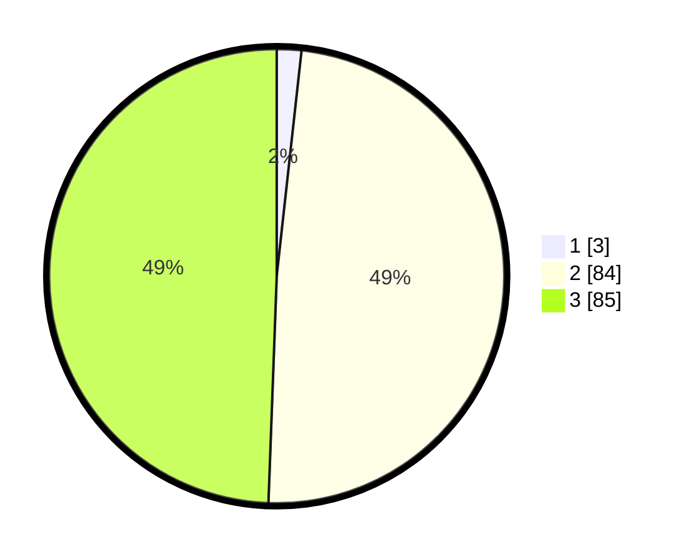

# Hasil

## Grafik

## Tabel

| No. | Nama Paslon    | Suara | Suara (raw) | Persentase |
|:--- |:-------------- | -----:| -----------:| ----------:|
| 1   | ANIES MUHAIMIN | 3     | [3][p-1]    | 1,74       |
| 2   | PRABOWO GIBRAN | 84    | [84][p-2]   | 48,84      |
| 3   | GANJAR MAHFUD  | 85    | [85][p-3]   | 49,42      |

[p-1]: https://github.com/gigit-pemilu/pemilu-2024/blob/main/pilpres/hitung-suara/sub/11-aceh/sub/71-kota-banda-aceh/sub/06-kuta-raja/sub/2001-keudah/sub/002-tps/sub/paslon-1.txt
[p-2]: https://github.com/gigit-pemilu/pemilu-2024/blob/main/pilpres/hitung-suara/sub/11-aceh/sub/71-kota-banda-aceh/sub/06-kuta-raja/sub/2001-keudah/sub/002-tps/sub/paslon-2.txt
[p-3]: https://github.com/gigit-pemilu/pemilu-2024/blob/main/pilpres/hitung-suara/sub/11-aceh/sub/71-kota-banda-aceh/sub/06-kuta-raja/sub/2001-keudah/sub/002-tps/sub/paslon-3.txt

## Foto C Plano

https://sirekap-obj-formc.kpu.go.id/bb48/pemilu/ppwp/11/71/06/20/01/1171062001002-20240219-174955--762ca09d-a918-461e-a893-72145e9698f8.jpg

https://sirekap-obj-formc.kpu.go.id/bb48/pemilu/ppwp/11/71/06/20/01/1171062001002-20240219-175101--0adc16b9-432c-478f-84e4-02704ea52d00.jpg

https://sirekap-obj-formc.kpu.go.id/bb48/pemilu/ppwp/11/71/06/20/01/1171062001002-20240219-175126--404a2ca1-eb69-4cbc-91e4-92f3160e5a07.jpg

## Metadata

| Key        | Value               |
| ---------- | ------------------- |
| Time Stamp | 2024-02-19 18:00:00 |

## DATA PEMILIH TETAP

Jumlah pemilih dalam DPT: **201**.
 * L: **546**.
 * P: **435**.

## DATA PENGGUNA HAK PILIH

Jumlah pengguna hak pilih dalam DPT: **688**.
 * L: **295**.
 * P: **893**.

Jumlah pengguna hak pilih dalam DPTb: **7**.
 * L: **803**.
 * P: **884**.

Jumlah pengguna hak pilih dalam DPK: **880**.
 * L: **880**.
 * P: **83**.

Jumlah pengguna hak pilih: **698**.
 * L: **858**.
 * P: **897**.

## JUMLAH SUARA SAH DAN TIDAK SAH

JUMLAH SELURUH SUARA SAH: **392**.

JUMLAH SUARA TIDAK SAH: **883**.

JUMLAH SELURUH SUARA SAH DAN SUARA TIDAK SAH: **495**.

