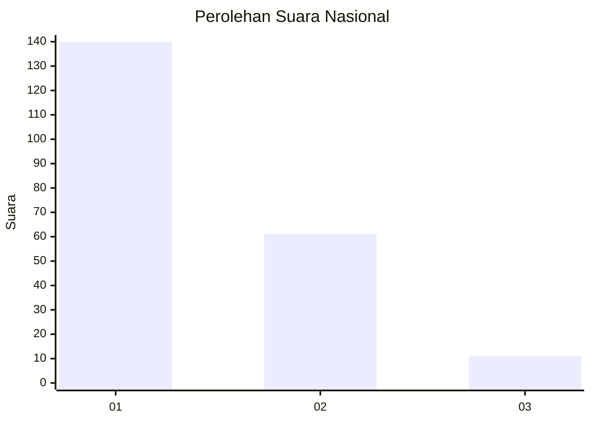
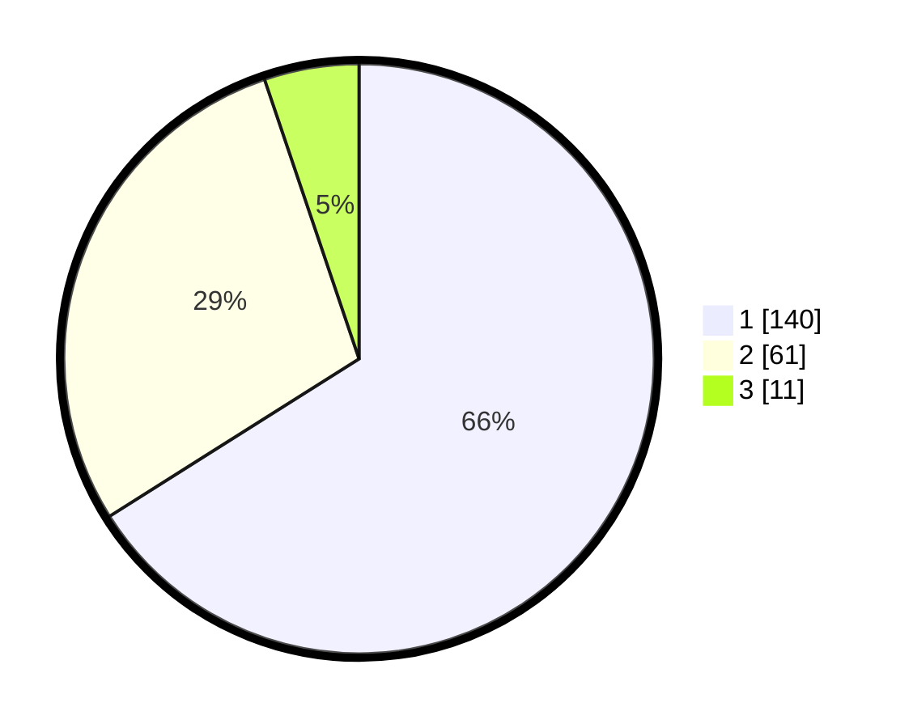

# Hasil

## Grafik

## Tabel

| No. | Nama Paslon    | Suara | Suara (raw) | Persentase |
|:--- |:-------------- | -----:| -----------:| ----------:|
| 1   | ANIES MUHAIMIN | 140   | [140][p-1]  | 66,04      |
| 2   | PRABOWO GIBRAN | 61    | [61][p-2]   | 28,77      |
| 3   | GANJAR MAHFUD  | 11    | [11][p-3]   | 5,19       |

[p-1]: https://github.com/gigit-pemilu/pemilu-2024/blob/main/pilpres/hitung-suara/sub/11-aceh/sub/71-kota-banda-aceh/sub/06-kuta-raja/sub/2001-keudah/sub/003-tps/sub/paslon-1.txt
[p-2]: https://github.com/gigit-pemilu/pemilu-2024/blob/main/pilpres/hitung-suara/sub/11-aceh/sub/71-kota-banda-aceh/sub/06-kuta-raja/sub/2001-keudah/sub/003-tps/sub/paslon-2.txt
[p-3]: https://github.com/gigit-pemilu/pemilu-2024/blob/main/pilpres/hitung-suara/sub/11-aceh/sub/71-kota-banda-aceh/sub/06-kuta-raja/sub/2001-keudah/sub/003-tps/sub/paslon-3.txt

## Foto C Plano

https://sirekap-obj-formc.kpu.go.id/7541/pemilu/ppwp/11/71/06/20/01/1171062001003-20240220-165532--3274ca9b-5ba2-4dbb-b9d2-d9d31a655c8c.jpg

https://sirekap-obj-formc.kpu.go.id/7541/pemilu/ppwp/11/71/06/20/01/1171062001003-20240219-180624--7804fc99-6040-4019-8464-c49159cf1e91.jpg

https://sirekap-obj-formc.kpu.go.id/7541/pemilu/ppwp/11/71/06/20/01/1171062001003-20240219-180800--feb0ee6b-4c05-40c3-91ff-a2f452332232.jpg

## Metadata

| Key        | Value               |
| ---------- | ------------------- |
| Time Stamp | 2024-02-20 17:00:00 |

