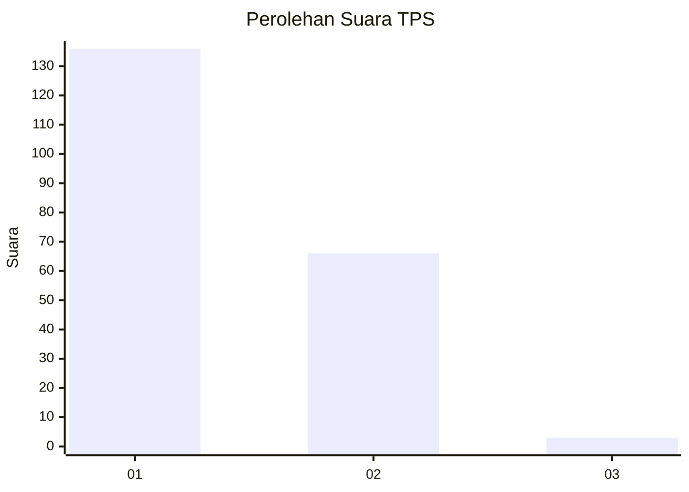
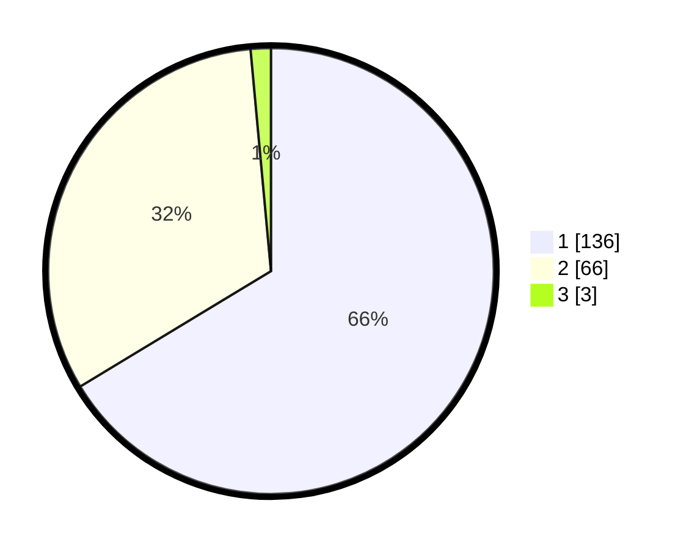

# Hasil

## Grafik

## Tabel

| No. | Nama Paslon    | Suara | Suara (raw) | Persentase |
|:--- |:-------------- | -----:| -----------:| ----------:|
| 1   | ANIES MUHAIMIN | 136   | [136][p-1]  | 66,34      |
| 2   | PRABOWO GIBRAN | 66    | [66][p-2]   | 32,20      |
| 3   | GANJAR MAHFUD  | 3     | [3][p-3]    | 1,46       |

[p-1]: https://github.com/gigit-pemilu/pemilu-2024-11-aceh/blob/main/pilpres/hitung-suara/sub/11-aceh/sub/71-kota-banda-aceh/sub/06-kuta-raja/sub/2001-keudah/sub/005-tps/sub/paslon-1.txt
[p-2]: https://github.com/gigit-pemilu/pemilu-2024-11-aceh/blob/main/pilpres/hitung-suara/sub/11-aceh/sub/71-kota-banda-aceh/sub/06-kuta-raja/sub/2001-keudah/sub/005-tps/sub/paslon-2.txt
[p-3]: https://github.com/gigit-pemilu/pemilu-2024-11-aceh/blob/main/pilpres/hitung-suara/sub/11-aceh/sub/71-kota-banda-aceh/sub/06-kuta-raja/sub/2001-keudah/sub/005-tps/sub/paslon-3.txt

## Foto C Plano

https://sirekap-obj-formc.kpu.go.id/6093/pemilu/ppwp/11/71/06/20/01/1171062001005-20240219-181500--d882fd4a-6006-4b01-af30-8e86c697d30c.jpg

https://sirekap-obj-formc.kpu.go.id/6093/pemilu/ppwp/11/71/06/20/01/1171062001005-20240219-181807--6a1c183d-1df0-4fb5-9b91-23e3bbf7e2a6.jpg

https://sirekap-obj-formc.kpu.go.id/6093/pemilu/ppwp/11/71/06/20/01/1171062001005-20240219-180535--6280f86f-aa22-443b-8d09-b17be64496ff.jpg

## Metadata

| Key        | Value               |
| ---------- | ------------------- |
| Time Stamp | 2024-02-20 11:00:00 |

