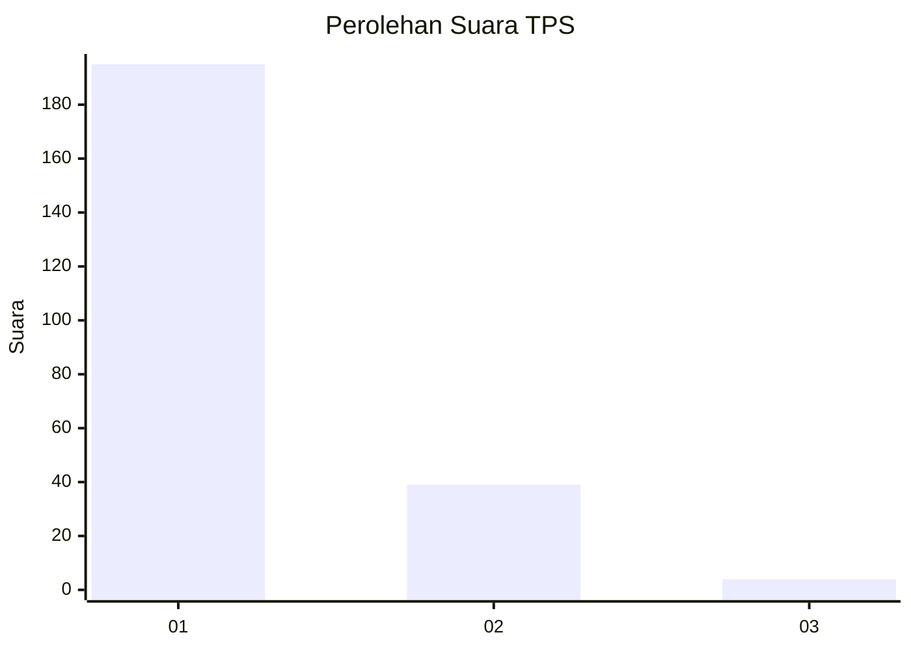
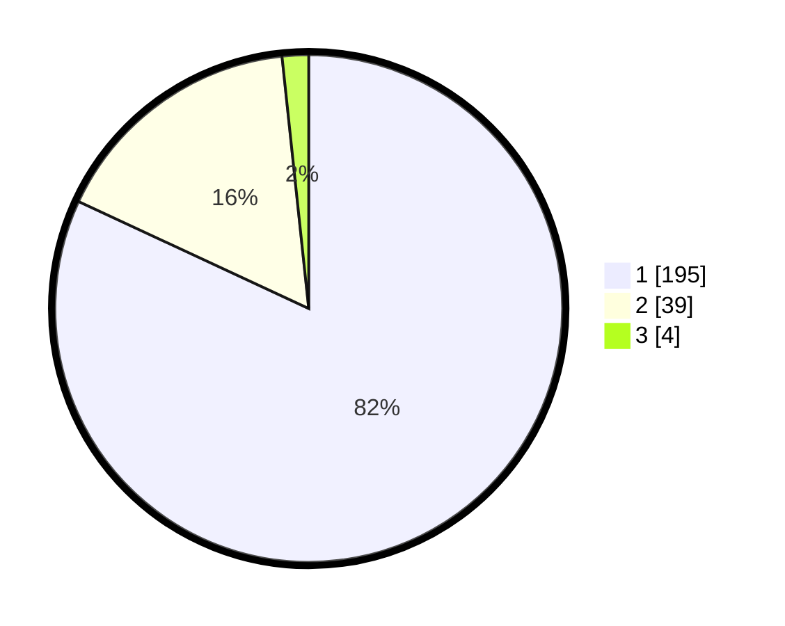

# Hasil

## Grafik

## Tabel

| No. | Nama Paslon    | Suara | Suara (raw) | Persentase |
|:--- |:-------------- | -----:| -----------:| ----------:|
| 1   | ANIES MUHAIMIN | 195   | [195][p-1]  | 81,93      |
| 2   | PRABOWO GIBRAN | 39    | [39][p-2]   | 16,39      |
| 3   | GANJAR MAHFUD  | 4     | [4][p-3]    | 1,68       |

[p-1]: https://github.com/gigit-pemilu/pemilu-2024-11-aceh/blob/main/pilpres/hitung-suara/sub/11-aceh/sub/71-kota-banda-aceh/sub/06-kuta-raja/sub/2002-peulanggahan/sub/001-tps/sub/paslon-1.txt
[p-2]: https://github.com/gigit-pemilu/pemilu-2024-11-aceh/blob/main/pilpres/hitung-suara/sub/11-aceh/sub/71-kota-banda-aceh/sub/06-kuta-raja/sub/2002-peulanggahan/sub/001-tps/sub/paslon-2.txt
[p-3]: https://github.com/gigit-pemilu/pemilu-2024-11-aceh/blob/main/pilpres/hitung-suara/sub/11-aceh/sub/71-kota-banda-aceh/sub/06-kuta-raja/sub/2002-peulanggahan/sub/001-tps/sub/paslon-3.txt

## Foto C Plano

https://sirekap-obj-formc.kpu.go.id/1261/pemilu/ppwp/11/71/06/20/02/1171062002001-20240222-094253--8799e6aa-fada-4134-8314-e497cacb2362.jpg

https://sirekap-obj-formc.kpu.go.id/1261/pemilu/ppwp/11/71/06/20/02/1171062002001-20240222-094634--b87b5b28-7158-4f23-971f-48bc9a04b886.jpg

https://sirekap-obj-formc.kpu.go.id/1261/pemilu/ppwp/11/71/06/20/02/1171062002001-20240214-201856--ae0cd7fa-abb8-4d58-b64b-41d8bc0208e0.jpg

## Metadata

| Key        | Value               |
| ---------- | ------------------- |
| Time Stamp | 2024-02-24 22:31:28 |

