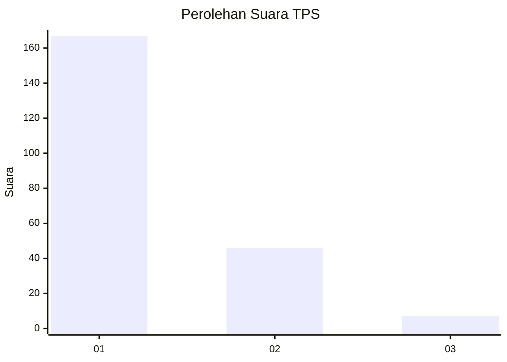
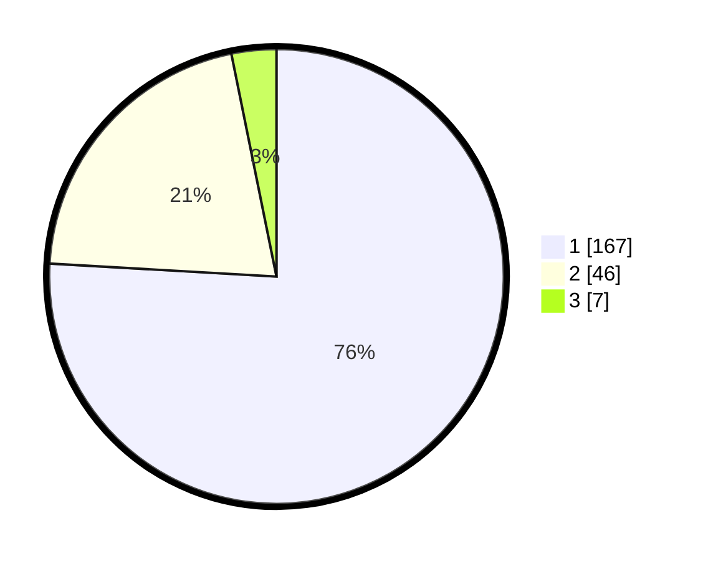

# Hasil

## Grafik

## Tabel

| No. | Nama Paslon    | Suara | Suara (raw) | Persentase |
|:--- |:-------------- | -----:| -----------:| ----------:|
| 1   | ANIES MUHAIMIN | 167   | [167][p-1]  | 75,91      |
| 2   | PRABOWO GIBRAN | 46    | [46][p-2]   | 20,91      |
| 3   | GANJAR MAHFUD  | 7     | [7][p-3]    | 3,18       |

[p-1]: https://github.com/gigit-pemilu/pemilu-2024-11-aceh/blob/main/pilpres/hitung-suara/sub/11-aceh/sub/71-kota-banda-aceh/sub/06-kuta-raja/sub/2002-peulanggahan/sub/002-tps/sub/paslon-1.txt
[p-2]: https://github.com/gigit-pemilu/pemilu-2024-11-aceh/blob/main/pilpres/hitung-suara/sub/11-aceh/sub/71-kota-banda-aceh/sub/06-kuta-raja/sub/2002-peulanggahan/sub/002-tps/sub/paslon-2.txt
[p-3]: https://github.com/gigit-pemilu/pemilu-2024-11-aceh/blob/main/pilpres/hitung-suara/sub/11-aceh/sub/71-kota-banda-aceh/sub/06-kuta-raja/sub/2002-peulanggahan/sub/002-tps/sub/paslon-3.txt

## Foto C Plano

https://sirekap-obj-formc.kpu.go.id/260b/pemilu/ppwp/11/71/06/20/02/1171062002002-20240222-101651--56f55a1e-db8d-436b-b367-8f0b9b0b76e6.jpg

https://sirekap-obj-formc.kpu.go.id/260b/pemilu/ppwp/11/71/06/20/02/1171062002002-20240222-101745--af0409f2-6495-495c-8d01-640e07994f93.jpg

https://sirekap-obj-formc.kpu.go.id/260b/pemilu/ppwp/11/71/06/20/02/1171062002002-20240222-102122--1eabfc90-5d9e-472c-b057-bde536b90e4c.jpg

## Metadata

| Key        | Value               |
| ---------- | ------------------- |
| Time Stamp | 2024-02-24 22:31:28 |

