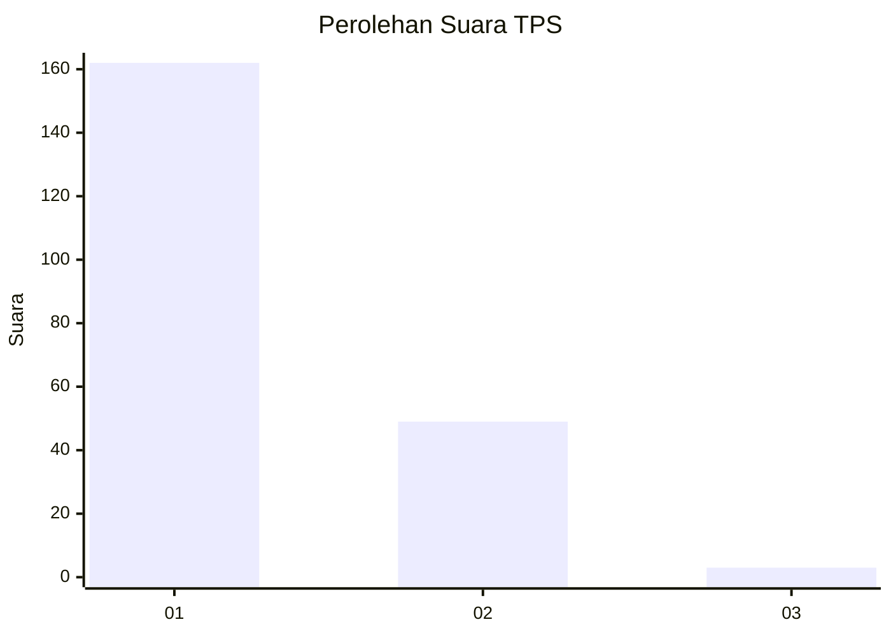
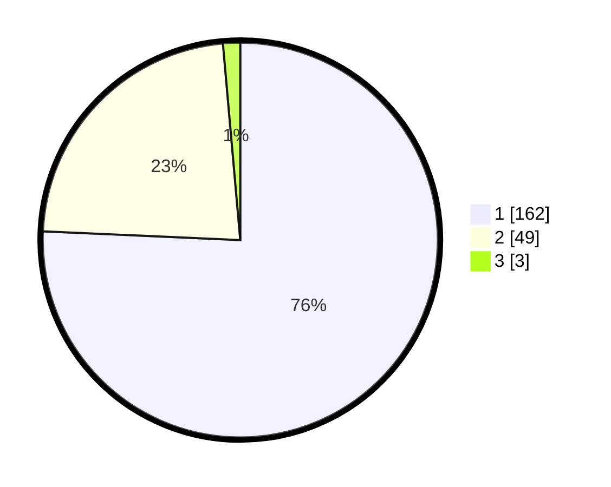

# Hasil

## Grafik

## Tabel

| No. | Nama Paslon    | Suara | Suara (raw) | Persentase |
|:--- |:-------------- | -----:| -----------:| ----------:|
| 1   | ANIES MUHAIMIN | 162   | [162][p-1]  | 75,70      |
| 2   | PRABOWO GIBRAN | 49    | [49][p-2]   | 22,90      |
| 3   | GANJAR MAHFUD  | 3     | [3][p-3]    | 1,40       |

[p-1]: https://github.com/gigit-pemilu/pemilu-2024-11-aceh/blob/main/pilpres/hitung-suara/sub/11-aceh/sub/71-kota-banda-aceh/sub/06-kuta-raja/sub/2002-peulanggahan/sub/005-tps/sub/paslon-1.txt
[p-2]: https://github.com/gigit-pemilu/pemilu-2024-11-aceh/blob/main/pilpres/hitung-suara/sub/11-aceh/sub/71-kota-banda-aceh/sub/06-kuta-raja/sub/2002-peulanggahan/sub/005-tps/sub/paslon-2.txt
[p-3]: https://github.com/gigit-pemilu/pemilu-2024-11-aceh/blob/main/pilpres/hitung-suara/sub/11-aceh/sub/71-kota-banda-aceh/sub/06-kuta-raja/sub/2002-peulanggahan/sub/005-tps/sub/paslon-3.txt

## Foto C Plano

https://sirekap-obj-formc.kpu.go.id/04c5/pemilu/ppwp/11/71/06/20/02/1171062002005-20240214-223007--2f80bcbe-5a1d-409c-96fd-77131dcace9e.jpg

https://sirekap-obj-formc.kpu.go.id/04c5/pemilu/ppwp/11/71/06/20/02/1171062002005-20240214-222916--0247a207-e0da-430d-a9b1-a0f69de7e133.jpg

https://sirekap-obj-formc.kpu.go.id/04c5/pemilu/ppwp/11/71/06/20/02/1171062002005-20240214-224045--f5836d57-2c0e-4fbe-a681-3af1527c175a.jpg

## Metadata

| Key        | Value               |
| ---------- | ------------------- |
| Time Stamp | 2024-02-15 15:00:29 |

