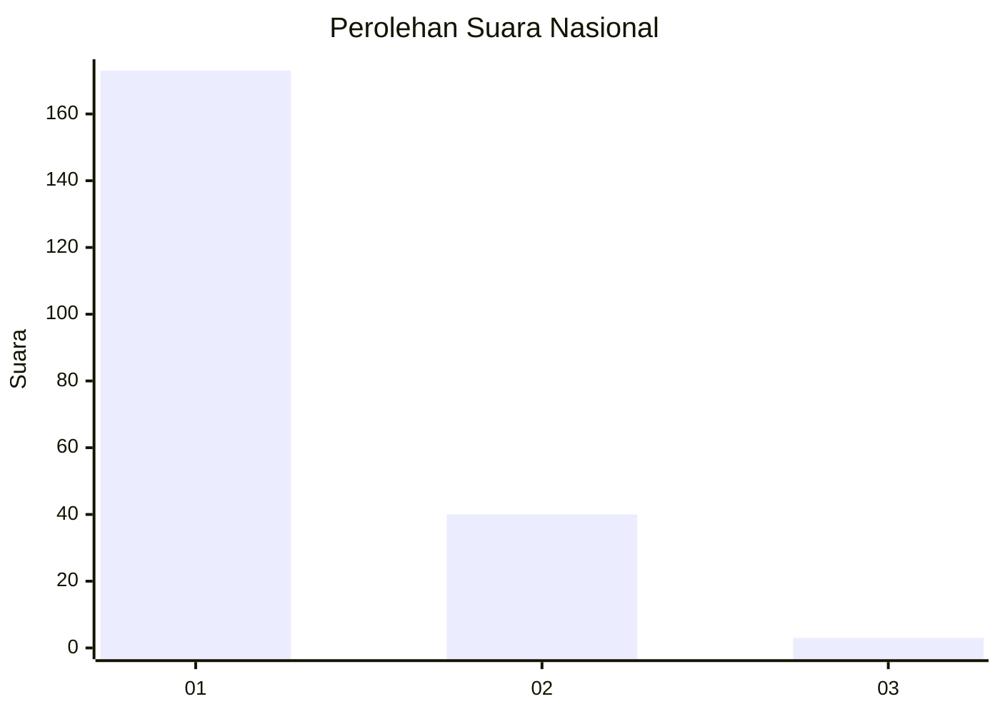
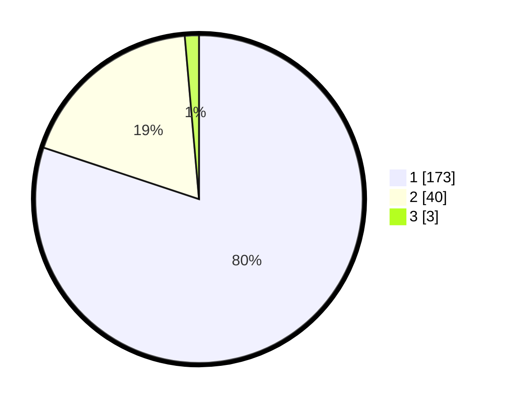

# Hasil

## Grafik

## Tabel

| No. | Nama Paslon    | Suara | Suara (raw) | Persentase |
|:--- |:-------------- | -----:| -----------:| ----------:|
| 1   | ANIES MUHAIMIN | 173   | [173][p-1]  | 80,09      |
| 2   | PRABOWO GIBRAN | 40    | [40][p-2]   | 18,52      |
| 3   | GANJAR MAHFUD  | 3     | [3][p-3]    | 1,39       |

[p-1]: https://github.com/gigit-pemilu/pemilu-2024/blob/main/pilpres/hitung-suara/sub/11-aceh/sub/71-kota-banda-aceh/sub/06-kuta-raja/sub/2002-peulanggahan/sub/006-tps/sub/paslon-1.txt
[p-2]: https://github.com/gigit-pemilu/pemilu-2024/blob/main/pilpres/hitung-suara/sub/11-aceh/sub/71-kota-banda-aceh/sub/06-kuta-raja/sub/2002-peulanggahan/sub/006-tps/sub/paslon-2.txt
[p-3]: https://github.com/gigit-pemilu/pemilu-2024/blob/main/pilpres/hitung-suara/sub/11-aceh/sub/71-kota-banda-aceh/sub/06-kuta-raja/sub/2002-peulanggahan/sub/006-tps/sub/paslon-3.txt

## Foto C Plano

https://sirekap-obj-formc.kpu.go.id/33f2/pemilu/ppwp/11/71/06/20/02/1171062002006-20240215-001701--a5df29e8-6eb7-437a-b5d8-64a5934694e6.jpg

https://sirekap-obj-formc.kpu.go.id/33f2/pemilu/ppwp/11/71/06/20/02/1171062002006-20240215-002032--251d400f-4d77-4352-8a13-c56529bad63d.jpg

https://sirekap-obj-formc.kpu.go.id/33f2/pemilu/ppwp/11/71/06/20/02/1171062002006-20240215-002204--7c44b790-4e75-4f08-899e-16e9e902f2f4.jpg

## Metadata

| Key        | Value               |
| ---------- | ------------------- |
| Time Stamp | 2024-02-15 15:00:29 |

