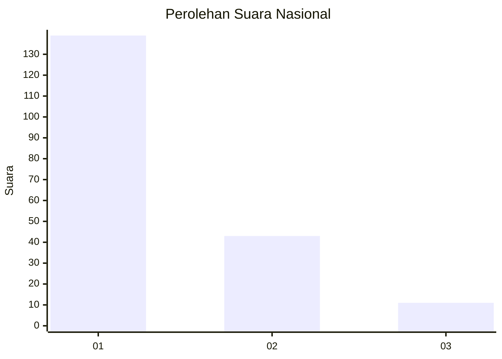
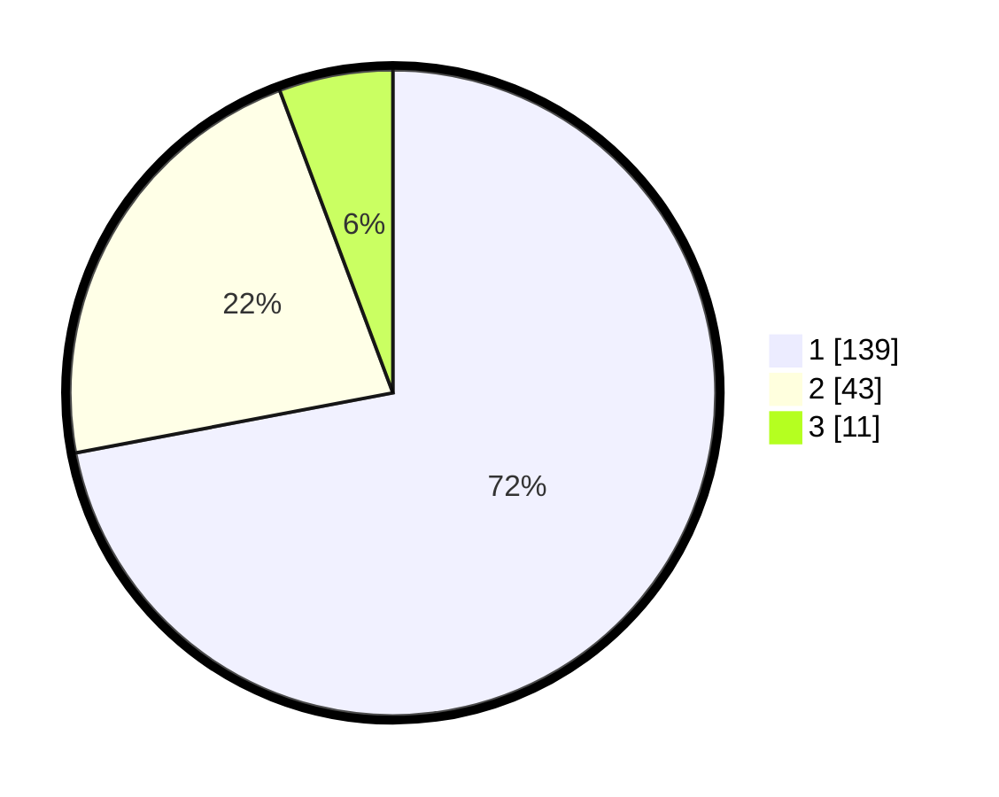

# Hasil

## Grafik

## Tabel

| No. | Nama Paslon    | Suara | Suara (raw) | Persentase |
|:--- |:-------------- | -----:| -----------:| ----------:|
| 1   | ANIES MUHAIMIN | 139   | [139][p-1]  | 72,02      |
| 2   | PRABOWO GIBRAN | 43    | [43][p-2]   | 22,28      |
| 3   | GANJAR MAHFUD  | 11    | [11][p-3]   | 5,70       |

[p-1]: https://github.com/gigit-pemilu/pemilu-2024/blob/main/pilpres/hitung-suara/sub/11-aceh/sub/71-kota-banda-aceh/sub/06-kuta-raja/sub/2003-merduati/sub/001-tps/sub/paslon-1.txt
[p-2]: https://github.com/gigit-pemilu/pemilu-2024/blob/main/pilpres/hitung-suara/sub/11-aceh/sub/71-kota-banda-aceh/sub/06-kuta-raja/sub/2003-merduati/sub/001-tps/sub/paslon-2.txt
[p-3]: https://github.com/gigit-pemilu/pemilu-2024/blob/main/pilpres/hitung-suara/sub/11-aceh/sub/71-kota-banda-aceh/sub/06-kuta-raja/sub/2003-merduati/sub/001-tps/sub/paslon-3.txt

## Foto C Plano

https://sirekap-obj-formc.kpu.go.id/3444/pemilu/ppwp/11/71/06/20/03/1171062003001-20240218-140729--f5efe66a-e4c3-4d0f-a11d-0aca3212c807.jpg

https://sirekap-obj-formc.kpu.go.id/3444/pemilu/ppwp/11/71/06/20/03/1171062003001-20240218-140815--693fad56-ace0-48a9-bec2-926c0b759d49.jpg

https://sirekap-obj-formc.kpu.go.id/3444/pemilu/ppwp/11/71/06/20/03/1171062003001-20240218-140943--222eb513-fce7-4efb-9d8a-b7a53092b4db.jpg

## Metadata

| Key        | Value               |
| ---------- | ------------------- |
| Time Stamp | 2024-02-19 06:16:00 |

