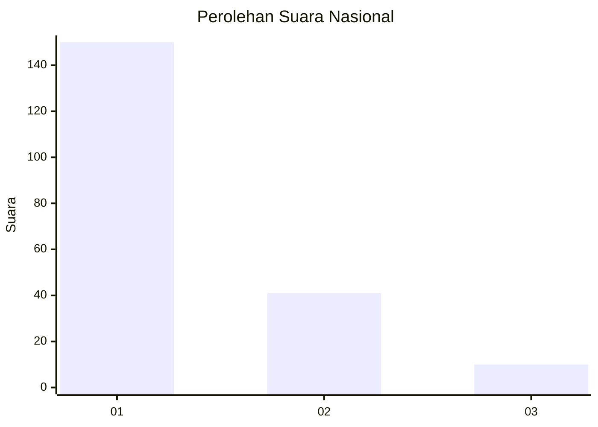
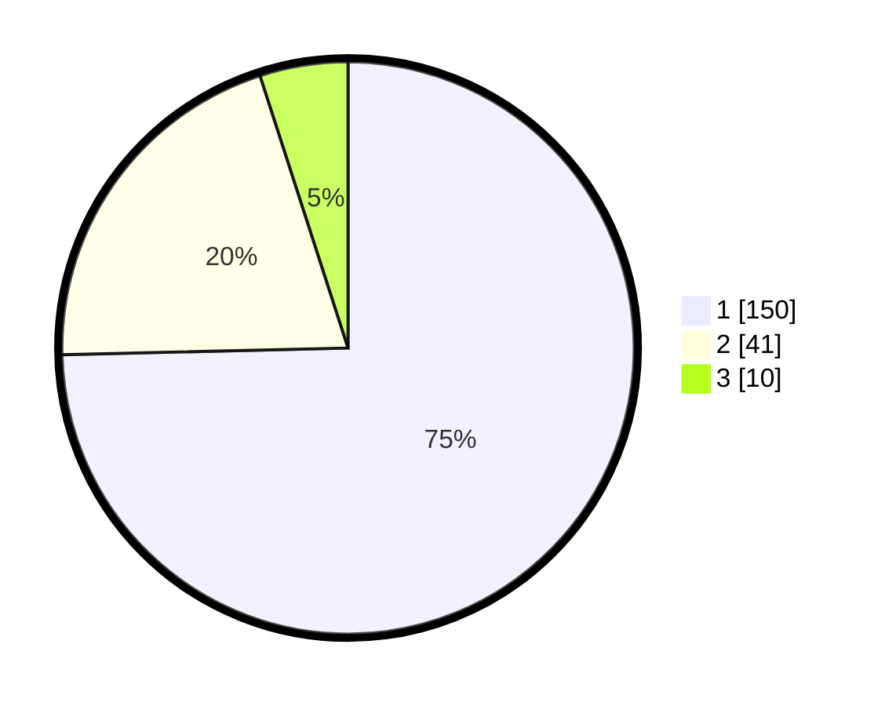

# Hasil

## Grafik

## Tabel

| No. | Nama Paslon    | Suara | Suara (raw) | Persentase |
|:--- |:-------------- | -----:| -----------:| ----------:|
| 1   | ANIES MUHAIMIN | 150   | [150][p-1]  | 74,63      |
| 2   | PRABOWO GIBRAN | 41    | [41][p-2]   | 20,40      |
| 3   | GANJAR MAHFUD  | 10    | [10][p-3]   | 4,98       |

[p-1]: https://github.com/gigit-pemilu/pemilu-2024/blob/main/pilpres/hitung-suara/sub/11-aceh/sub/71-kota-banda-aceh/sub/06-kuta-raja/sub/2003-merduati/sub/002-tps/sub/paslon-1.txt
[p-2]: https://github.com/gigit-pemilu/pemilu-2024/blob/main/pilpres/hitung-suara/sub/11-aceh/sub/71-kota-banda-aceh/sub/06-kuta-raja/sub/2003-merduati/sub/002-tps/sub/paslon-2.txt
[p-3]: https://github.com/gigit-pemilu/pemilu-2024/blob/main/pilpres/hitung-suara/sub/11-aceh/sub/71-kota-banda-aceh/sub/06-kuta-raja/sub/2003-merduati/sub/002-tps/sub/paslon-3.txt

## Foto C Plano

https://sirekap-obj-formc.kpu.go.id/b790/pemilu/ppwp/11/71/06/20/03/1171062003002-20240218-141247--60b9d9d5-3ba4-4856-aa79-b4e0bcca40c0.jpg

https://sirekap-obj-formc.kpu.go.id/b790/pemilu/ppwp/11/71/06/20/03/1171062003002-20240218-141441--a35bea19-f699-4a33-a63a-04790aa63f56.jpg

https://sirekap-obj-formc.kpu.go.id/b790/pemilu/ppwp/11/71/06/20/03/1171062003002-20240218-141524--f4369ca3-24c4-4d7d-a731-2847bb24c387.jpg

## Metadata

| Key        | Value               |
| ---------- | ------------------- |
| Time Stamp | 2024-02-19 06:16:00 |

