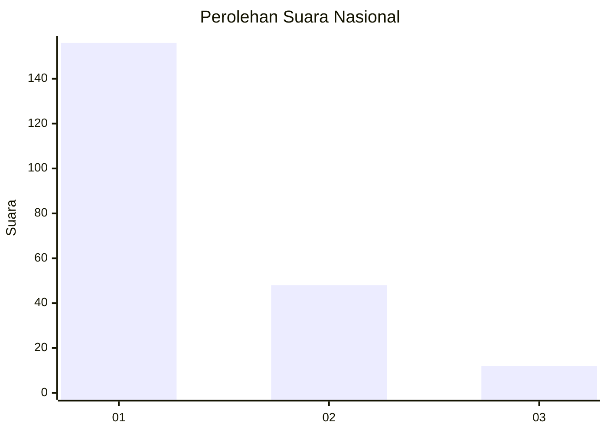
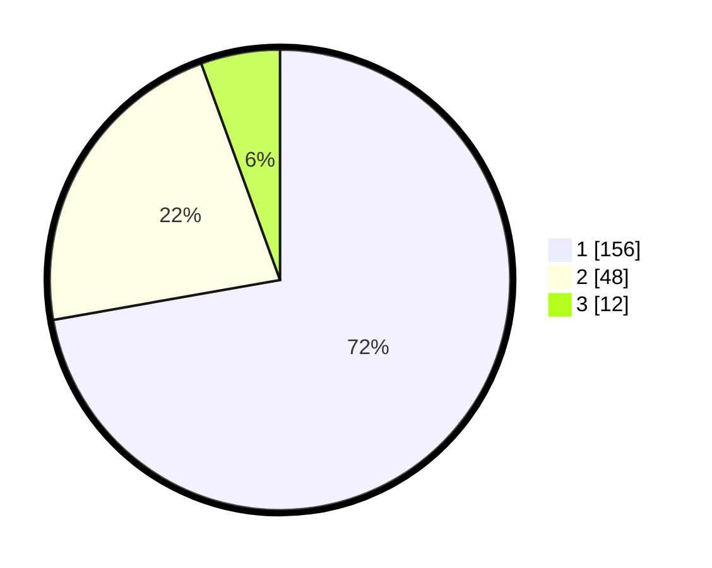

# Hasil

## Grafik

## Tabel

| No. | Nama Paslon    | Suara | Suara (raw) | Persentase |
|:--- |:-------------- | -----:| -----------:| ----------:|
| 1   | ANIES MUHAIMIN | 156   | [156][p-1]  | 72,22      |
| 2   | PRABOWO GIBRAN | 48    | [48][p-2]   | 22,22      |
| 3   | GANJAR MAHFUD  | 12    | [12][p-3]   | 5,56       |

[p-1]: https://github.com/gigit-pemilu/pemilu-2024/blob/main/pilpres/hitung-suara/sub/11-aceh/sub/71-kota-banda-aceh/sub/06-kuta-raja/sub/2003-merduati/sub/003-tps/sub/paslon-1.txt
[p-2]: https://github.com/gigit-pemilu/pemilu-2024/blob/main/pilpres/hitung-suara/sub/11-aceh/sub/71-kota-banda-aceh/sub/06-kuta-raja/sub/2003-merduati/sub/003-tps/sub/paslon-2.txt
[p-3]: https://github.com/gigit-pemilu/pemilu-2024/blob/main/pilpres/hitung-suara/sub/11-aceh/sub/71-kota-banda-aceh/sub/06-kuta-raja/sub/2003-merduati/sub/003-tps/sub/paslon-3.txt

## Foto C Plano

https://sirekap-obj-formc.kpu.go.id/d06a/pemilu/ppwp/11/71/06/20/03/1171062003003-20240218-141714--0ea45f84-d45b-4023-9a87-62b1b82781f9.jpg

https://sirekap-obj-formc.kpu.go.id/d06a/pemilu/ppwp/11/71/06/20/03/1171062003003-20240218-141817--9932df6f-98c4-4f73-b7b5-af32dfb729ef.jpg

https://sirekap-obj-formc.kpu.go.id/d06a/pemilu/ppwp/11/71/06/20/03/1171062003003-20240218-141855--202e6115-45f3-4e91-92dc-d5c6bb7adbff.jpg

## Metadata

| Key        | Value               |
| ---------- | ------------------- |
| Time Stamp | 2024-02-19 06:16:00 |

