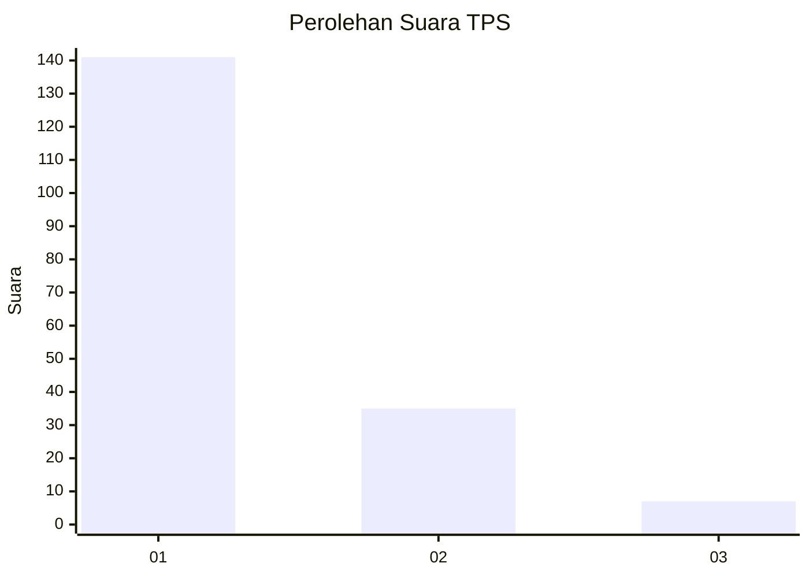
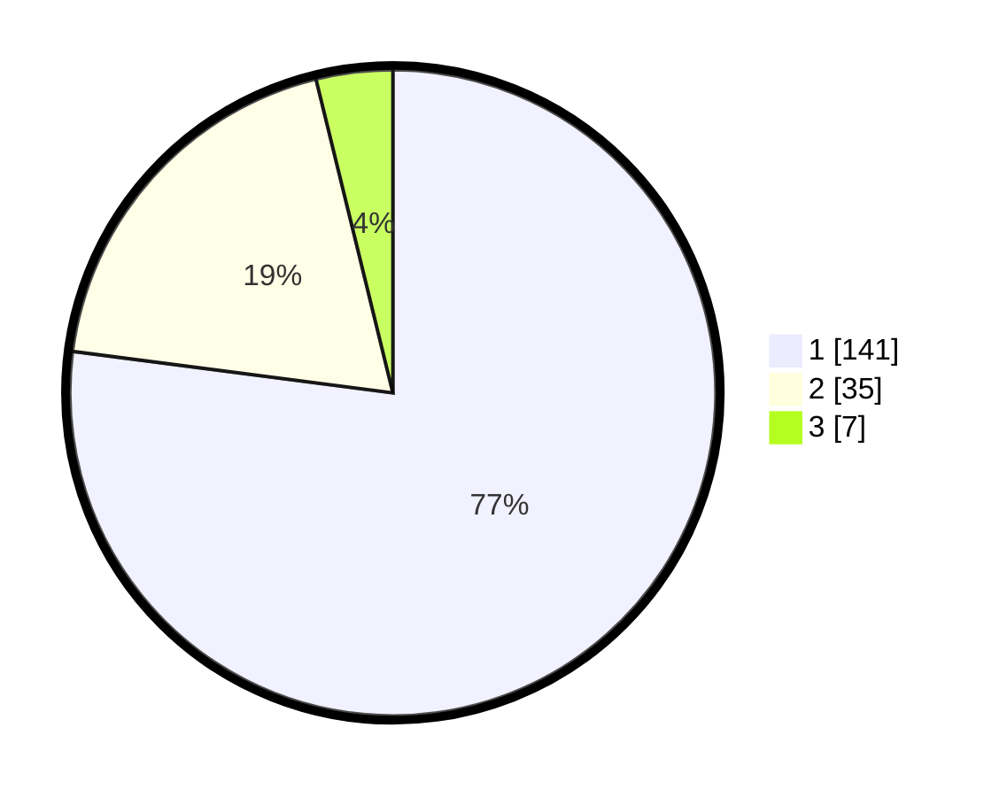

# Hasil

## Grafik

## Tabel

| No. | Nama Paslon    | Suara | Suara (raw) | Persentase |
|:--- |:-------------- | -----:| -----------:| ----------:|
| 1   | ANIES MUHAIMIN | 141   | [141][p-1]  | 77,05      |
| 2   | PRABOWO GIBRAN | 35    | [35][p-2]   | 19,13      |
| 3   | GANJAR MAHFUD  | 7     | [7][p-3]    | 3,83       |

[p-1]: https://github.com/gigit-pemilu/pemilu-2024-11-aceh/blob/main/pilpres/hitung-suara/sub/11-aceh/sub/71-kota-banda-aceh/sub/06-kuta-raja/sub/2003-merduati/sub/007-tps/sub/paslon-1.txt
[p-2]: https://github.com/gigit-pemilu/pemilu-2024-11-aceh/blob/main/pilpres/hitung-suara/sub/11-aceh/sub/71-kota-banda-aceh/sub/06-kuta-raja/sub/2003-merduati/sub/007-tps/sub/paslon-2.txt
[p-3]: https://github.com/gigit-pemilu/pemilu-2024-11-aceh/blob/main/pilpres/hitung-suara/sub/11-aceh/sub/71-kota-banda-aceh/sub/06-kuta-raja/sub/2003-merduati/sub/007-tps/sub/paslon-3.txt

## Foto C Plano

https://sirekap-obj-formc.kpu.go.id/f61f/pemilu/ppwp/11/71/06/20/03/1171062003007-20240218-143859--f6d73eed-8ca7-45b4-9d5e-b27ea4bbec0a.jpg

https://sirekap-obj-formc.kpu.go.id/f61f/pemilu/ppwp/11/71/06/20/03/1171062003007-20240218-144023--492cb74c-e9da-440d-bd12-7d5eae04384a.jpg

https://sirekap-obj-formc.kpu.go.id/f61f/pemilu/ppwp/11/71/06/20/03/1171062003007-20240218-143539--657a4b73-1242-4ae6-bf94-56bd2818bbb2.jpg

## Metadata

| Key        | Value               |
| ---------- | ------------------- |
| Time Stamp | 2024-02-19 06:16:00 |

