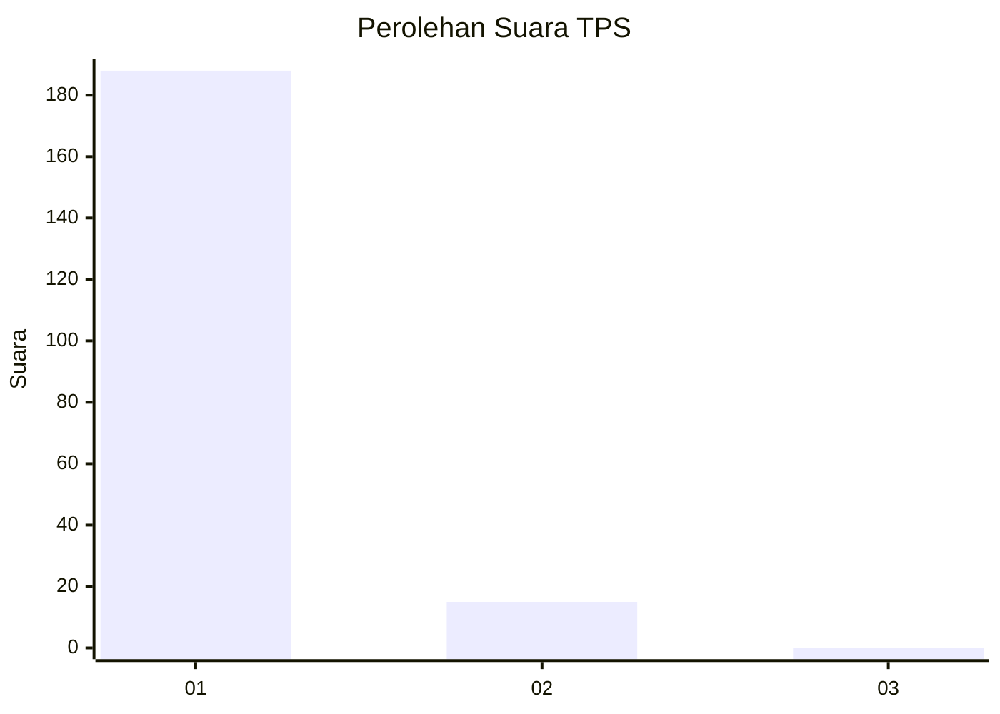
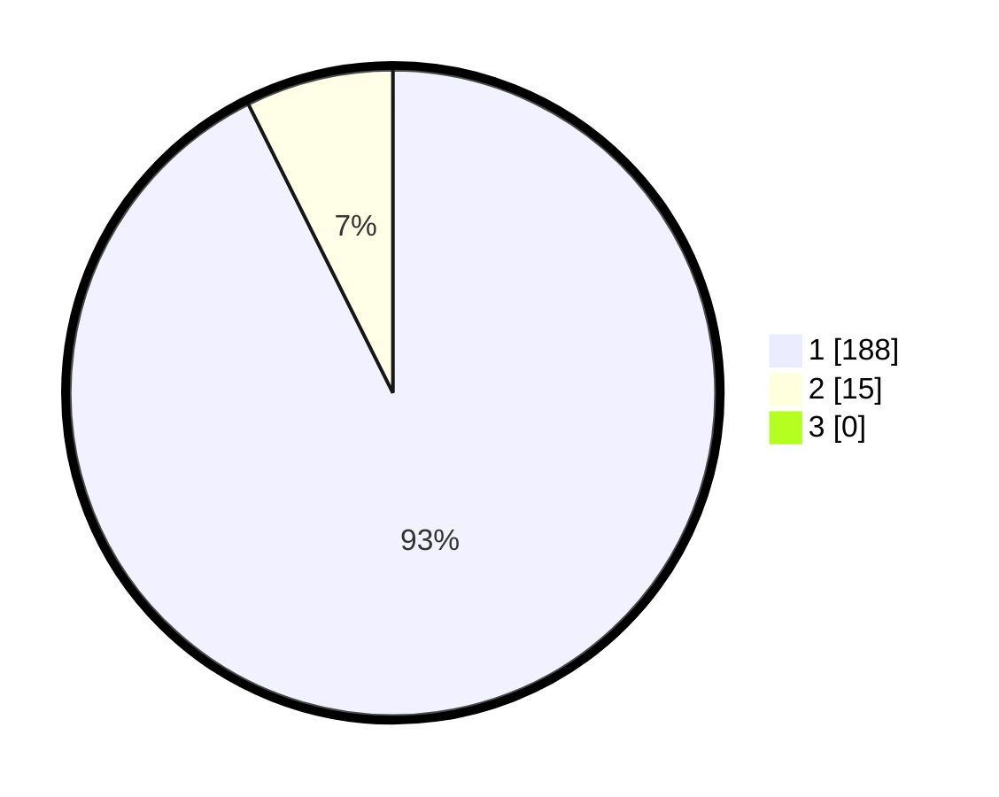

# Hasil

## Grafik

## Tabel

| No. | Nama Paslon    | Suara | Suara (raw) | Persentase |
|:--- |:-------------- | -----:| -----------:| ----------:|
| 1   | ANIES MUHAIMIN | 188   | [188][p-1]  | 92,61      |
| 2   | PRABOWO GIBRAN | 15    | [15][p-2]   | 7,39       |
| 3   | GANJAR MAHFUD  | 0     | [0][p-3]    | 0,00       |

[p-1]: https://github.com/gigit-pemilu/pemilu-2024-11-aceh/blob/main/pilpres/hitung-suara/sub/11-aceh/sub/71-kota-banda-aceh/sub/06-kuta-raja/sub/2004-lampaseh-kota/sub/001-tps/sub/paslon-1.txt
[p-2]: https://github.com/gigit-pemilu/pemilu-2024-11-aceh/blob/main/pilpres/hitung-suara/sub/11-aceh/sub/71-kota-banda-aceh/sub/06-kuta-raja/sub/2004-lampaseh-kota/sub/001-tps/sub/paslon-2.txt
[p-3]: https://github.com/gigit-pemilu/pemilu-2024-11-aceh/blob/main/pilpres/hitung-suara/sub/11-aceh/sub/71-kota-banda-aceh/sub/06-kuta-raja/sub/2004-lampaseh-kota/sub/001-tps/sub/paslon-3.txt

## Foto C Plano

https://sirekap-obj-formc.kpu.go.id/a7b7/pemilu/ppwp/11/71/06/20/04/1171062004001-20240217-115409--d5103d59-da1d-4cd7-a3f4-d9bee95d6b40.jpg

https://sirekap-obj-formc.kpu.go.id/a7b7/pemilu/ppwp/11/71/06/20/04/1171062004001-20240217-115517--8e16e0df-4ca1-454a-9468-69a738b92f6d.jpg

https://sirekap-obj-formc.kpu.go.id/a7b7/pemilu/ppwp/11/71/06/20/04/1171062004001-20240217-115608--21e6b509-9479-4835-8317-b72bd195bc8b.jpg

## Metadata

| Key        | Value               |
| ---------- | ------------------- |
| Time Stamp | 2024-02-17 18:30:00 |

