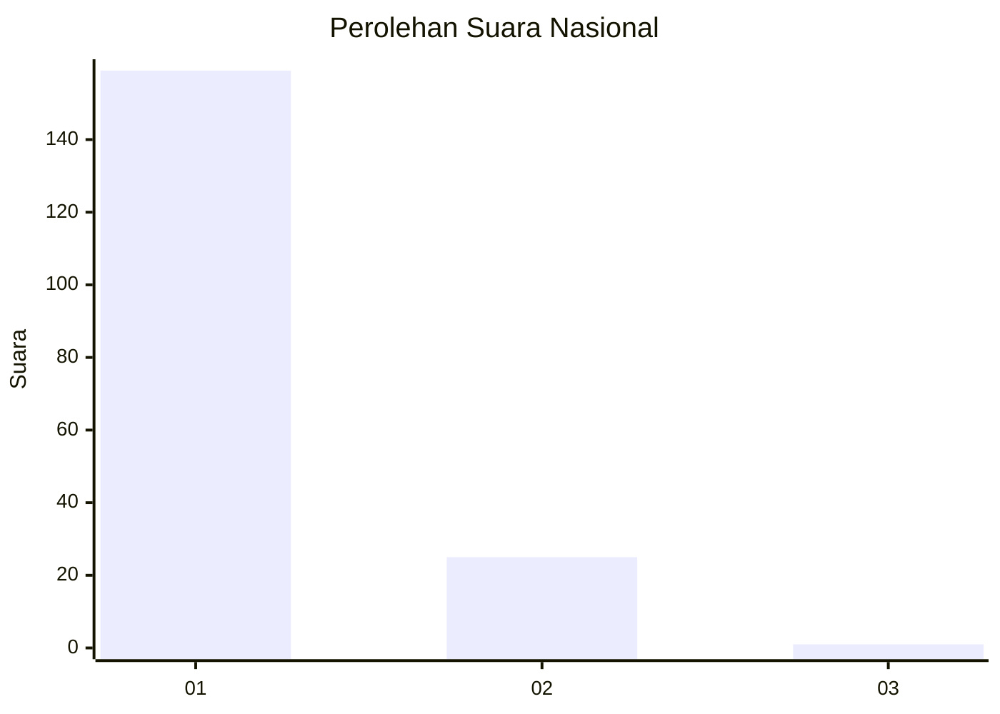
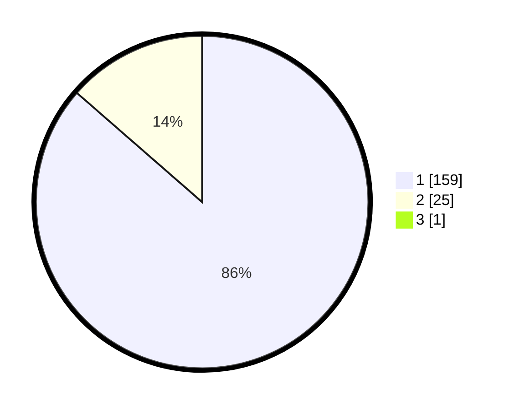

# Hasil

## Grafik

## Tabel

| No. | Nama Paslon    | Suara | Suara (raw) | Persentase |
|:--- |:-------------- | -----:| -----------:| ----------:|
| 1   | ANIES MUHAIMIN | 159   | [159][p-1]  | 85,95      |
| 2   | PRABOWO GIBRAN | 25    | [25][p-2]   | 13,51      |
| 3   | GANJAR MAHFUD  | 1     | [1][p-3]    | 0,54       |

[p-1]: https://github.com/gigit-pemilu/pemilu-2024/blob/main/pilpres/hitung-suara/sub/11-aceh/sub/71-kota-banda-aceh/sub/06-kuta-raja/sub/2004-lampaseh-kota/sub/002-tps/sub/paslon-1.txt
[p-2]: https://github.com/gigit-pemilu/pemilu-2024/blob/main/pilpres/hitung-suara/sub/11-aceh/sub/71-kota-banda-aceh/sub/06-kuta-raja/sub/2004-lampaseh-kota/sub/002-tps/sub/paslon-2.txt
[p-3]: https://github.com/gigit-pemilu/pemilu-2024/blob/main/pilpres/hitung-suara/sub/11-aceh/sub/71-kota-banda-aceh/sub/06-kuta-raja/sub/2004-lampaseh-kota/sub/002-tps/sub/paslon-3.txt

## Foto C Plano

https://sirekap-obj-formc.kpu.go.id/3850/pemilu/ppwp/11/71/06/20/04/1171062004002-20240217-115738--7edea572-566c-48c7-967c-92a191591697.jpg

https://sirekap-obj-formc.kpu.go.id/3850/pemilu/ppwp/11/71/06/20/04/1171062004002-20240217-115840--cbbcc32c-2f24-4308-b642-59b4076934ea.jpg

https://sirekap-obj-formc.kpu.go.id/3850/pemilu/ppwp/11/71/06/20/04/1171062004002-20240217-115957--e9aa6404-20d0-45e5-9eb2-4c1a367439a5.jpg

## Metadata

| Key        | Value               |
| ---------- | ------------------- |
| Time Stamp | 2024-02-17 18:30:00 |

