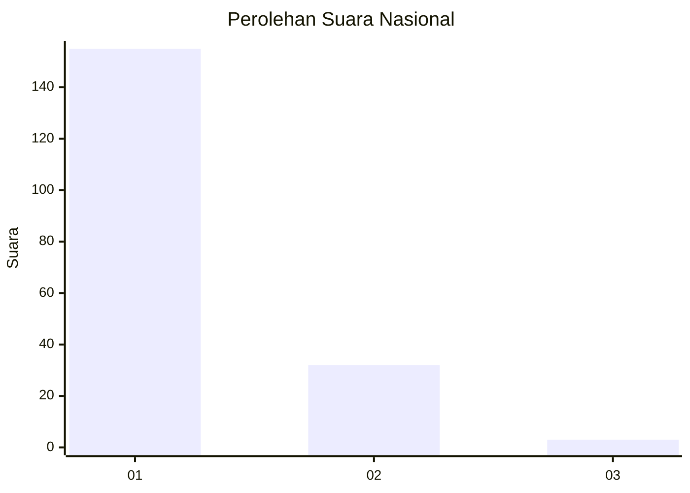
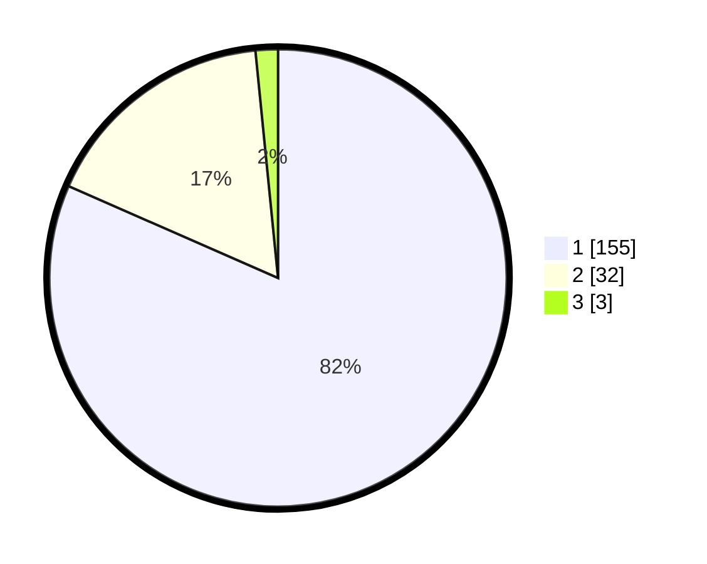

# Hasil

## Grafik

## Tabel

| No. | Nama Paslon    | Suara | Suara (raw) | Persentase |
|:--- |:-------------- | -----:| -----------:| ----------:|
| 1   | ANIES MUHAIMIN | 155   | [155][p-1]  | 81,58      |
| 2   | PRABOWO GIBRAN | 32    | [32][p-2]   | 16,84      |
| 3   | GANJAR MAHFUD  | 3     | [3][p-3]    | 1,58       |

[p-1]: https://github.com/gigit-pemilu/pemilu-2024/blob/main/pilpres/hitung-suara/sub/11-aceh/sub/71-kota-banda-aceh/sub/06-kuta-raja/sub/2004-lampaseh-kota/sub/003-tps/sub/paslon-1.txt
[p-2]: https://github.com/gigit-pemilu/pemilu-2024/blob/main/pilpres/hitung-suara/sub/11-aceh/sub/71-kota-banda-aceh/sub/06-kuta-raja/sub/2004-lampaseh-kota/sub/003-tps/sub/paslon-2.txt
[p-3]: https://github.com/gigit-pemilu/pemilu-2024/blob/main/pilpres/hitung-suara/sub/11-aceh/sub/71-kota-banda-aceh/sub/06-kuta-raja/sub/2004-lampaseh-kota/sub/003-tps/sub/paslon-3.txt

## Foto C Plano

https://sirekap-obj-formc.kpu.go.id/846d/pemilu/ppwp/11/71/06/20/04/1171062004003-20240217-121645--3e7250ab-48c6-4f08-8331-7f37d97aca6b.jpg

https://sirekap-obj-formc.kpu.go.id/846d/pemilu/ppwp/11/71/06/20/04/1171062004003-20240217-121738--c41aacee-962b-4d03-a144-bf1d98f1a2d1.jpg

https://sirekap-obj-formc.kpu.go.id/846d/pemilu/ppwp/11/71/06/20/04/1171062004003-20240217-121828--86ebb0bf-7675-483f-97db-d0eec51dc870.jpg

## Metadata

| Key        | Value               |
| ---------- | ------------------- |
| Time Stamp | 2024-02-17 18:30:00 |

