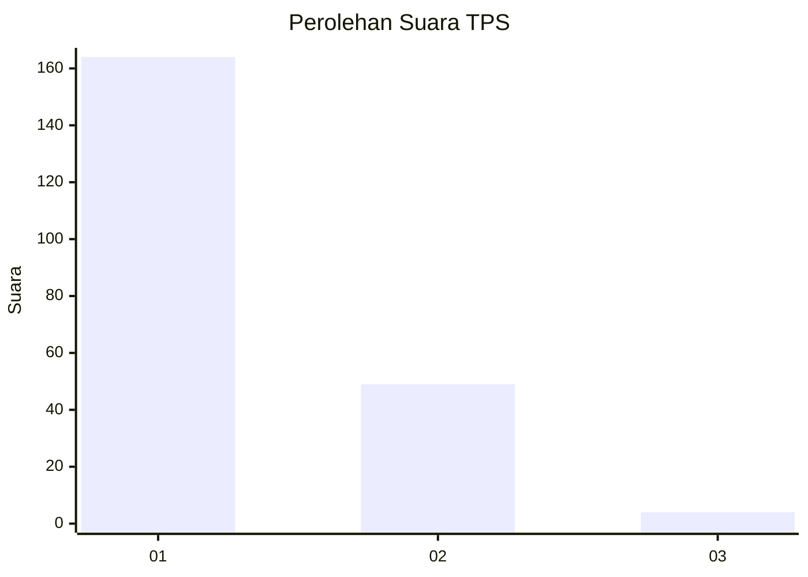
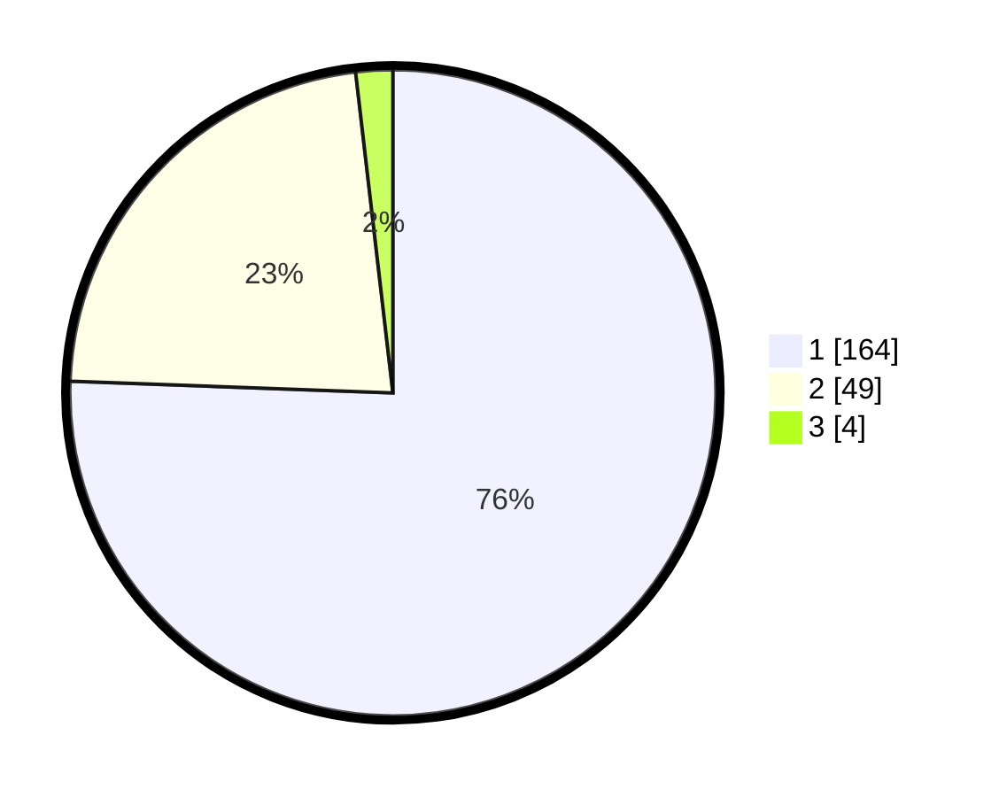

# Hasil

## Grafik

## Tabel

| No. | Nama Paslon    | Suara | Suara (raw) | Persentase |
|:--- |:-------------- | -----:| -----------:| ----------:|
| 1   | ANIES MUHAIMIN | 164   | [164][p-1]  | 75,58      |
| 2   | PRABOWO GIBRAN | 49    | [49][p-2]   | 22,58      |
| 3   | GANJAR MAHFUD  | 4     | [4][p-3]    | 1,84       |

[p-1]: https://github.com/gigit-pemilu/pemilu-2024-11-aceh/blob/main/pilpres/hitung-suara/sub/11-aceh/sub/71-kota-banda-aceh/sub/06-kuta-raja/sub/2004-lampaseh-kota/sub/004-tps/sub/paslon-1.txt
[p-2]: https://github.com/gigit-pemilu/pemilu-2024-11-aceh/blob/main/pilpres/hitung-suara/sub/11-aceh/sub/71-kota-banda-aceh/sub/06-kuta-raja/sub/2004-lampaseh-kota/sub/004-tps/sub/paslon-2.txt
[p-3]: https://github.com/gigit-pemilu/pemilu-2024-11-aceh/blob/main/pilpres/hitung-suara/sub/11-aceh/sub/71-kota-banda-aceh/sub/06-kuta-raja/sub/2004-lampaseh-kota/sub/004-tps/sub/paslon-3.txt

## Foto C Plano

https://sirekap-obj-formc.kpu.go.id/50ef/pemilu/ppwp/11/71/06/20/04/1171062004004-20240217-122317--c007aea8-e305-4b99-b628-997dcf56edca.jpg

https://sirekap-obj-formc.kpu.go.id/50ef/pemilu/ppwp/11/71/06/20/04/1171062004004-20240217-122420--7b2898c5-883a-4851-9684-c32eadeda609.jpg

https://sirekap-obj-formc.kpu.go.id/50ef/pemilu/ppwp/11/71/06/20/04/1171062004004-20240217-122524--820f6fab-8294-45e2-96e6-e16fb1f67555.jpg

## Metadata

| Key        | Value               |
| ---------- | ------------------- |
| Time Stamp | 2024-02-17 18:30:00 |

