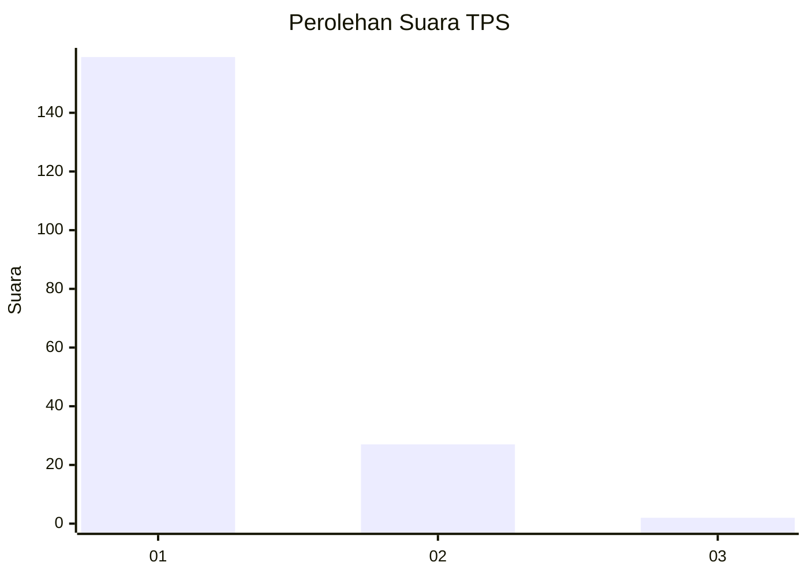
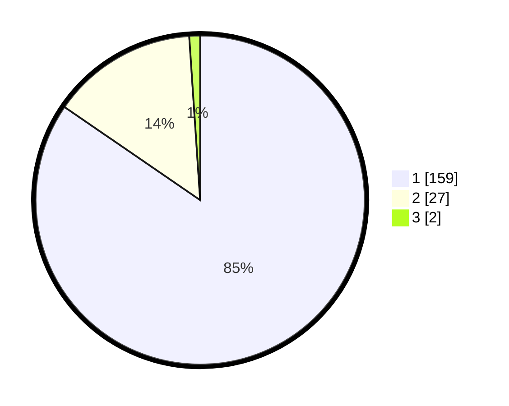

# Hasil

## Grafik

## Tabel

| No. | Nama Paslon    | Suara | Suara (raw) | Persentase |
|:--- |:-------------- | -----:| -----------:| ----------:|
| 1   | ANIES MUHAIMIN | 159   | [159][p-1]  | 84,57      |
| 2   | PRABOWO GIBRAN | 27    | [27][p-2]   | 14,36      |
| 3   | GANJAR MAHFUD  | 2     | [2][p-3]    | 1,06       |

[p-1]: https://github.com/gigit-pemilu/pemilu-2024-11-aceh/blob/main/pilpres/hitung-suara/sub/11-aceh/sub/71-kota-banda-aceh/sub/06-kuta-raja/sub/2004-lampaseh-kota/sub/005-tps/sub/paslon-1.txt
[p-2]: https://github.com/gigit-pemilu/pemilu-2024-11-aceh/blob/main/pilpres/hitung-suara/sub/11-aceh/sub/71-kota-banda-aceh/sub/06-kuta-raja/sub/2004-lampaseh-kota/sub/005-tps/sub/paslon-2.txt
[p-3]: https://github.com/gigit-pemilu/pemilu-2024-11-aceh/blob/main/pilpres/hitung-suara/sub/11-aceh/sub/71-kota-banda-aceh/sub/06-kuta-raja/sub/2004-lampaseh-kota/sub/005-tps/sub/paslon-3.txt

## Foto C Plano

https://sirekap-obj-formc.kpu.go.id/e7b2/pemilu/ppwp/11/71/06/20/04/1171062004005-20240217-123617--9627da7e-2832-42ca-9333-2e38d491dc14.jpg

https://sirekap-obj-formc.kpu.go.id/e7b2/pemilu/ppwp/11/71/06/20/04/1171062004005-20240217-123710--9eac4a8b-b94c-4874-bffe-b1c6a5f4e167.jpg

https://sirekap-obj-formc.kpu.go.id/e7b2/pemilu/ppwp/11/71/06/20/04/1171062004005-20240217-123754--68f85003-a21a-4318-a99f-62541a14ad3e.jpg

## Metadata

| Key        | Value               |
| ---------- | ------------------- |
| Time Stamp | 2024-02-17 18:30:00 |

