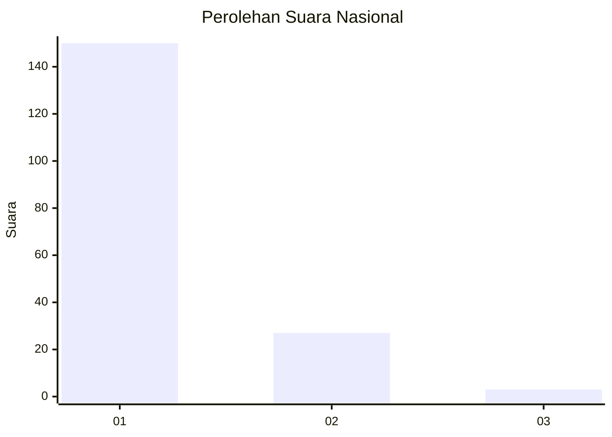
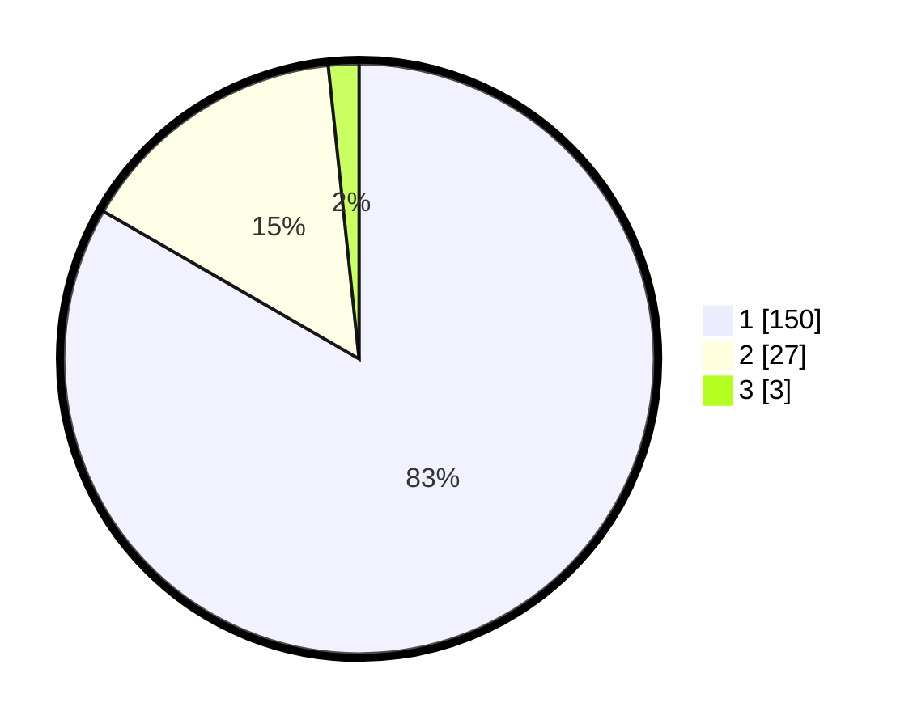

# Hasil

## Grafik

## Tabel

| No. | Nama Paslon    | Suara | Suara (raw) | Persentase |
|:--- |:-------------- | -----:| -----------:| ----------:|
| 1   | ANIES MUHAIMIN | 150   | [150][p-1]  | 83,33      |
| 2   | PRABOWO GIBRAN | 27    | [27][p-2]   | 15,00      |
| 3   | GANJAR MAHFUD  | 3     | [3][p-3]    | 1,67       |

[p-1]: https://github.com/gigit-pemilu/pemilu-2024/blob/main/pilpres/hitung-suara/sub/11-aceh/sub/71-kota-banda-aceh/sub/06-kuta-raja/sub/2004-lampaseh-kota/sub/006-tps/sub/paslon-1.txt
[p-2]: https://github.com/gigit-pemilu/pemilu-2024/blob/main/pilpres/hitung-suara/sub/11-aceh/sub/71-kota-banda-aceh/sub/06-kuta-raja/sub/2004-lampaseh-kota/sub/006-tps/sub/paslon-2.txt
[p-3]: https://github.com/gigit-pemilu/pemilu-2024/blob/main/pilpres/hitung-suara/sub/11-aceh/sub/71-kota-banda-aceh/sub/06-kuta-raja/sub/2004-lampaseh-kota/sub/006-tps/sub/paslon-3.txt

## Foto C Plano

https://sirekap-obj-formc.kpu.go.id/3808/pemilu/ppwp/11/71/06/20/04/1171062004006-20240217-123932--20660d00-ad10-4ceb-ad88-37569477c9b6.jpg

https://sirekap-obj-formc.kpu.go.id/3808/pemilu/ppwp/11/71/06/20/04/1171062004006-20240217-124023--f09d9e21-2418-45dd-86f3-e6bc807e6e6e.jpg

https://sirekap-obj-formc.kpu.go.id/3808/pemilu/ppwp/11/71/06/20/04/1171062004006-20240217-124205--ff28dee3-beee-4862-ba69-cbaac9cf3634.jpg

## Metadata

| Key        | Value               |
| ---------- | ------------------- |
| Time Stamp | 2024-02-17 18:30:00 |

