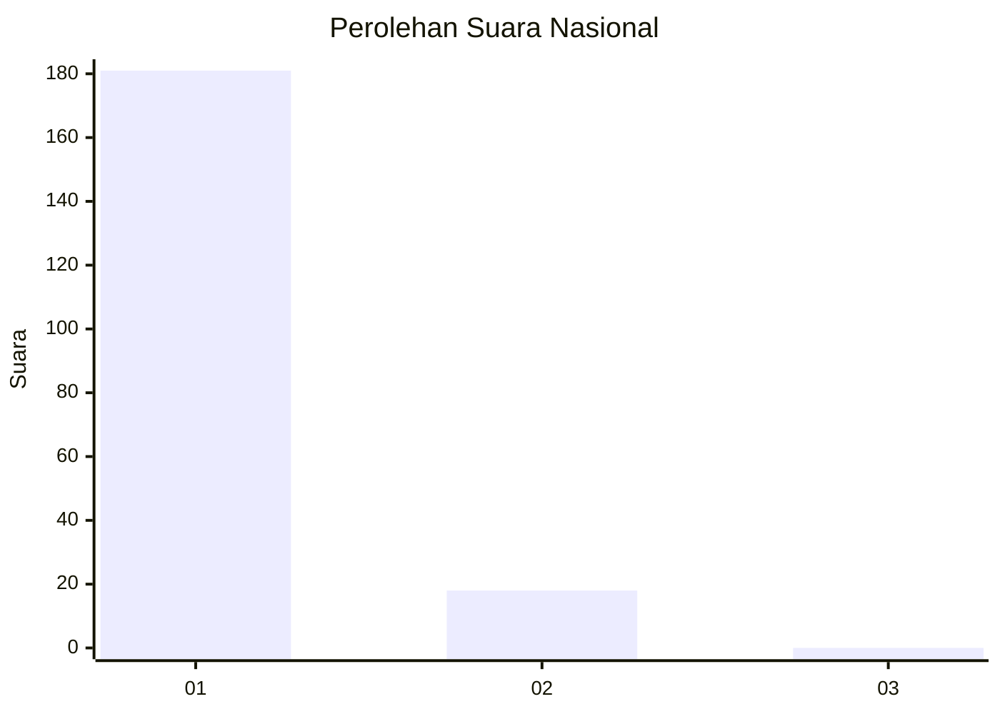
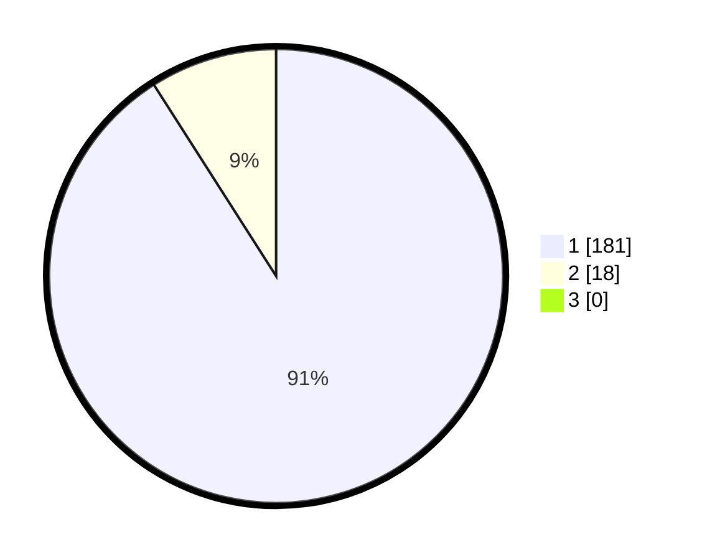

# Hasil

## Grafik

## Tabel

| No. | Nama Paslon    | Suara | Suara (raw) | Persentase |
|:--- |:-------------- | -----:| -----------:| ----------:|
| 1   | ANIES MUHAIMIN | 181   | [181][p-1]  | 90,95      |
| 2   | PRABOWO GIBRAN | 18    | [18][p-2]   | 9,05       |
| 3   | GANJAR MAHFUD  | 0     | [0][p-3]    | 0,00       |

[p-1]: https://github.com/gigit-pemilu/pemilu-2024/blob/main/pilpres/hitung-suara/sub/11-aceh/sub/71-kota-banda-aceh/sub/06-kuta-raja/sub/2005-gampong-pande/sub/002-tps/sub/paslon-1.txt
[p-2]: https://github.com/gigit-pemilu/pemilu-2024/blob/main/pilpres/hitung-suara/sub/11-aceh/sub/71-kota-banda-aceh/sub/06-kuta-raja/sub/2005-gampong-pande/sub/002-tps/sub/paslon-2.txt
[p-3]: https://github.com/gigit-pemilu/pemilu-2024/blob/main/pilpres/hitung-suara/sub/11-aceh/sub/71-kota-banda-aceh/sub/06-kuta-raja/sub/2005-gampong-pande/sub/002-tps/sub/paslon-3.txt

## Foto C Plano

https://sirekap-obj-formc.kpu.go.id/f498/pemilu/ppwp/11/71/06/20/05/1171062005002-20240216-110823--9cfc6740-6775-4200-ac89-841486b3b9ff.jpg

https://sirekap-obj-formc.kpu.go.id/f498/pemilu/ppwp/11/71/06/20/05/1171062005002-20240216-110858--f8c371b8-e673-4587-ab8b-3a27da936cc8.jpg

https://sirekap-obj-formc.kpu.go.id/f498/pemilu/ppwp/11/71/06/20/05/1171062005002-20240216-110933--148e4769-9df5-45d5-bdf0-401a207ad30a.jpg

## Metadata

| Key        | Value               |
| ---------- | ------------------- |
| Time Stamp | 2024-02-16 16:25:10 |

