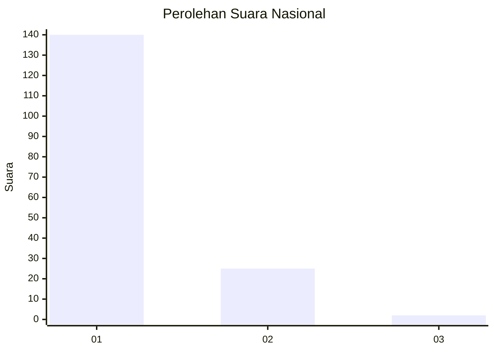
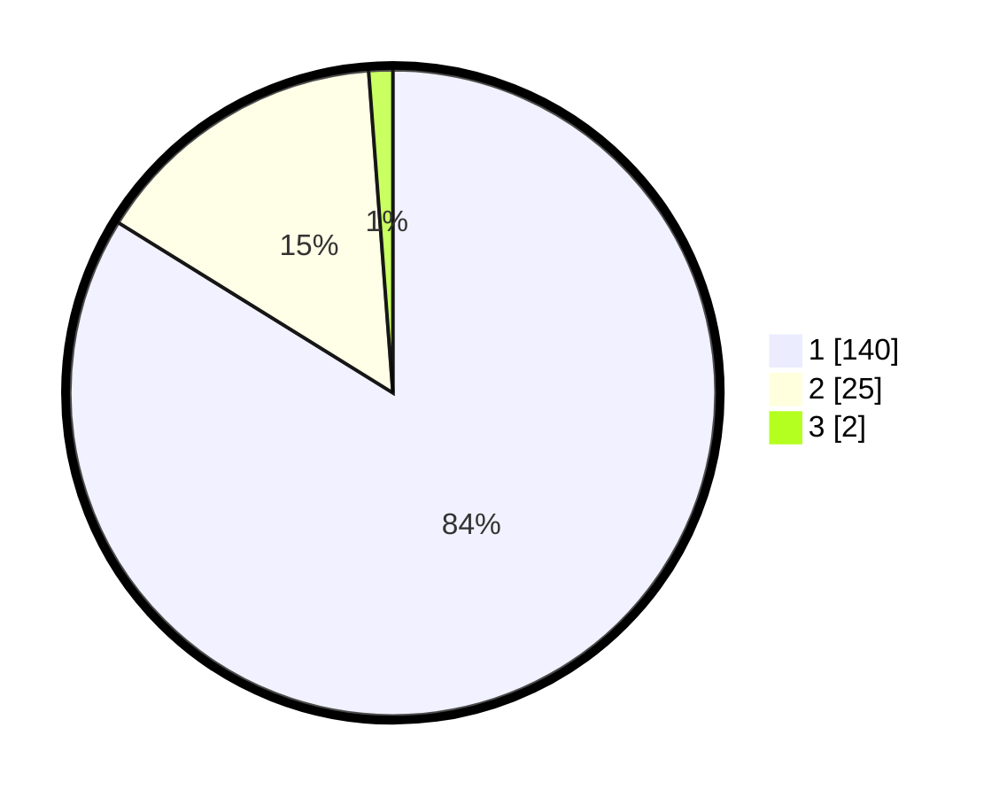

# Hasil

## Grafik

## Tabel

| No. | Nama Paslon    | Suara | Suara (raw) | Persentase |
|:--- |:-------------- | -----:| -----------:| ----------:|
| 1   | ANIES MUHAIMIN | 140   | [140][p-1]  | 83,83      |
| 2   | PRABOWO GIBRAN | 25    | [25][p-2]   | 14,97      |
| 3   | GANJAR MAHFUD  | 2     | [2][p-3]    | 1,20       |

[p-1]: https://github.com/gigit-pemilu/pemilu-2024/blob/main/pilpres/hitung-suara/sub/11-aceh/sub/71-kota-banda-aceh/sub/06-kuta-raja/sub/2005-gampong-pande/sub/003-tps/sub/paslon-1.txt
[p-2]: https://github.com/gigit-pemilu/pemilu-2024/blob/main/pilpres/hitung-suara/sub/11-aceh/sub/71-kota-banda-aceh/sub/06-kuta-raja/sub/2005-gampong-pande/sub/003-tps/sub/paslon-2.txt
[p-3]: https://github.com/gigit-pemilu/pemilu-2024/blob/main/pilpres/hitung-suara/sub/11-aceh/sub/71-kota-banda-aceh/sub/06-kuta-raja/sub/2005-gampong-pande/sub/003-tps/sub/paslon-3.txt

## Foto C Plano

https://sirekap-obj-formc.kpu.go.id/29e4/pemilu/ppwp/11/71/06/20/05/1171062005003-20240214-220415--7e897e34-3e21-413b-8cb8-7cebf7755fbe.jpg

https://sirekap-obj-formc.kpu.go.id/29e4/pemilu/ppwp/11/71/06/20/05/1171062005003-20240216-114654--8e9b5a8f-79b1-4c3a-a79b-6b4f12408c3a.jpg

https://sirekap-obj-formc.kpu.go.id/29e4/pemilu/ppwp/11/71/06/20/05/1171062005003-20240216-114758--a5790c47-e9de-4c41-852c-943358ce4533.jpg

## Metadata

| Key        | Value               |
| ---------- | ------------------- |
| Time Stamp | 2024-02-16 16:25:10 |

