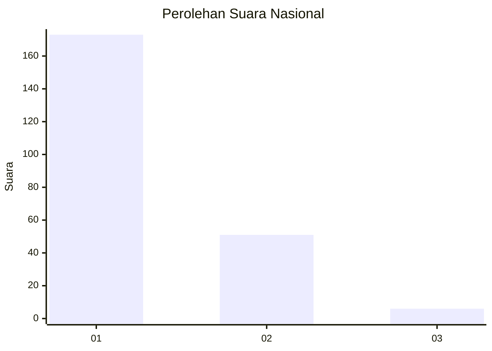
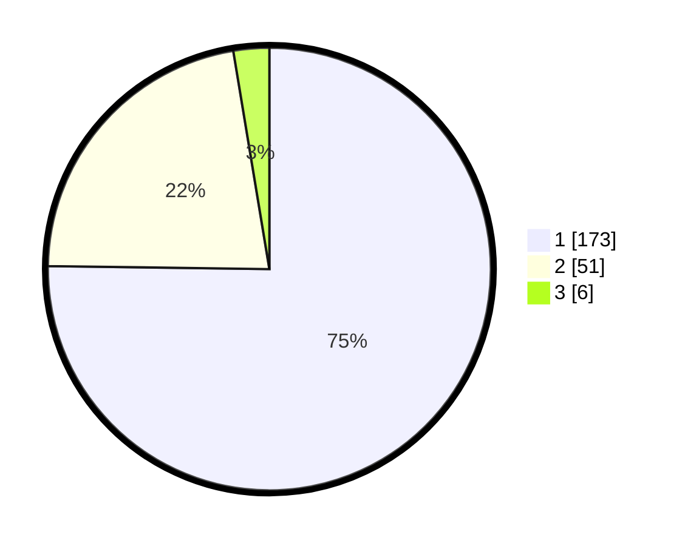

# Hasil

## Grafik

## Tabel

| No. | Nama Paslon    | Suara | Suara (raw) | Persentase |
|:--- |:-------------- | -----:| -----------:| ----------:|
| 1   | ANIES MUHAIMIN | 173   | [173][p-1]  | 75,22      |
| 2   | PRABOWO GIBRAN | 51    | [51][p-2]   | 22,17      |
| 3   | GANJAR MAHFUD  | 6     | [6][p-3]    | 2,61       |

[p-1]: https://github.com/gigit-pemilu/pemilu-2024/blob/main/pilpres/hitung-suara/sub/11-aceh/sub/71-kota-banda-aceh/sub/06-kuta-raja/sub/2006-gampong-jawa/sub/001-tps/sub/paslon-1.txt
[p-2]: https://github.com/gigit-pemilu/pemilu-2024/blob/main/pilpres/hitung-suara/sub/11-aceh/sub/71-kota-banda-aceh/sub/06-kuta-raja/sub/2006-gampong-jawa/sub/001-tps/sub/paslon-2.txt
[p-3]: https://github.com/gigit-pemilu/pemilu-2024/blob/main/pilpres/hitung-suara/sub/11-aceh/sub/71-kota-banda-aceh/sub/06-kuta-raja/sub/2006-gampong-jawa/sub/001-tps/sub/paslon-3.txt

## Foto C Plano

https://sirekap-obj-formc.kpu.go.id/a5c5/pemilu/ppwp/11/71/06/20/06/1171062006001-20240220-213356--1a8d7ed1-0739-48a7-a46a-c6ad8d5ae443.jpg

https://sirekap-obj-formc.kpu.go.id/a5c5/pemilu/ppwp/11/71/06/20/06/1171062006001-20240220-213501--7886c40f-9703-4a2e-a9b5-32c897b12c3d.jpg

https://sirekap-obj-formc.kpu.go.id/a5c5/pemilu/ppwp/11/71/06/20/06/1171062006001-20240220-213616--00278000-ca90-4dfe-9ef1-49cae73bfa1c.jpg

## Metadata

| Key        | Value               |
| ---------- | ------------------- |
| Time Stamp | 2024-02-24 22:31:28 |

