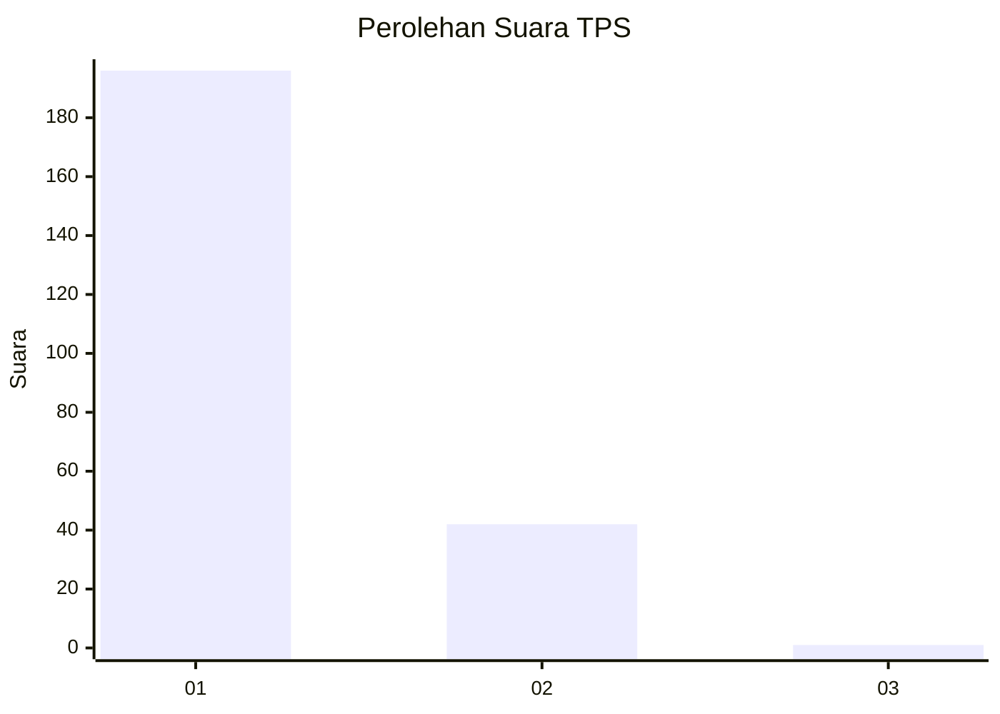
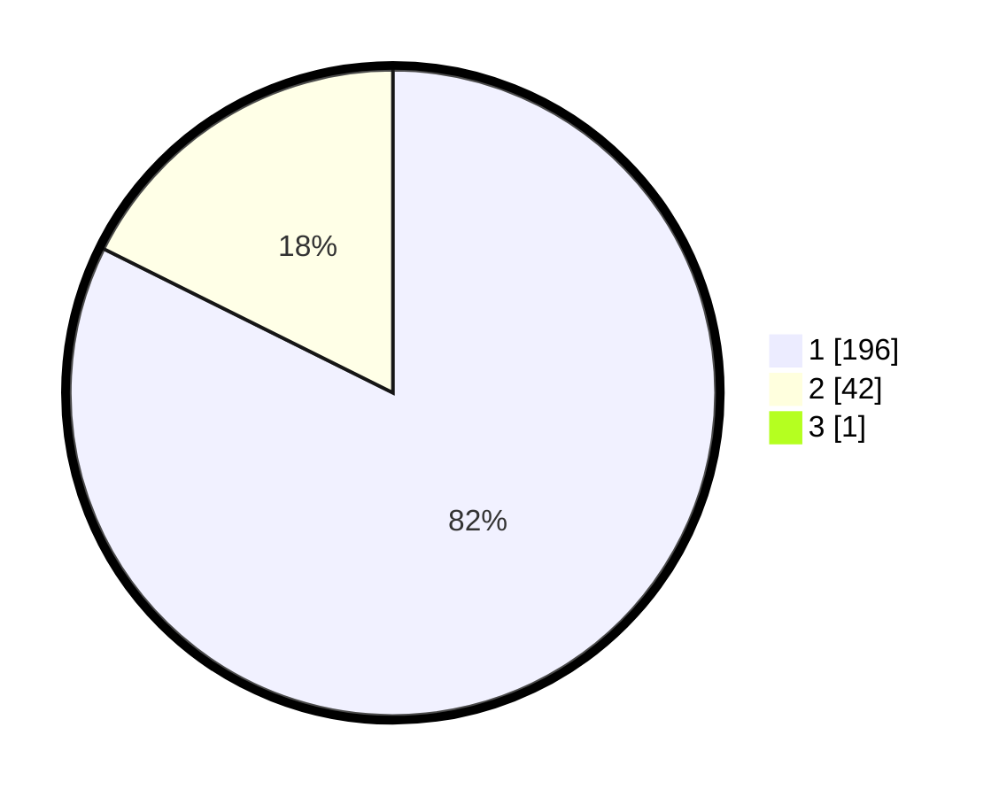

# Hasil

## Grafik

## Tabel

| No. | Nama Paslon    | Suara | Suara (raw) | Persentase |
|:--- |:-------------- | -----:| -----------:| ----------:|
| 1   | ANIES MUHAIMIN | 196   | [196][p-1]  | 82,01      |
| 2   | PRABOWO GIBRAN | 42    | [42][p-2]   | 17,57      |
| 3   | GANJAR MAHFUD  | 1     | [1][p-3]    | 0,42       |

[p-1]: https://github.com/gigit-pemilu/pemilu-2024-11-aceh/blob/main/pilpres/hitung-suara/sub/11-aceh/sub/71-kota-banda-aceh/sub/06-kuta-raja/sub/2006-gampong-jawa/sub/002-tps/sub/paslon-1.txt
[p-2]: https://github.com/gigit-pemilu/pemilu-2024-11-aceh/blob/main/pilpres/hitung-suara/sub/11-aceh/sub/71-kota-banda-aceh/sub/06-kuta-raja/sub/2006-gampong-jawa/sub/002-tps/sub/paslon-2.txt
[p-3]: https://github.com/gigit-pemilu/pemilu-2024-11-aceh/blob/main/pilpres/hitung-suara/sub/11-aceh/sub/71-kota-banda-aceh/sub/06-kuta-raja/sub/2006-gampong-jawa/sub/002-tps/sub/paslon-3.txt

## Foto C Plano

https://sirekap-obj-formc.kpu.go.id/b658/pemilu/ppwp/11/71/06/20/06/1171062006002-20240220-214115--8753718b-6717-4d54-81ff-f0f644f8c9ad.jpg

https://sirekap-obj-formc.kpu.go.id/b658/pemilu/ppwp/11/71/06/20/06/1171062006002-20240220-214325--0d068c47-85f5-437a-9eb2-0cbbe1eba2fb.jpg

https://sirekap-obj-formc.kpu.go.id/b658/pemilu/ppwp/11/71/06/20/06/1171062006002-20240220-214421--d87941e3-e54f-4c1e-806e-98738a9c5a93.jpg

## Metadata

| Key        | Value               |
| ---------- | ------------------- |
| Time Stamp | 2024-02-24 22:31:28 |

