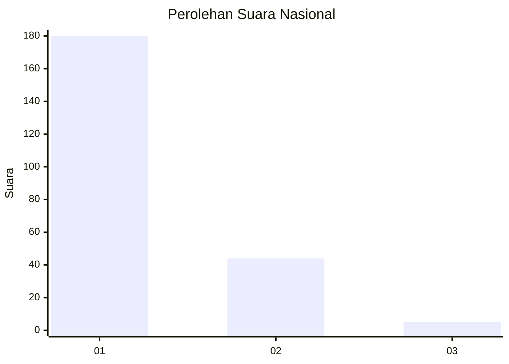
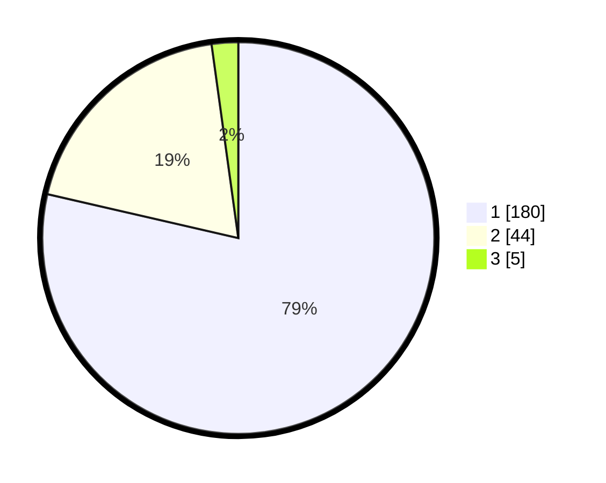

# Hasil

## Grafik

## Tabel

| No. | Nama Paslon    | Suara | Suara (raw) | Persentase |
|:--- |:-------------- | -----:| -----------:| ----------:|
| 1   | ANIES MUHAIMIN | 180   | [180][p-1]  | 78,60      |
| 2   | PRABOWO GIBRAN | 44    | [44][p-2]   | 19,21      |
| 3   | GANJAR MAHFUD  | 5     | [5][p-3]    | 2,18       |

[p-1]: https://github.com/gigit-pemilu/pemilu-2024/blob/main/pilpres/hitung-suara/sub/11-aceh/sub/71-kota-banda-aceh/sub/06-kuta-raja/sub/2006-gampong-jawa/sub/004-tps/sub/paslon-1.txt
[p-2]: https://github.com/gigit-pemilu/pemilu-2024/blob/main/pilpres/hitung-suara/sub/11-aceh/sub/71-kota-banda-aceh/sub/06-kuta-raja/sub/2006-gampong-jawa/sub/004-tps/sub/paslon-2.txt
[p-3]: https://github.com/gigit-pemilu/pemilu-2024/blob/main/pilpres/hitung-suara/sub/11-aceh/sub/71-kota-banda-aceh/sub/06-kuta-raja/sub/2006-gampong-jawa/sub/004-tps/sub/paslon-3.txt

## Foto C Plano

https://sirekap-obj-formc.kpu.go.id/943c/pemilu/ppwp/11/71/06/20/06/1171062006004-20240220-215009--ec84feb3-b719-42c5-b40e-26743cb047ec.jpg

https://sirekap-obj-formc.kpu.go.id/943c/pemilu/ppwp/11/71/06/20/06/1171062006004-20240220-215126--683c3d67-06a7-427b-bde2-0ab1ea37b62e.jpg

https://sirekap-obj-formc.kpu.go.id/943c/pemilu/ppwp/11/71/06/20/06/1171062006004-20240220-215234--04bca837-6308-4850-ae1d-e40dab0c4187.jpg

## Metadata

| Key        | Value               |
| ---------- | ------------------- |
| Time Stamp | 2024-02-24 22:31:28 |

