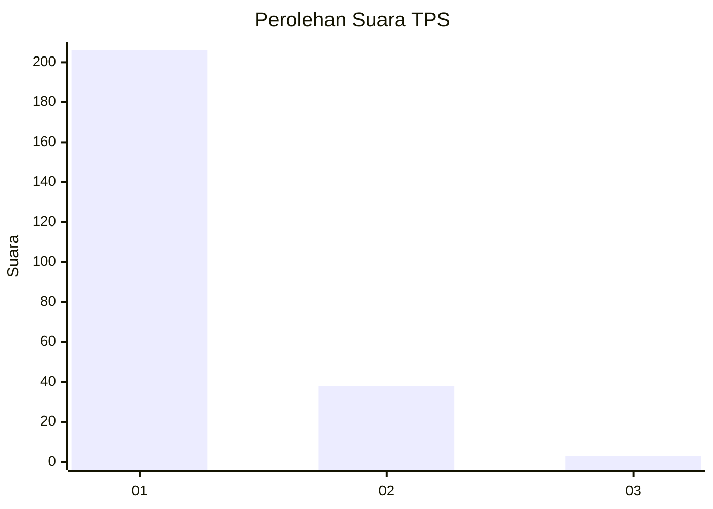
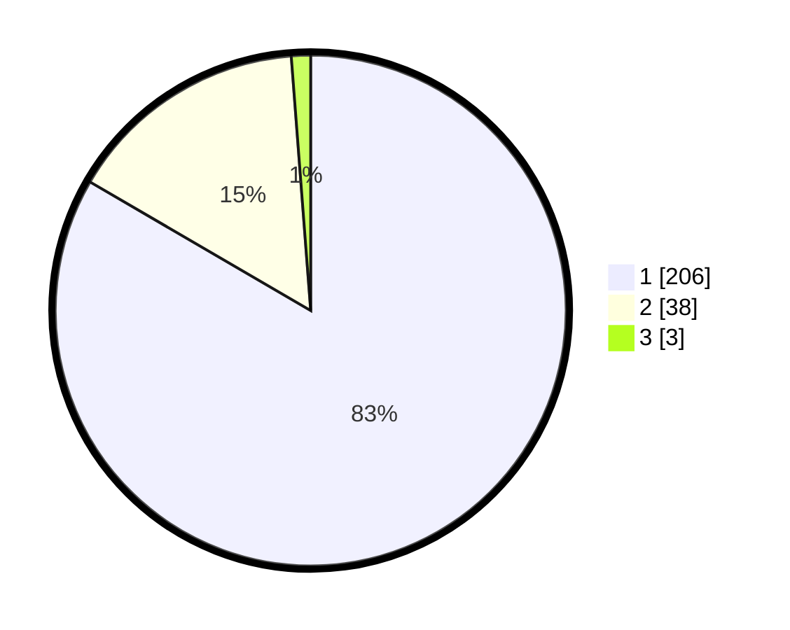

# Hasil

## Grafik

## Tabel

| No. | Nama Paslon    | Suara | Suara (raw) | Persentase |
|:--- |:-------------- | -----:| -----------:| ----------:|
| 1   | ANIES MUHAIMIN | 206   | [206][p-1]  | 83,40      |
| 2   | PRABOWO GIBRAN | 38    | [38][p-2]   | 15,38      |
| 3   | GANJAR MAHFUD  | 3     | [3][p-3]    | 1,21       |

[p-1]: https://github.com/gigit-pemilu/pemilu-2024-11-aceh/blob/main/pilpres/hitung-suara/sub/11-aceh/sub/71-kota-banda-aceh/sub/06-kuta-raja/sub/2006-gampong-jawa/sub/005-tps/sub/paslon-1.txt
[p-2]: https://github.com/gigit-pemilu/pemilu-2024-11-aceh/blob/main/pilpres/hitung-suara/sub/11-aceh/sub/71-kota-banda-aceh/sub/06-kuta-raja/sub/2006-gampong-jawa/sub/005-tps/sub/paslon-2.txt
[p-3]: https://github.com/gigit-pemilu/pemilu-2024-11-aceh/blob/main/pilpres/hitung-suara/sub/11-aceh/sub/71-kota-banda-aceh/sub/06-kuta-raja/sub/2006-gampong-jawa/sub/005-tps/sub/paslon-3.txt

## Foto C Plano

https://sirekap-obj-formc.kpu.go.id/57f7/pemilu/ppwp/11/71/06/20/06/1171062006005-20240220-215434--44c57dca-88cf-4e9f-a4dc-a7fe5242d913.jpg

https://sirekap-obj-formc.kpu.go.id/57f7/pemilu/ppwp/11/71/06/20/06/1171062006005-20240220-215527--738f505b-ec7d-4719-8cae-4876f4d975e4.jpg

https://sirekap-obj-formc.kpu.go.id/57f7/pemilu/ppwp/11/71/06/20/06/1171062006005-20240220-215640--bc3a6104-078c-4a87-ab0c-866179ef292e.jpg

## Metadata

| Key        | Value               |
| ---------- | ------------------- |
| Time Stamp | 2024-02-24 22:31:28 |

