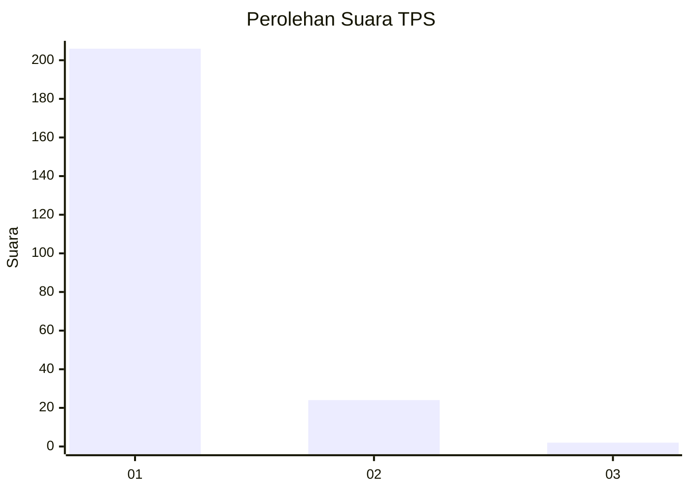
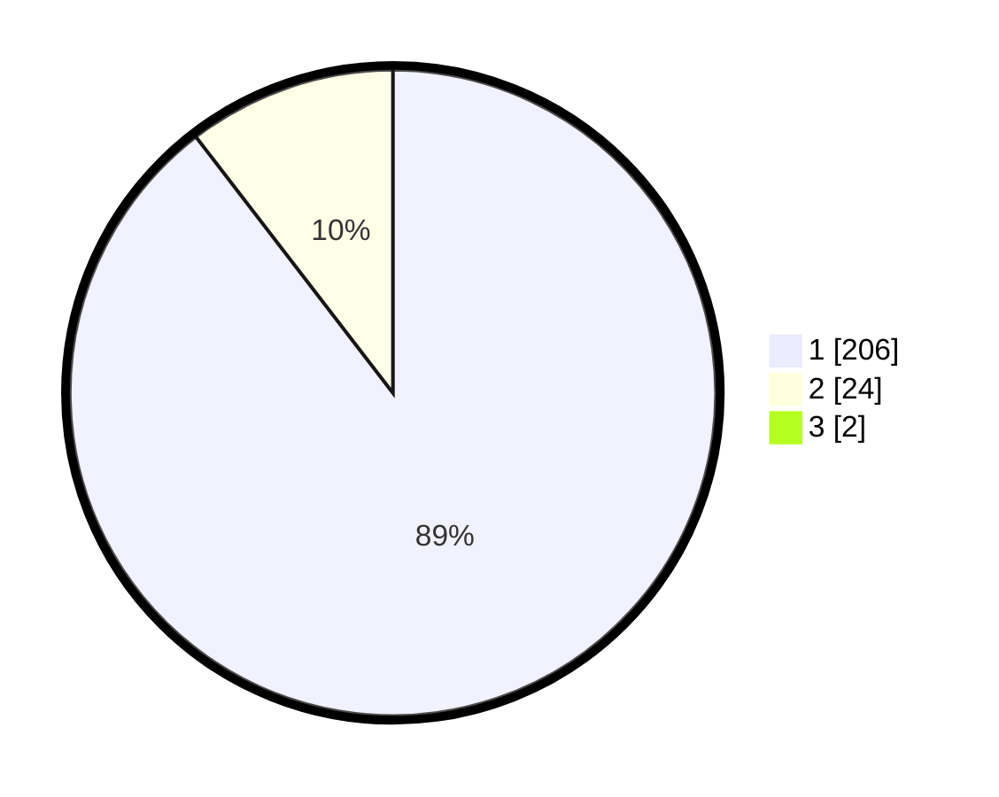

# Hasil

## Grafik

## Tabel

| No. | Nama Paslon    | Suara | Suara (raw) | Persentase |
|:--- |:-------------- | -----:| -----------:| ----------:|
| 1   | ANIES MUHAIMIN | 206   | [206][p-1]  | 88,79      |
| 2   | PRABOWO GIBRAN | 24    | [24][p-2]   | 10,34      |
| 3   | GANJAR MAHFUD  | 2     | [2][p-3]    | 0,86       |

[p-1]: https://github.com/gigit-pemilu/pemilu-2024-11-aceh/blob/main/pilpres/hitung-suara/sub/11-aceh/sub/71-kota-banda-aceh/sub/07-banda-raya/sub/2001-geuceu-komplek/sub/002-tps/sub/paslon-1.txt
[p-2]: https://github.com/gigit-pemilu/pemilu-2024-11-aceh/blob/main/pilpres/hitung-suara/sub/11-aceh/sub/71-kota-banda-aceh/sub/07-banda-raya/sub/2001-geuceu-komplek/sub/002-tps/sub/paslon-2.txt
[p-3]: https://github.com/gigit-pemilu/pemilu-2024-11-aceh/blob/main/pilpres/hitung-suara/sub/11-aceh/sub/71-kota-banda-aceh/sub/07-banda-raya/sub/2001-geuceu-komplek/sub/002-tps/sub/paslon-3.txt

## Foto C Plano

https://sirekap-obj-formc.kpu.go.id/635f/pemilu/ppwp/11/71/07/20/01/1171072001002-20240219-142436--602b9b17-f064-4dc1-95d2-645d7ce2ebdd.jpg

https://sirekap-obj-formc.kpu.go.id/635f/pemilu/ppwp/11/71/07/20/01/1171072001002-20240219-142711--2eea840f-7824-4dd5-be9c-b6669678fbd2.jpg

https://sirekap-obj-formc.kpu.go.id/635f/pemilu/ppwp/11/71/07/20/01/1171072001002-20240219-143108--dfdb5653-6c41-4577-92b7-a6660d995a13.jpg

## Metadata

| Key        | Value               |
| ---------- | ------------------- |
| Time Stamp | 2024-02-19 17:00:00 |

## DATA PEMILIH TETAP

Jumlah pemilih dalam DPT: **277**.
 * L: **229**.
 * P: **248**.

## DATA PENGGUNA HAK PILIH

Jumlah pengguna hak pilih dalam DPT: **217**.
 * L: **39**.
 * P: **122**.

Jumlah pengguna hak pilih dalam DPTb: **853**.
 * L: **85**.
 * P: **2**.

Jumlah pengguna hak pilih dalam DPK: **5**.
 * L: **3**.
 * P: **2**.

Jumlah pengguna hak pilih: **234**.
 * L: **109**.
 * P: **125**.

## JUMLAH SUARA SAH DAN TIDAK SAH

JUMLAH SELURUH SUARA SAH: **232**.

JUMLAH SUARA TIDAK SAH: **2**.

JUMLAH SELURUH SUARA SAH DAN SUARA TIDAK SAH: **234**.

