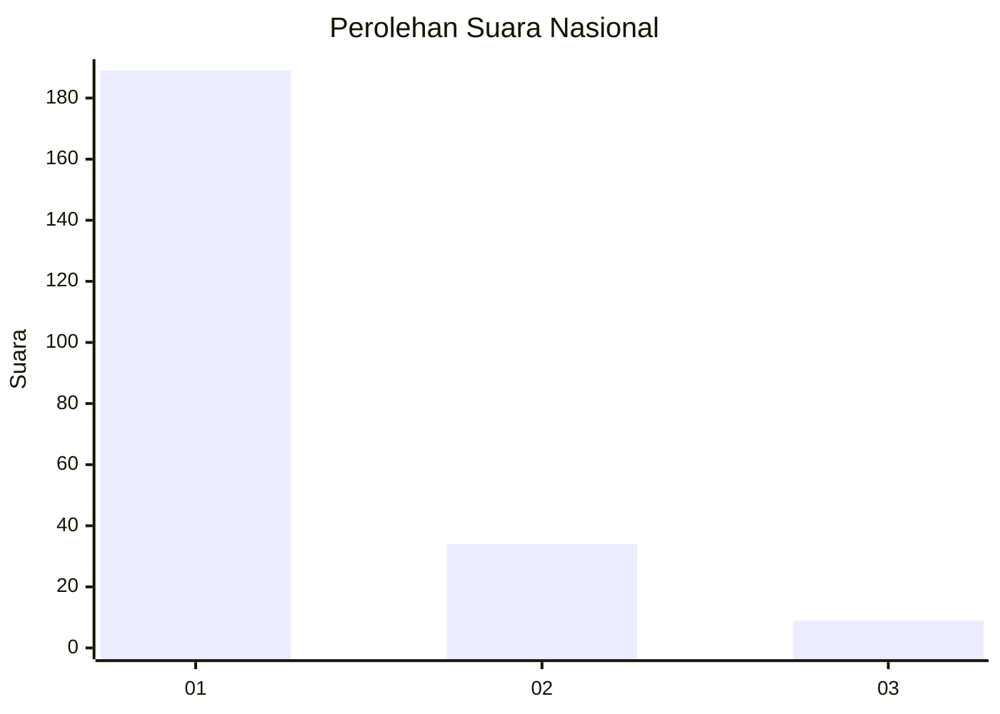
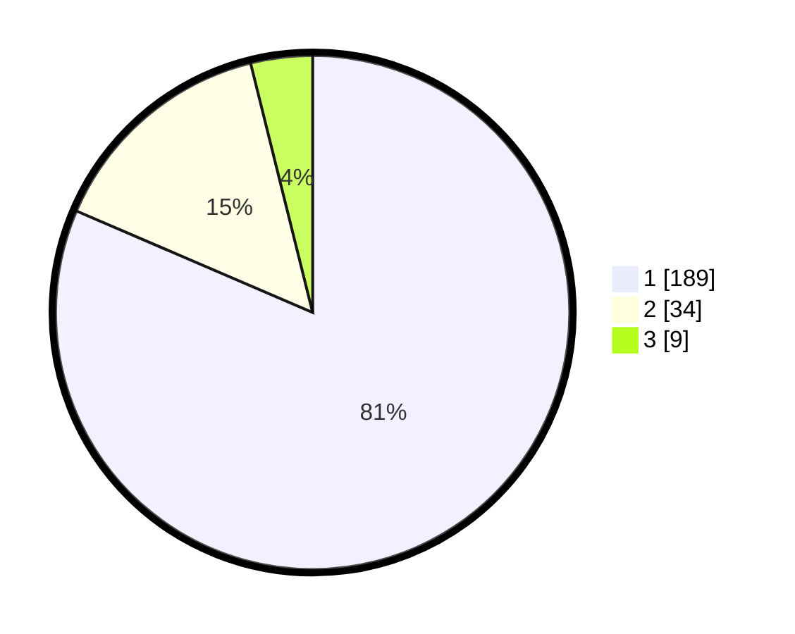

# Hasil

## Grafik

## Tabel

| No. | Nama Paslon    | Suara | Suara (raw) | Persentase |
|:--- |:-------------- | -----:| -----------:| ----------:|
| 1   | ANIES MUHAIMIN | 189   | [189][p-1]  | 81,47      |
| 2   | PRABOWO GIBRAN | 34    | [34][p-2]   | 14,66      |
| 3   | GANJAR MAHFUD  | 9     | [9][p-3]    | 3,88       |

[p-1]: https://github.com/gigit-pemilu/pemilu-2024/blob/main/pilpres/hitung-suara/sub/11-aceh/sub/71-kota-banda-aceh/sub/07-banda-raya/sub/2001-geuceu-komplek/sub/005-tps/sub/paslon-1.txt
[p-2]: https://github.com/gigit-pemilu/pemilu-2024/blob/main/pilpres/hitung-suara/sub/11-aceh/sub/71-kota-banda-aceh/sub/07-banda-raya/sub/2001-geuceu-komplek/sub/005-tps/sub/paslon-2.txt
[p-3]: https://github.com/gigit-pemilu/pemilu-2024/blob/main/pilpres/hitung-suara/sub/11-aceh/sub/71-kota-banda-aceh/sub/07-banda-raya/sub/2001-geuceu-komplek/sub/005-tps/sub/paslon-3.txt

## Foto C Plano

https://sirekap-obj-formc.kpu.go.id/b33b/pemilu/ppwp/11/71/07/20/01/1171072001005-20240214-190138--c2d1c7a6-bbc7-4097-abd1-d60aa0af9cbc.jpg

https://sirekap-obj-formc.kpu.go.id/b33b/pemilu/ppwp/11/71/07/20/01/1171072001005-20240214-184556--c8cbf6b3-879d-4508-bd50-a7af7479da03.jpg

https://sirekap-obj-formc.kpu.go.id/b33b/pemilu/ppwp/11/71/07/20/01/1171072001005-20240214-184639--e52afdce-50a3-4e47-b554-6248f959c5ec.jpg

## Metadata

| Key        | Value               |
| ---------- | ------------------- |
| Time Stamp | 2024-02-15 09:00:24 |

## DATA PEMILIH TETAP

Jumlah pemilih dalam DPT: **282**.
 * L: **132**.
 * P: **150**.

## DATA PENGGUNA HAK PILIH

Jumlah pengguna hak pilih dalam DPT: **233**.
 * L: **108**.
 * P: **125**.

Jumlah pengguna hak pilih dalam DPTb: **0**.
 * L: **0**.
 * P: **0**.

Jumlah pengguna hak pilih dalam DPK: **1**.
 * L: **0**.
 * P: **1**.

Jumlah pengguna hak pilih: **234**.
 * L: **108**.
 * P: **126**.

## JUMLAH SUARA SAH DAN TIDAK SAH

JUMLAH SELURUH SUARA SAH: **232**.

JUMLAH SUARA TIDAK SAH: **2**.

JUMLAH SELURUH SUARA SAH DAN SUARA TIDAK SAH: **234**.

