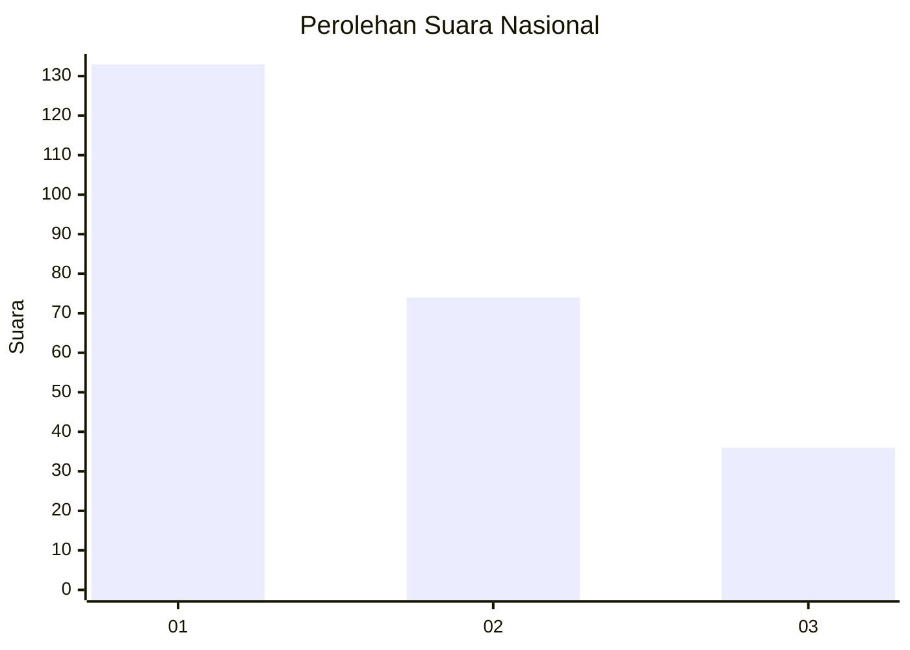
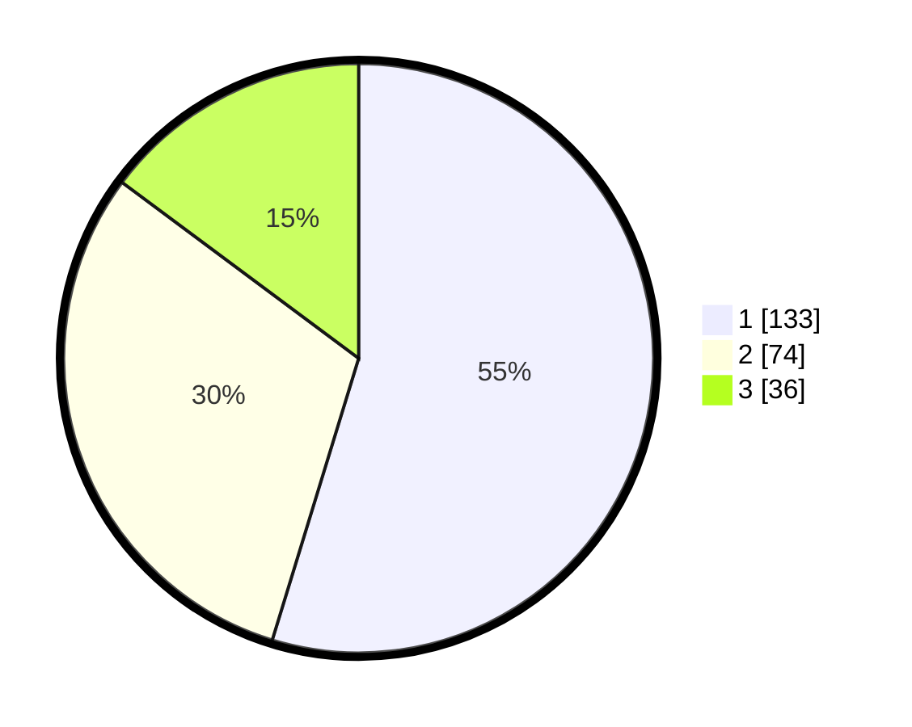

# Hasil

## Grafik

## Tabel

| No. | Nama Paslon    | Suara | Suara (raw) | Persentase |
|:--- |:-------------- | -----:| -----------:| ----------:|
| 1   | ANIES MUHAIMIN | 133   | [133][p-1]  | 54,73      |
| 2   | PRABOWO GIBRAN | 74    | [74][p-2]   | 30,45      |
| 3   | GANJAR MAHFUD  | 36    | [36][p-3]   | 14,81      |

[p-1]: https://github.com/gigit-pemilu/pemilu-2024/blob/main/pilpres/hitung-suara/sub/11-aceh/sub/71-kota-banda-aceh/sub/07-banda-raya/sub/2002-lamlagang/sub/003-tps/sub/paslon-1.txt
[p-2]: https://github.com/gigit-pemilu/pemilu-2024/blob/main/pilpres/hitung-suara/sub/11-aceh/sub/71-kota-banda-aceh/sub/07-banda-raya/sub/2002-lamlagang/sub/003-tps/sub/paslon-2.txt
[p-3]: https://github.com/gigit-pemilu/pemilu-2024/blob/main/pilpres/hitung-suara/sub/11-aceh/sub/71-kota-banda-aceh/sub/07-banda-raya/sub/2002-lamlagang/sub/003-tps/sub/paslon-3.txt

## Foto C Plano

https://sirekap-obj-formc.kpu.go.id/c271/pemilu/ppwp/11/71/07/20/02/1171072002003-20240220-215123--62897d90-f9c8-4083-a9df-fcfacb1e399b.jpg

https://sirekap-obj-formc.kpu.go.id/c271/pemilu/ppwp/11/71/07/20/02/1171072002003-20240220-215304--ffda4a2a-3bf0-4dab-b0fd-39378bbeedfa.jpg

https://sirekap-obj-formc.kpu.go.id/c271/pemilu/ppwp/11/71/07/20/02/1171072002003-20240220-215234--9c79a6f2-856b-4139-ab35-e900fb068121.jpg

## Metadata

| Key        | Value               |
| ---------- | ------------------- |
| Time Stamp | 2024-02-20 22:00:00 |

## DATA PEMILIH TETAP

Jumlah pemilih dalam DPT: **379**.
 * L: **374**.
 * P: **345**.

## DATA PENGGUNA HAK PILIH

Jumlah pengguna hak pilih dalam DPT: **208**.
 * L: **98**.
 * P: **870**.

Jumlah pengguna hak pilih dalam DPTb: **877**.
 * L: **6**.
 * P: **857**.

Jumlah pengguna hak pilih dalam DPK: **3**.
 * L: **2**.
 * P: **5**.

Jumlah pengguna hak pilih: **228**.
 * L: **75**.
 * P: **132**.

## JUMLAH SUARA SAH DAN TIDAK SAH

JUMLAH SELURUH SUARA SAH: **227**.

JUMLAH SUARA TIDAK SAH: **1**.

JUMLAH SELURUH SUARA SAH DAN SUARA TIDAK SAH: **228**.

