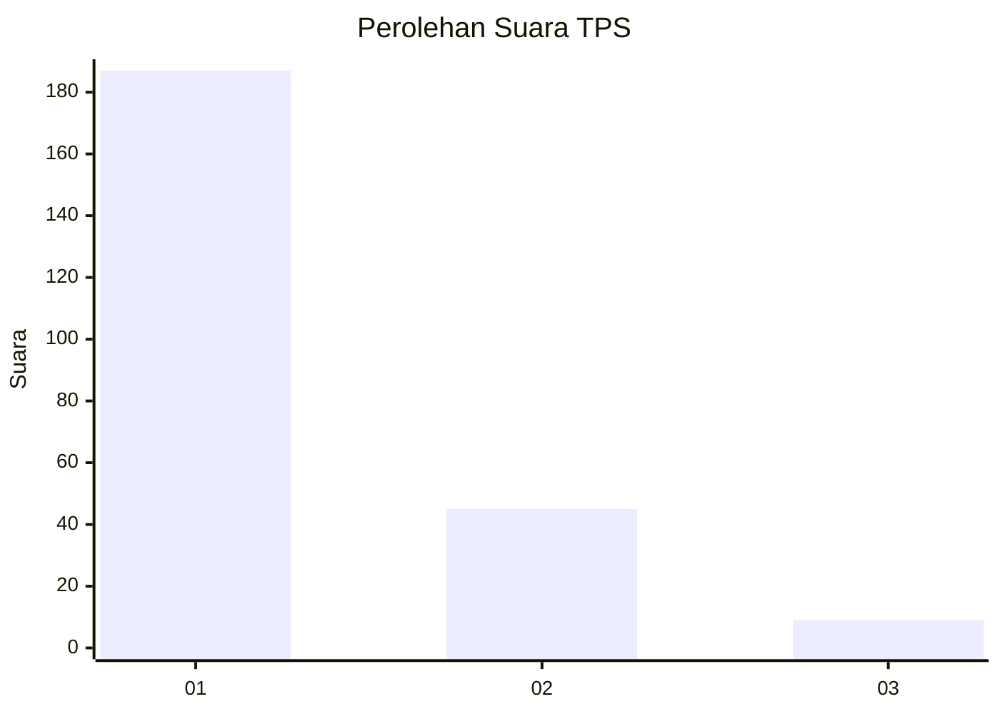
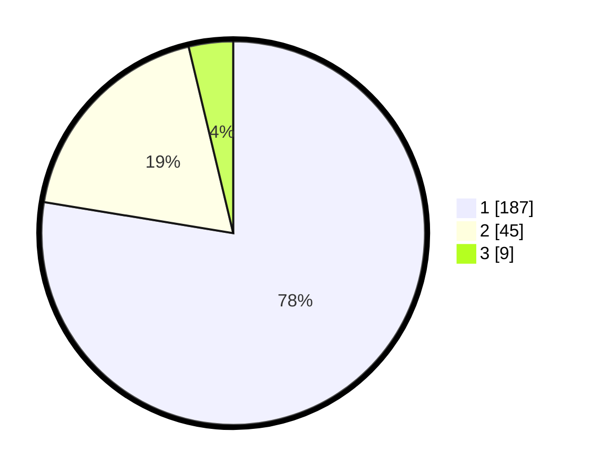

# Hasil

## Grafik

## Tabel

| No. | Nama Paslon    | Suara | Suara (raw) | Persentase |
|:--- |:-------------- | -----:| -----------:| ----------:|
| 1   | ANIES MUHAIMIN | 187   | [187][p-1]  | 77,59      |
| 2   | PRABOWO GIBRAN | 45    | [45][p-2]   | 18,67      |
| 3   | GANJAR MAHFUD  | 9     | [9][p-3]    | 3,73       |

[p-1]: https://github.com/gigit-pemilu/pemilu-2024-11-aceh/blob/main/pilpres/hitung-suara/sub/11-aceh/sub/71-kota-banda-aceh/sub/07-banda-raya/sub/2002-lamlagang/sub/004-tps/sub/paslon-1.txt
[p-2]: https://github.com/gigit-pemilu/pemilu-2024-11-aceh/blob/main/pilpres/hitung-suara/sub/11-aceh/sub/71-kota-banda-aceh/sub/07-banda-raya/sub/2002-lamlagang/sub/004-tps/sub/paslon-2.txt
[p-3]: https://github.com/gigit-pemilu/pemilu-2024-11-aceh/blob/main/pilpres/hitung-suara/sub/11-aceh/sub/71-kota-banda-aceh/sub/07-banda-raya/sub/2002-lamlagang/sub/004-tps/sub/paslon-3.txt

## Foto C Plano

https://sirekap-obj-formc.kpu.go.id/7273/pemilu/ppwp/11/71/07/20/02/1171072002004-20240220-215747--48513a17-4c5a-49fa-89e4-17008f0705e7.jpg

https://sirekap-obj-formc.kpu.go.id/7273/pemilu/ppwp/11/71/07/20/02/1171072002004-20240220-220256--7ada14a0-fc62-41e2-85e6-03232ab14e31.jpg

https://sirekap-obj-formc.kpu.go.id/7273/pemilu/ppwp/11/71/07/20/02/1171072002004-20240220-220441--b4c7cc91-ba00-4ec7-94f2-ac852fc14430.jpg

## Metadata

| Key        | Value               |
| ---------- | ------------------- |
| Time Stamp | 2024-02-21 01:00:00 |

## DATA PEMILIH TETAP

Jumlah pemilih dalam DPT: **277**.
 * L: **120**.
 * P: **157**.

## DATA PENGGUNA HAK PILIH

Jumlah pengguna hak pilih dalam DPT: **231**.
 * L: **95**.
 * P: **136**.

Jumlah pengguna hak pilih dalam DPTb: **13**.
 * L: **887**.
 * P: **806**.

Jumlah pengguna hak pilih dalam DPK: **0**.
 * L: **0**.
 * P: **0**.

Jumlah pengguna hak pilih: **234**.
 * L: **102**.
 * P: **142**.

## JUMLAH SUARA SAH DAN TIDAK SAH

JUMLAH SELURUH SUARA SAH: **241**.

JUMLAH SUARA TIDAK SAH: **3**.

JUMLAH SELURUH SUARA SAH DAN SUARA TIDAK SAH: **244**.

