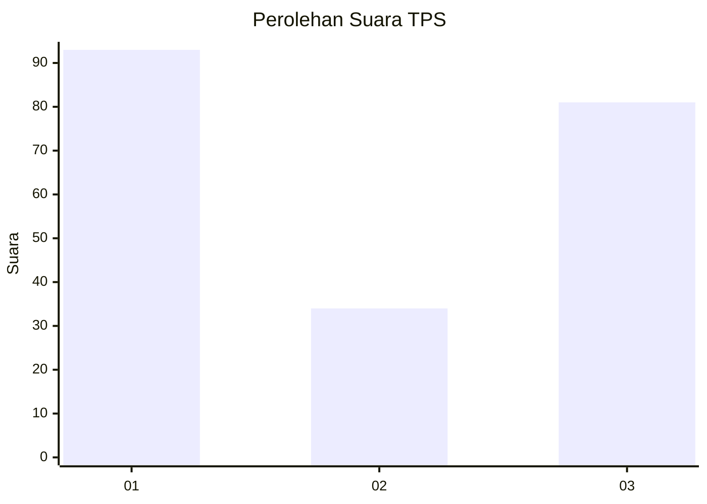
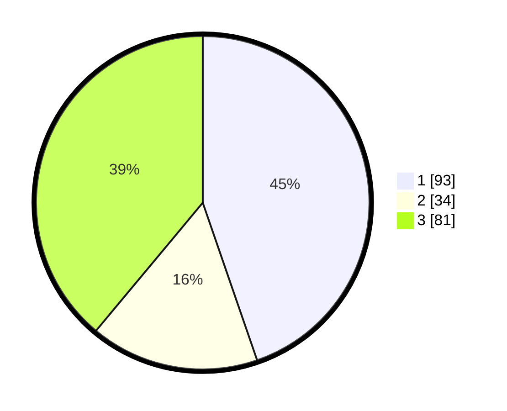

# Hasil

## Grafik

## Tabel

| No. | Nama Paslon    | Suara | Suara (raw) | Persentase |
|:--- |:-------------- | -----:| -----------:| ----------:|
| 1   | ANIES MUHAIMIN | 93    | [93][p-1]   | 44,71      |
| 2   | PRABOWO GIBRAN | 34    | [34][p-2]   | 16,35      |
| 3   | GANJAR MAHFUD  | 81    | [81][p-3]   | 38,94      |

[p-1]: https://github.com/gigit-pemilu/pemilu-2024-11-aceh/blob/main/pilpres/hitung-suara/sub/11-aceh/sub/71-kota-banda-aceh/sub/07-banda-raya/sub/2003-geuceu-iniem/sub/001-tps/sub/paslon-1.txt
[p-2]: https://github.com/gigit-pemilu/pemilu-2024-11-aceh/blob/main/pilpres/hitung-suara/sub/11-aceh/sub/71-kota-banda-aceh/sub/07-banda-raya/sub/2003-geuceu-iniem/sub/001-tps/sub/paslon-2.txt
[p-3]: https://github.com/gigit-pemilu/pemilu-2024-11-aceh/blob/main/pilpres/hitung-suara/sub/11-aceh/sub/71-kota-banda-aceh/sub/07-banda-raya/sub/2003-geuceu-iniem/sub/001-tps/sub/paslon-3.txt

## Foto C Plano

https://sirekap-obj-formc.kpu.go.id/348c/pemilu/ppwp/11/71/07/20/03/1171072003001-20240222-102625--532b25ad-3e77-4e76-9560-bd9c5c6ab1e0.jpg

https://sirekap-obj-formc.kpu.go.id/348c/pemilu/ppwp/11/71/07/20/03/1171072003001-20240222-102820--832a2fa5-f311-4c47-a842-f73c5753ff12.jpg

https://sirekap-obj-formc.kpu.go.id/348c/pemilu/ppwp/11/71/07/20/03/1171072003001-20240222-103449--25c1875c-c893-4c5c-b512-614c3fa233a8.jpg

## Metadata

| Key        | Value               |
| ---------- | ------------------- |
| Time Stamp | 2024-02-22 11:00:00 |

## DATA PEMILIH TETAP

Jumlah pemilih dalam DPT: **377**.
 * L: **125**.
 * P: **352**.

## DATA PENGGUNA HAK PILIH

Jumlah pengguna hak pilih dalam DPT: **32**.
 * L: **343**.
 * P: **123**.

Jumlah pengguna hak pilih dalam DPTb: **85**.
 * L: **5**.
 * P: **301**.

Jumlah pengguna hak pilih dalam DPK: **52**.
 * L: **34**.
 * P: **4**.

Jumlah pengguna hak pilih: **223**.
 * L: **273**.
 * P: **130**.

## JUMLAH SUARA SAH DAN TIDAK SAH

JUMLAH SELURUH SUARA SAH: **228**.

JUMLAH SUARA TIDAK SAH: **407**.

JUMLAH SELURUH SUARA SAH DAN SUARA TIDAK SAH: **278**.

