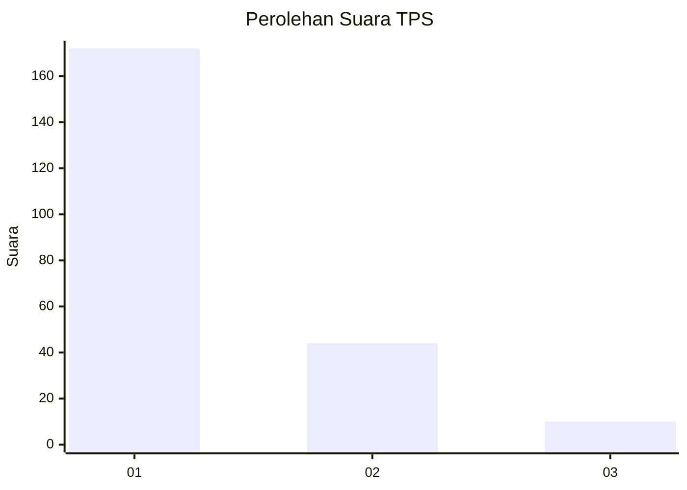
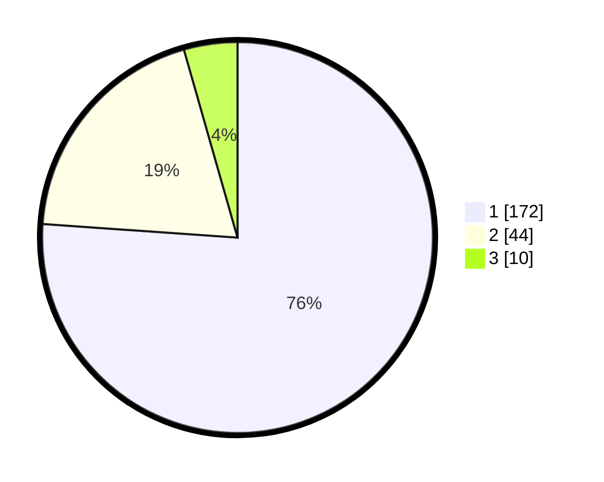

# Hasil

## Grafik

## Tabel

| No. | Nama Paslon    | Suara | Suara (raw) | Persentase |
|:--- |:-------------- | -----:| -----------:| ----------:|
| 1   | ANIES MUHAIMIN | 172   | [172][p-1]  | 76,11      |
| 2   | PRABOWO GIBRAN | 44    | [44][p-2]   | 19,47      |
| 3   | GANJAR MAHFUD  | 10    | [10][p-3]   | 4,42       |

[p-1]: https://github.com/gigit-pemilu/pemilu-2024-11-aceh/blob/main/pilpres/hitung-suara/sub/11-aceh/sub/71-kota-banda-aceh/sub/07-banda-raya/sub/2003-geuceu-iniem/sub/004-tps/sub/paslon-1.txt
[p-2]: https://github.com/gigit-pemilu/pemilu-2024-11-aceh/blob/main/pilpres/hitung-suara/sub/11-aceh/sub/71-kota-banda-aceh/sub/07-banda-raya/sub/2003-geuceu-iniem/sub/004-tps/sub/paslon-2.txt
[p-3]: https://github.com/gigit-pemilu/pemilu-2024-11-aceh/blob/main/pilpres/hitung-suara/sub/11-aceh/sub/71-kota-banda-aceh/sub/07-banda-raya/sub/2003-geuceu-iniem/sub/004-tps/sub/paslon-3.txt

## Foto C Plano

https://sirekap-obj-formc.kpu.go.id/62d4/pemilu/ppwp/11/71/07/20/03/1171072003004-20240222-110213--e7afd07a-a222-4044-b83a-b89fdab3a2f3.jpg

https://sirekap-obj-formc.kpu.go.id/62d4/pemilu/ppwp/11/71/07/20/03/1171072003004-20240222-110207--1bf2c7d8-6899-40b4-b3fe-d13e9634c0da.jpg

https://sirekap-obj-formc.kpu.go.id/62d4/pemilu/ppwp/11/71/07/20/03/1171072003004-20240222-110311--3798ad76-fa6a-4be5-ac3b-5f8e16ab3799.jpg

## Metadata

| Key        | Value               |
| ---------- | ------------------- |
| Time Stamp | 2024-02-22 12:00:00 |

## DATA PEMILIH TETAP

Jumlah pemilih dalam DPT: **74**.
 * L: **107**.
 * P: **147**.

## DATA PENGGUNA HAK PILIH

Jumlah pengguna hak pilih dalam DPT: **4**.
 * L: **45**.
 * P: **104**.

Jumlah pengguna hak pilih dalam DPTb: **1**.
 * L: **1**.
 * P: **0**.

Jumlah pengguna hak pilih dalam DPK: **7**.
 * L: **0**.
 * P: **1**.

Jumlah pengguna hak pilih: **4**.
 * L: **44**.
 * P: **104**.

## JUMLAH SUARA SAH DAN TIDAK SAH

JUMLAH SELURUH SUARA SAH: **5**.

JUMLAH SUARA TIDAK SAH: **0**.

JUMLAH SELURUH SUARA SAH DAN SUARA TIDAK SAH: **0**.

