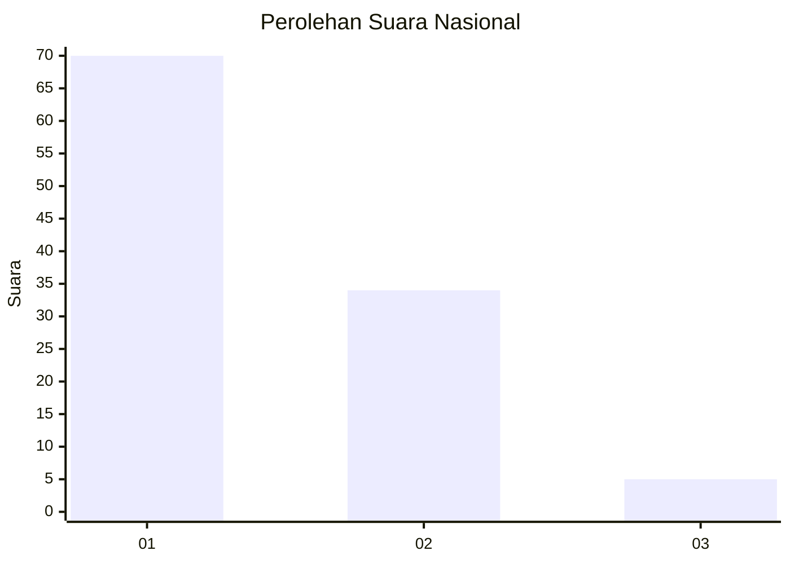
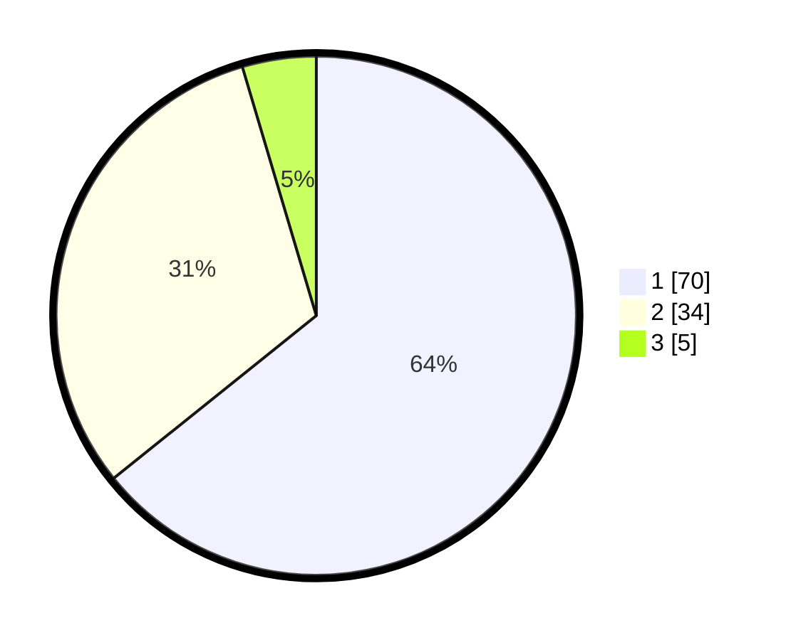

# Hasil

## Grafik

## Tabel

| No. | Nama Paslon    | Suara | Suara (raw) | Persentase |
|:--- |:-------------- | -----:| -----------:| ----------:|
| 1   | ANIES MUHAIMIN | 70    | [70][p-1]   | 64,22      |
| 2   | PRABOWO GIBRAN | 34    | [34][p-2]   | 31,19      |
| 3   | GANJAR MAHFUD  | 5     | [5][p-3]    | 4,59       |

[p-1]: https://github.com/gigit-pemilu/pemilu-2024/blob/main/pilpres/hitung-suara/sub/11-aceh/sub/71-kota-banda-aceh/sub/07-banda-raya/sub/2004-geuceu-kayee-jato/sub/003-tps/sub/paslon-1.txt
[p-2]: https://github.com/gigit-pemilu/pemilu-2024/blob/main/pilpres/hitung-suara/sub/11-aceh/sub/71-kota-banda-aceh/sub/07-banda-raya/sub/2004-geuceu-kayee-jato/sub/003-tps/sub/paslon-2.txt
[p-3]: https://github.com/gigit-pemilu/pemilu-2024/blob/main/pilpres/hitung-suara/sub/11-aceh/sub/71-kota-banda-aceh/sub/07-banda-raya/sub/2004-geuceu-kayee-jato/sub/003-tps/sub/paslon-3.txt

## Foto C Plano

https://sirekap-obj-formc.kpu.go.id/9f55/pemilu/ppwp/11/71/07/20/04/1171072004003-20240223-133648--5da46da2-53ed-4e04-8144-f12253859eae.jpg

https://sirekap-obj-formc.kpu.go.id/9f55/pemilu/ppwp/11/71/07/20/04/1171072004003-20240223-133710--53877671-4b7f-4f0c-9d4f-c0f7f85aab66.jpg

https://sirekap-obj-formc.kpu.go.id/9f55/pemilu/ppwp/11/71/07/20/04/1171072004003-20240223-133731--62ae414e-5829-4c84-ab5e-3b0d17c6009a.jpg

## Metadata

| Key        | Value               |
| ---------- | ------------------- |
| Time Stamp | 2024-02-24 22:31:28 |

## DATA PEMILIH TETAP

Jumlah pemilih dalam DPT: **250**.
 * L: **125**.
 * P: **325**.

## DATA PENGGUNA HAK PILIH

Jumlah pengguna hak pilih dalam DPT: **205**.
 * L: **706**.
 * P: **203**.

Jumlah pengguna hak pilih dalam DPTb: **81**.
 * L: **1**.
 * P: **8**.

Jumlah pengguna hak pilih dalam DPK: **80**.
 * L: **800**.
 * P: **8**.

Jumlah pengguna hak pilih: **210**.
 * L: **107**.
 * P: **103**.

## JUMLAH SUARA SAH DAN TIDAK SAH

JUMLAH SELURUH SUARA SAH: **210**.

JUMLAH SUARA TIDAK SAH: **0**.

JUMLAH SELURUH SUARA SAH DAN SUARA TIDAK SAH: **210**.

