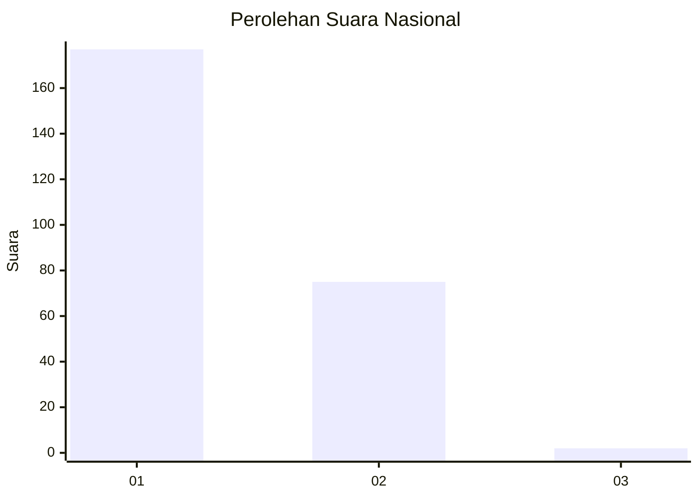
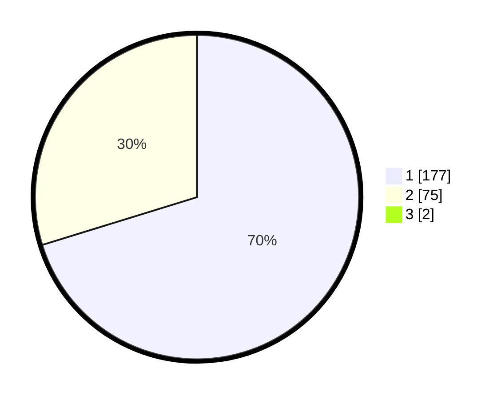

# Hasil

## Grafik

## Tabel

| No. | Nama Paslon    | Suara | Suara (raw) | Persentase |
|:--- |:-------------- | -----:| -----------:| ----------:|
| 1   | ANIES MUHAIMIN | 177   | [177][p-1]  | 69,69      |
| 2   | PRABOWO GIBRAN | 75    | [75][p-2]   | 29,53      |
| 3   | GANJAR MAHFUD  | 2     | [2][p-3]    | 0,79       |

[p-1]: https://github.com/gigit-pemilu/pemilu-2024/blob/main/pilpres/hitung-suara/sub/11-aceh/sub/71-kota-banda-aceh/sub/07-banda-raya/sub/2006-lhong-raya/sub/002-tps/sub/paslon-1.txt
[p-2]: https://github.com/gigit-pemilu/pemilu-2024/blob/main/pilpres/hitung-suara/sub/11-aceh/sub/71-kota-banda-aceh/sub/07-banda-raya/sub/2006-lhong-raya/sub/002-tps/sub/paslon-2.txt
[p-3]: https://github.com/gigit-pemilu/pemilu-2024/blob/main/pilpres/hitung-suara/sub/11-aceh/sub/71-kota-banda-aceh/sub/07-banda-raya/sub/2006-lhong-raya/sub/002-tps/sub/paslon-3.txt

## Foto C Plano

https://sirekap-obj-formc.kpu.go.id/3409/pemilu/ppwp/11/71/07/20/06/1171072006002-20240220-140228--ffbff965-6fb0-4099-ab1b-8d4e3c87523e.jpg

https://sirekap-obj-formc.kpu.go.id/3409/pemilu/ppwp/11/71/07/20/06/1171072006002-20240220-140252--5d218ccd-46ad-4f47-a20b-5ffdb48b14a7.jpg

https://sirekap-obj-formc.kpu.go.id/3409/pemilu/ppwp/11/71/07/20/06/1171072006002-20240220-140323--756e904b-5254-43c2-bc1e-36022fe19bb4.jpg

## Metadata

| Key        | Value               |
| ---------- | ------------------- |
| Time Stamp | 2024-02-20 15:00:00 |

## DATA PEMILIH TETAP

Jumlah pemilih dalam DPT: **279**.
 * L: **130**.
 * P: **149**.

## DATA PENGGUNA HAK PILIH

Jumlah pengguna hak pilih dalam DPT: **213**.
 * L: **92**.
 * P: **127**.

Jumlah pengguna hak pilih dalam DPTb: **85**.
 * L: **3**.
 * P: **83**.

Jumlah pengguna hak pilih dalam DPK: **800**.
 * L: **0**.
 * P: **80**.

Jumlah pengguna hak pilih: **272**.
 * L: **99**.
 * P: **919**.

## JUMLAH SUARA SAH DAN TIDAK SAH

JUMLAH SELURUH SUARA SAH: **115**.

JUMLAH SUARA TIDAK SAH: **3**.

JUMLAH SELURUH SUARA SAH DAN SUARA TIDAK SAH: **369**.

