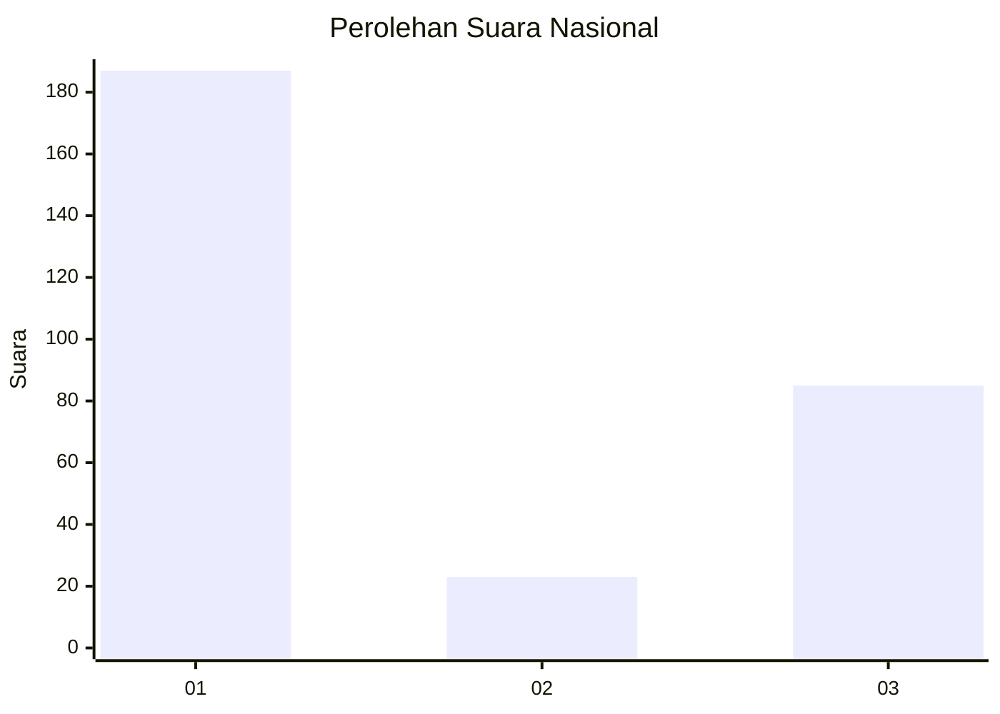
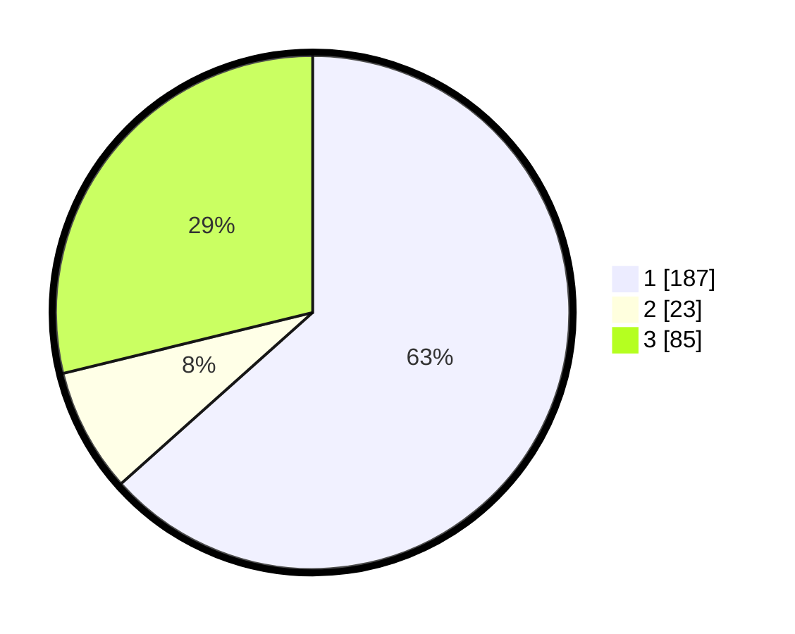

# Hasil

## Grafik

## Tabel

| No. | Nama Paslon    | Suara | Suara (raw) | Persentase |
|:--- |:-------------- | -----:| -----------:| ----------:|
| 1   | ANIES MUHAIMIN | 187   | [187][p-1]  | 63,39      |
| 2   | PRABOWO GIBRAN | 23    | [23][p-2]   | 7,80       |
| 3   | GANJAR MAHFUD  | 85    | [85][p-3]   | 28,81      |

[p-1]: https://github.com/gigit-pemilu/pemilu-2024/blob/main/pilpres/hitung-suara/sub/11-aceh/sub/71-kota-banda-aceh/sub/07-banda-raya/sub/2006-lhong-raya/sub/003-tps/sub/paslon-1.txt
[p-2]: https://github.com/gigit-pemilu/pemilu-2024/blob/main/pilpres/hitung-suara/sub/11-aceh/sub/71-kota-banda-aceh/sub/07-banda-raya/sub/2006-lhong-raya/sub/003-tps/sub/paslon-2.txt
[p-3]: https://github.com/gigit-pemilu/pemilu-2024/blob/main/pilpres/hitung-suara/sub/11-aceh/sub/71-kota-banda-aceh/sub/07-banda-raya/sub/2006-lhong-raya/sub/003-tps/sub/paslon-3.txt

## Foto C Plano

https://sirekap-obj-formc.kpu.go.id/f103/pemilu/ppwp/11/71/07/20/06/1171072006003-20240220-124817--f181c890-c83a-408d-963e-40df88445dd2.jpg

https://sirekap-obj-formc.kpu.go.id/f103/pemilu/ppwp/11/71/07/20/06/1171072006003-20240220-124857--62be6e47-09df-456b-80f8-f6608116a95b.jpg

https://sirekap-obj-formc.kpu.go.id/f103/pemilu/ppwp/11/71/07/20/06/1171072006003-20240220-125003--df64b206-13cd-45d2-be2c-4b66bcf7e374.jpg

## Metadata

| Key        | Value               |
| ---------- | ------------------- |
| Time Stamp | 2024-02-20 13:00:00 |

## DATA PEMILIH TETAP

Jumlah pemilih dalam DPT: **259**.
 * L: **278**.
 * P: **146**.

## DATA PENGGUNA HAK PILIH

Jumlah pengguna hak pilih dalam DPT: **215**.
 * L: **95**.
 * P: **114**.

Jumlah pengguna hak pilih dalam DPTb: **3**.
 * L: **802**.
 * P: **1**.

Jumlah pengguna hak pilih dalam DPK: **87**.
 * L: **803**.
 * P: **82**.

Jumlah pengguna hak pilih: **235**.
 * L: **304**.
 * P: **134**.

## JUMLAH SUARA SAH DAN TIDAK SAH

JUMLAH SELURUH SUARA SAH: **223**.

JUMLAH SUARA TIDAK SAH: **55**.

JUMLAH SELURUH SUARA SAH DAN SUARA TIDAK SAH: **275**.

