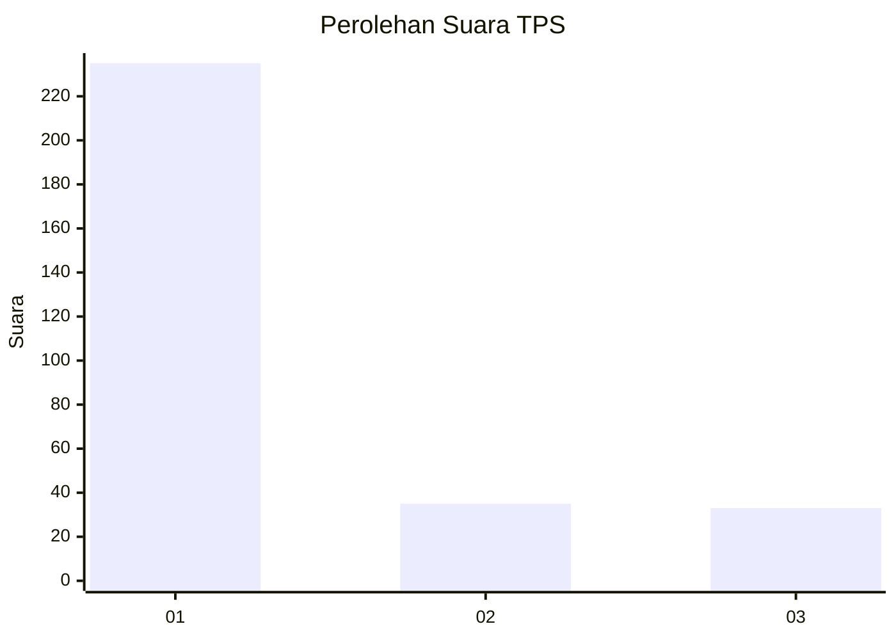
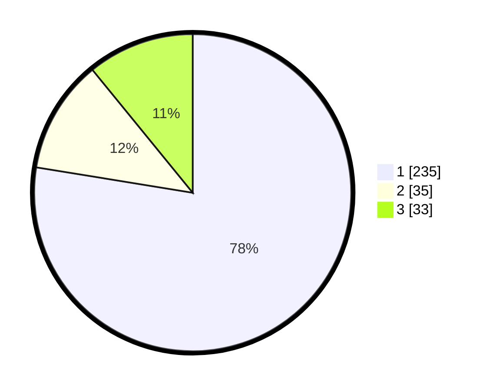

# Hasil

## Grafik

## Tabel

| No. | Nama Paslon    | Suara | Suara (raw) | Persentase |
|:--- |:-------------- | -----:| -----------:| ----------:|
| 1   | ANIES MUHAIMIN | 235   | [235][p-1]  | 77,56      |
| 2   | PRABOWO GIBRAN | 35    | [35][p-2]   | 11,55      |
| 3   | GANJAR MAHFUD  | 33    | [33][p-3]   | 10,89      |

[p-1]: https://github.com/gigit-pemilu/pemilu-2024-11-aceh/blob/main/pilpres/hitung-suara/sub/11-aceh/sub/71-kota-banda-aceh/sub/07-banda-raya/sub/2006-lhong-raya/sub/004-tps/sub/paslon-1.txt
[p-2]: https://github.com/gigit-pemilu/pemilu-2024-11-aceh/blob/main/pilpres/hitung-suara/sub/11-aceh/sub/71-kota-banda-aceh/sub/07-banda-raya/sub/2006-lhong-raya/sub/004-tps/sub/paslon-2.txt
[p-3]: https://github.com/gigit-pemilu/pemilu-2024-11-aceh/blob/main/pilpres/hitung-suara/sub/11-aceh/sub/71-kota-banda-aceh/sub/07-banda-raya/sub/2006-lhong-raya/sub/004-tps/sub/paslon-3.txt

## Foto C Plano

https://sirekap-obj-formc.kpu.go.id/e60e/pemilu/ppwp/11/71/07/20/06/1171072006004-20240220-132816--1fbf7f21-f6f6-4759-be9a-76c2cc72b8a6.jpg

https://sirekap-obj-formc.kpu.go.id/e60e/pemilu/ppwp/11/71/07/20/06/1171072006004-20240220-132841--7359271d-3250-4833-b30f-7535a94de930.jpg

https://sirekap-obj-formc.kpu.go.id/e60e/pemilu/ppwp/11/71/07/20/06/1171072006004-20240220-133013--318fedd8-d5c5-4e5e-8d7d-d9ba83c1f5bb.jpg

## Metadata

| Key        | Value               |
| ---------- | ------------------- |
| Time Stamp | 2024-02-20 14:00:00 |

## DATA PEMILIH TETAP

Jumlah pemilih dalam DPT: **273**.
 * L: **123**.
 * P: **139**.

## DATA PENGGUNA HAK PILIH

Jumlah pengguna hak pilih dalam DPT: **333**.
 * L: **124**.
 * P: **413**.

Jumlah pengguna hak pilih dalam DPTb: **823**.
 * L: **433**.
 * P: **481**.

Jumlah pengguna hak pilih dalam DPK: **745**.
 * L: **347**.
 * P: **383**.

Jumlah pengguna hak pilih: **253**.
 * L: **125**.
 * P: **315**.

## JUMLAH SUARA SAH DAN TIDAK SAH

JUMLAH SELURUH SUARA SAH: **340**.

JUMLAH SUARA TIDAK SAH: **554**.

JUMLAH SELURUH SUARA SAH DAN SUARA TIDAK SAH: **261**.

