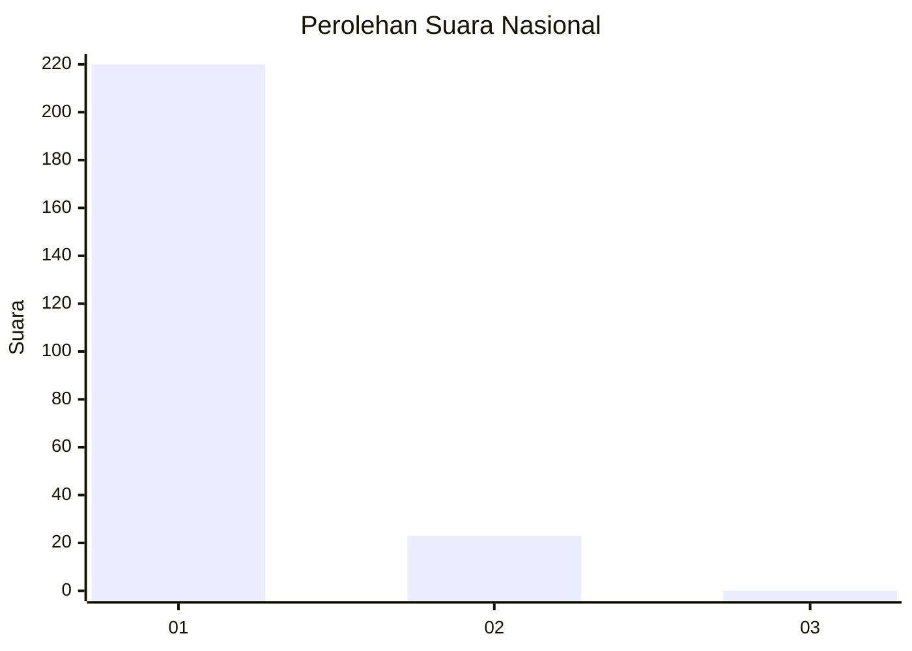
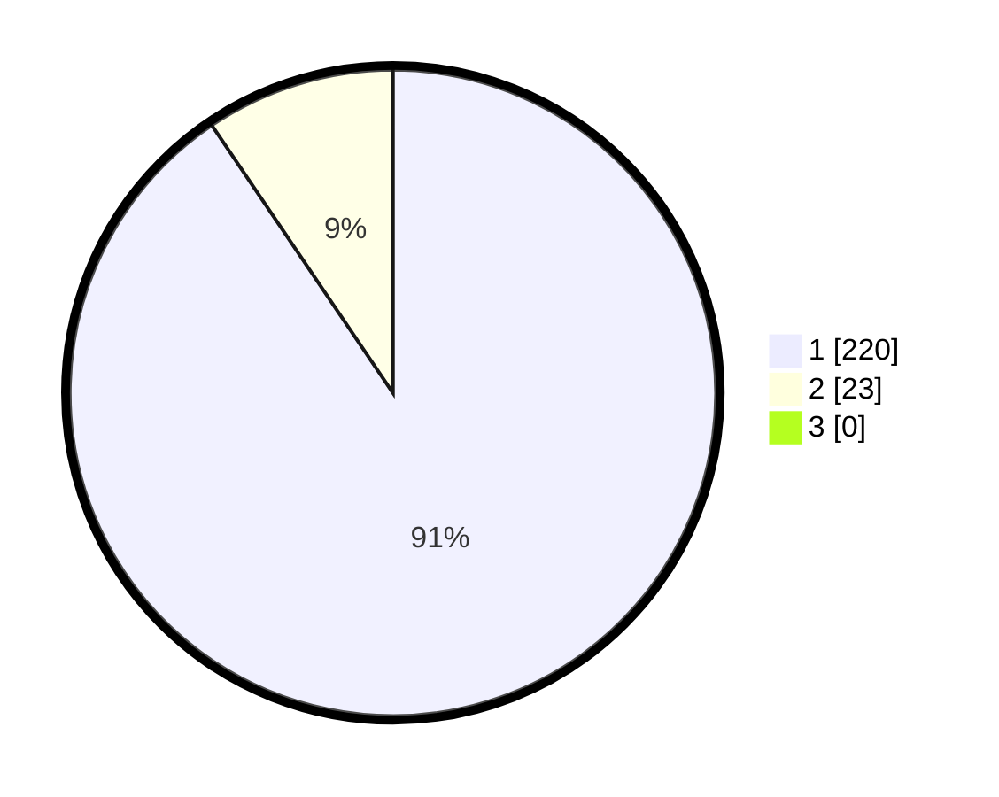

# Hasil

## Grafik

## Tabel

| No. | Nama Paslon    | Suara | Suara (raw) | Persentase |
|:--- |:-------------- | -----:| -----------:| ----------:|
| 1   | ANIES MUHAIMIN | 220   | [220][p-1]  | 90,53      |
| 2   | PRABOWO GIBRAN | 23    | [23][p-2]   | 9,47       |
| 3   | GANJAR MAHFUD  | 0     | [0][p-3]    | 0,00       |

[p-1]: https://github.com/gigit-pemilu/pemilu-2024/blob/main/pilpres/hitung-suara/sub/11-aceh/sub/71-kota-banda-aceh/sub/07-banda-raya/sub/2006-lhong-raya/sub/005-tps/sub/paslon-1.txt
[p-2]: https://github.com/gigit-pemilu/pemilu-2024/blob/main/pilpres/hitung-suara/sub/11-aceh/sub/71-kota-banda-aceh/sub/07-banda-raya/sub/2006-lhong-raya/sub/005-tps/sub/paslon-2.txt
[p-3]: https://github.com/gigit-pemilu/pemilu-2024/blob/main/pilpres/hitung-suara/sub/11-aceh/sub/71-kota-banda-aceh/sub/07-banda-raya/sub/2006-lhong-raya/sub/005-tps/sub/paslon-3.txt

## Foto C Plano

https://sirekap-obj-formc.kpu.go.id/b5cb/pemilu/ppwp/11/71/07/20/06/1171072006005-20240220-134102--ce7f7dae-83bc-4b03-b5ec-114fcbf8335c.jpg

https://sirekap-obj-formc.kpu.go.id/b5cb/pemilu/ppwp/11/71/07/20/06/1171072006005-20240220-134143--13ad17c1-8d97-4bf6-9706-a47e82b0cfcf.jpg

https://sirekap-obj-formc.kpu.go.id/b5cb/pemilu/ppwp/11/71/07/20/06/1171072006005-20240220-134212--ae62e752-859e-42f6-acee-709acdf5fca0.jpg

## Metadata

| Key        | Value               |
| ---------- | ------------------- |
| Time Stamp | 2024-02-24 22:31:28 |

