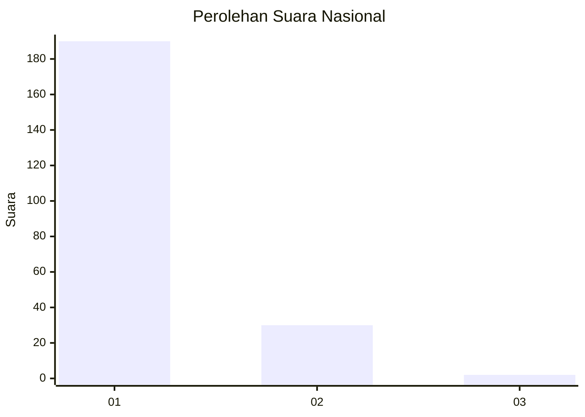
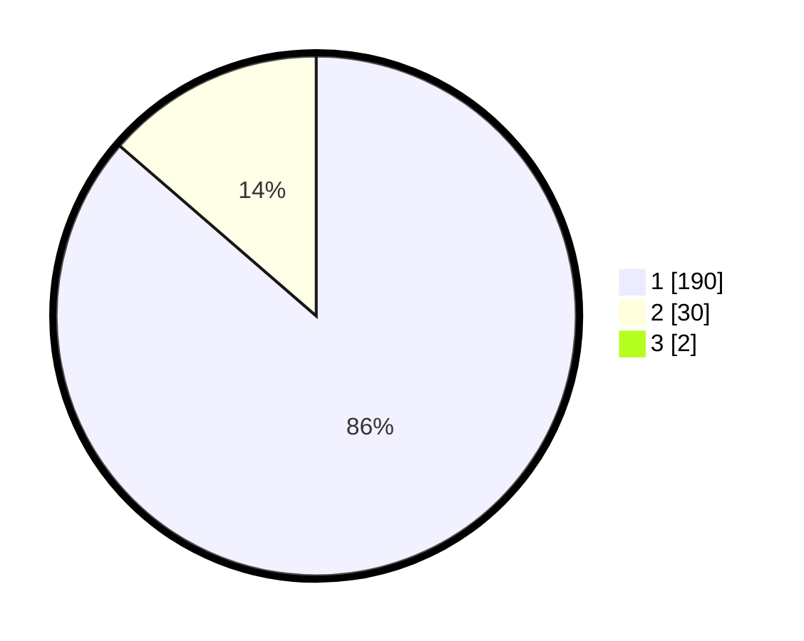

# Hasil

## Grafik

## Tabel

| No. | Nama Paslon    | Suara | Suara (raw) | Persentase |
|:--- |:-------------- | -----:| -----------:| ----------:|
| 1   | ANIES MUHAIMIN | 190   | [190][p-1]  | 85,59      |
| 2   | PRABOWO GIBRAN | 30    | [30][p-2]   | 13,51      |
| 3   | GANJAR MAHFUD  | 2     | [2][p-3]    | 0,90       |

[p-1]: https://github.com/gigit-pemilu/pemilu-2024/blob/main/pilpres/hitung-suara/sub/11-aceh/sub/71-kota-banda-aceh/sub/07-banda-raya/sub/2006-lhong-raya/sub/006-tps/sub/paslon-1.txt
[p-2]: https://github.com/gigit-pemilu/pemilu-2024/blob/main/pilpres/hitung-suara/sub/11-aceh/sub/71-kota-banda-aceh/sub/07-banda-raya/sub/2006-lhong-raya/sub/006-tps/sub/paslon-2.txt
[p-3]: https://github.com/gigit-pemilu/pemilu-2024/blob/main/pilpres/hitung-suara/sub/11-aceh/sub/71-kota-banda-aceh/sub/07-banda-raya/sub/2006-lhong-raya/sub/006-tps/sub/paslon-3.txt

## Foto C Plano

https://sirekap-obj-formc.kpu.go.id/f96d/pemilu/ppwp/11/71/07/20/06/1171072006006-20240220-140528--065455d7-987c-415d-b9a5-b7f6e8ad7176.jpg

https://sirekap-obj-formc.kpu.go.id/f96d/pemilu/ppwp/11/71/07/20/06/1171072006006-20240220-140713--cbcf9143-6c5f-47d7-88c8-3841584089e7.jpg

https://sirekap-obj-formc.kpu.go.id/f96d/pemilu/ppwp/11/71/07/20/06/1171072006006-20240220-140629--b40c6d4b-9f32-4a8f-b1a1-4dfa259c6b0e.jpg

## Metadata

| Key        | Value               |
| ---------- | ------------------- |
| Time Stamp | 2024-02-21 20:00:00 |

## DATA PEMILIH TETAP

Jumlah pemilih dalam DPT: **259**.
 * L: **833**.
 * P: **132**.

## DATA PENGGUNA HAK PILIH

Jumlah pengguna hak pilih dalam DPT: **225**.
 * L: **405**.
 * P: **113**.

Jumlah pengguna hak pilih dalam DPTb: **800**.
 * L: **880**.
 * P: **40**.

Jumlah pengguna hak pilih dalam DPK: **887**.
 * L: **882**.
 * P: **802**.

Jumlah pengguna hak pilih: **225**.
 * L: **838**.
 * P: **117**.

## JUMLAH SUARA SAH DAN TIDAK SAH

JUMLAH SELURUH SUARA SAH: **222**.

JUMLAH SUARA TIDAK SAH: **3**.

JUMLAH SELURUH SUARA SAH DAN SUARA TIDAK SAH: **225**.

