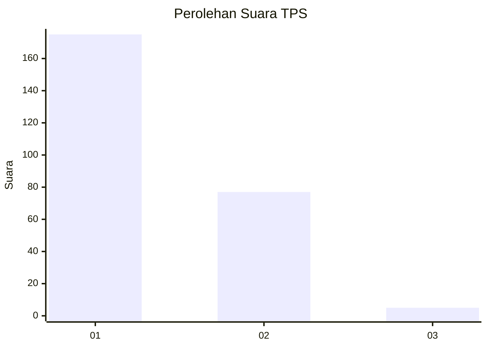
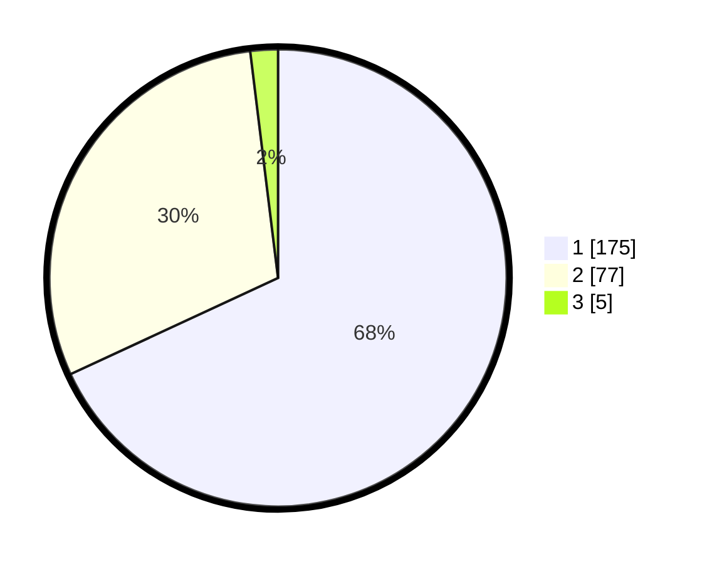

# Hasil

## Grafik

## Tabel

| No. | Nama Paslon    | Suara | Suara (raw) | Persentase |
|:--- |:-------------- | -----:| -----------:| ----------:|
| 1   | ANIES MUHAIMIN | 175   | [175][p-1]  | 68,09      |
| 2   | PRABOWO GIBRAN | 77    | [77][p-2]   | 29,96      |
| 3   | GANJAR MAHFUD  | 5     | [5][p-3]    | 1,95       |

[p-1]: https://github.com/gigit-pemilu/pemilu-2024-11-aceh/blob/main/pilpres/hitung-suara/sub/11-aceh/sub/71-kota-banda-aceh/sub/07-banda-raya/sub/2008-peunyerat/sub/001-tps/sub/paslon-1.txt
[p-2]: https://github.com/gigit-pemilu/pemilu-2024-11-aceh/blob/main/pilpres/hitung-suara/sub/11-aceh/sub/71-kota-banda-aceh/sub/07-banda-raya/sub/2008-peunyerat/sub/001-tps/sub/paslon-2.txt
[p-3]: https://github.com/gigit-pemilu/pemilu-2024-11-aceh/blob/main/pilpres/hitung-suara/sub/11-aceh/sub/71-kota-banda-aceh/sub/07-banda-raya/sub/2008-peunyerat/sub/001-tps/sub/paslon-3.txt

## Foto C Plano

https://sirekap-obj-formc.kpu.go.id/060c/pemilu/ppwp/11/71/07/20/08/1171072008001-20240222-212243--ee905cd3-047b-480f-8a73-01bfbb3660de.jpg

https://sirekap-obj-formc.kpu.go.id/060c/pemilu/ppwp/11/71/07/20/08/1171072008001-20240222-212312--272ae1e4-3482-40c9-a4d1-57612bcc902e.jpg

https://sirekap-obj-formc.kpu.go.id/060c/pemilu/ppwp/11/71/07/20/08/1171072008001-20240222-212337--af102859-c6fa-4371-9514-af3cb26277ab.jpg

## Metadata

| Key        | Value               |
| ---------- | ------------------- |
| Time Stamp | 2024-02-22 22:00:00 |

## DATA PEMILIH TETAP

Jumlah pemilih dalam DPT: **357**.
 * L: **139**.
 * P: **128**.

## DATA PENGGUNA HAK PILIH

Jumlah pengguna hak pilih dalam DPT: **212**.
 * L: **102**.
 * P: **110**.

Jumlah pengguna hak pilih dalam DPTb: **5**.
 * L: **0**.
 * P: **5**.

Jumlah pengguna hak pilih dalam DPK: **1**.
 * L: **6**.
 * P: **0**.

Jumlah pengguna hak pilih: **218**.
 * L: **203**.
 * P: **115**.

## JUMLAH SUARA SAH DAN TIDAK SAH

JUMLAH SELURUH SUARA SAH: **218**.

JUMLAH SUARA TIDAK SAH: **300**.

JUMLAH SELURUH SUARA SAH DAN SUARA TIDAK SAH: **218**.

