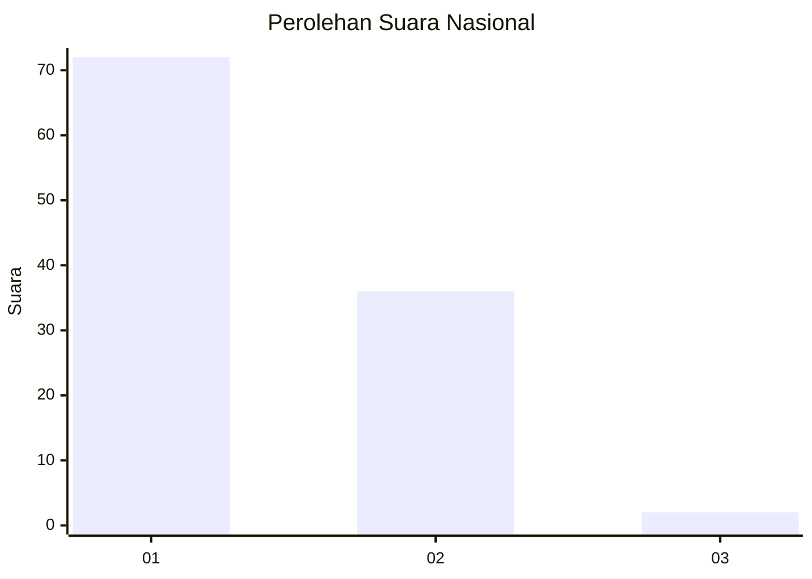
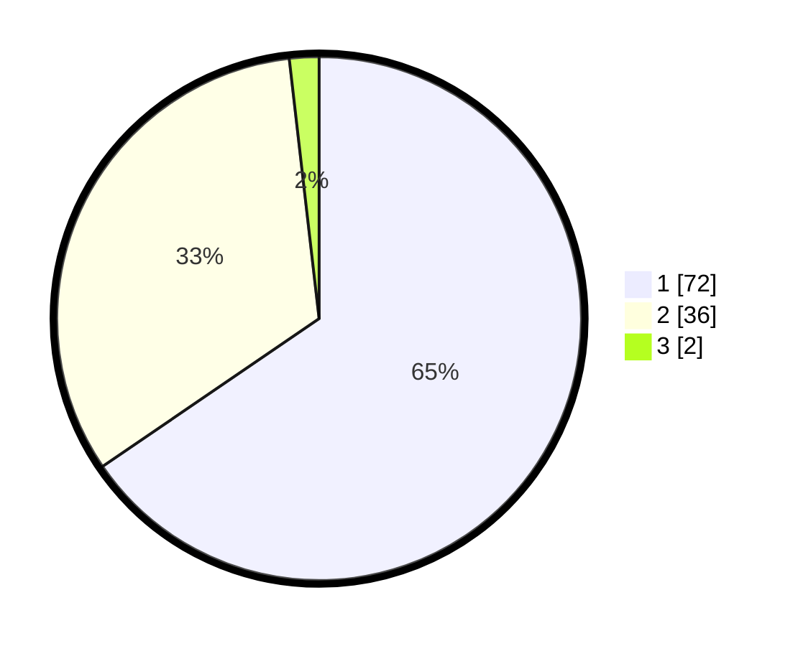

# Hasil

## Grafik

## Tabel

| No. | Nama Paslon    | Suara | Suara (raw) | Persentase |
|:--- |:-------------- | -----:| -----------:| ----------:|
| 1   | ANIES MUHAIMIN | 72    | [72][p-1]   | 65,45      |
| 2   | PRABOWO GIBRAN | 36    | [36][p-2]   | 32,73      |
| 3   | GANJAR MAHFUD  | 2     | [2][p-3]    | 1,82       |

[p-1]: https://github.com/gigit-pemilu/pemilu-2024/blob/main/pilpres/hitung-suara/sub/11-aceh/sub/71-kota-banda-aceh/sub/07-banda-raya/sub/2008-peunyerat/sub/003-tps/sub/paslon-1.txt
[p-2]: https://github.com/gigit-pemilu/pemilu-2024/blob/main/pilpres/hitung-suara/sub/11-aceh/sub/71-kota-banda-aceh/sub/07-banda-raya/sub/2008-peunyerat/sub/003-tps/sub/paslon-2.txt
[p-3]: https://github.com/gigit-pemilu/pemilu-2024/blob/main/pilpres/hitung-suara/sub/11-aceh/sub/71-kota-banda-aceh/sub/07-banda-raya/sub/2008-peunyerat/sub/003-tps/sub/paslon-3.txt

## Foto C Plano

https://sirekap-obj-formc.kpu.go.id/9565/pemilu/ppwp/11/71/07/20/08/1171072008003-20240222-212647--6bde2db2-158e-4c61-89de-b9748b5b85dc.jpg

https://sirekap-obj-formc.kpu.go.id/9565/pemilu/ppwp/11/71/07/20/08/1171072008003-20240222-212719--edec9812-4f41-4af8-a438-19b670e20ca1.jpg

https://sirekap-obj-formc.kpu.go.id/9565/pemilu/ppwp/11/71/07/20/08/1171072008003-20240222-212906--a934c988-8c58-43eb-9ba9-1d27b4d9cb56.jpg

## Metadata

| Key        | Value               |
| ---------- | ------------------- |
| Time Stamp | 2024-02-22 22:00:00 |

## DATA PEMILIH TETAP

Jumlah pemilih dalam DPT: **253**.
 * L: **123**.
 * P: **125**.

## DATA PENGGUNA HAK PILIH

Jumlah pengguna hak pilih dalam DPT: **220**.
 * L: **200**.
 * P: **250**.

Jumlah pengguna hak pilih dalam DPTb: **301**.
 * L: **800**.
 * P: **83**.

Jumlah pengguna hak pilih dalam DPK: **2**.
 * L: **2**.
 * P: **2**.

Jumlah pengguna hak pilih: **223**.
 * L: **201**.
 * P: **332**.

## JUMLAH SUARA SAH DAN TIDAK SAH

JUMLAH SELURUH SUARA SAH: **211**.

JUMLAH SUARA TIDAK SAH: **2**.

JUMLAH SELURUH SUARA SAH DAN SUARA TIDAK SAH: **213**.

