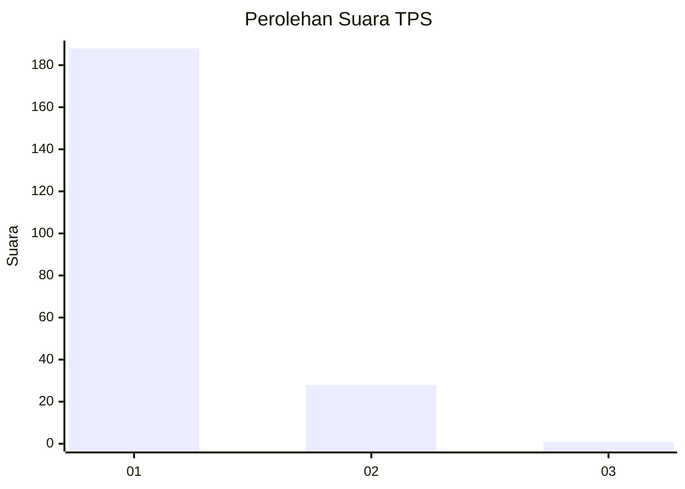
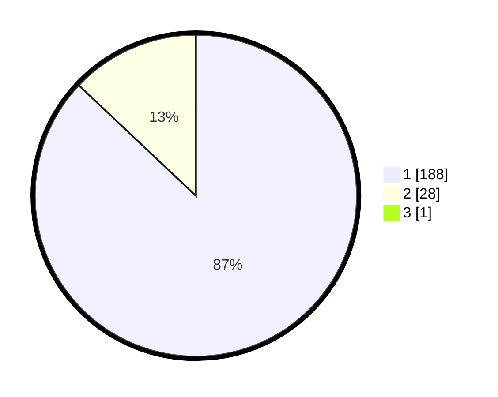

# Hasil

## Grafik

## Tabel

| No. | Nama Paslon    | Suara | Suara (raw) | Persentase |
|:--- |:-------------- | -----:| -----------:| ----------:|
| 1   | ANIES MUHAIMIN | 188   | [188][p-1]  | 86,64      |
| 2   | PRABOWO GIBRAN | 28    | [28][p-2]   | 12,90      |
| 3   | GANJAR MAHFUD  | 1     | [1][p-3]    | 0,46       |

[p-1]: https://github.com/gigit-pemilu/pemilu-2024-11-aceh/blob/main/pilpres/hitung-suara/sub/11-aceh/sub/71-kota-banda-aceh/sub/07-banda-raya/sub/2008-peunyerat/sub/005-tps/sub/paslon-1.txt
[p-2]: https://github.com/gigit-pemilu/pemilu-2024-11-aceh/blob/main/pilpres/hitung-suara/sub/11-aceh/sub/71-kota-banda-aceh/sub/07-banda-raya/sub/2008-peunyerat/sub/005-tps/sub/paslon-2.txt
[p-3]: https://github.com/gigit-pemilu/pemilu-2024-11-aceh/blob/main/pilpres/hitung-suara/sub/11-aceh/sub/71-kota-banda-aceh/sub/07-banda-raya/sub/2008-peunyerat/sub/005-tps/sub/paslon-3.txt

## Foto C Plano

https://sirekap-obj-formc.kpu.go.id/d7bb/pemilu/ppwp/11/71/07/20/08/1171072008005-20240222-213207--fa1255f4-e694-4a56-b463-1177c47308d2.jpg

https://sirekap-obj-formc.kpu.go.id/d7bb/pemilu/ppwp/11/71/07/20/08/1171072008005-20240222-213232--ebaae058-0951-4360-b4c2-b36418d57e91.jpg

https://sirekap-obj-formc.kpu.go.id/d7bb/pemilu/ppwp/11/71/07/20/08/1171072008005-20240222-213353--100c5de7-1265-496f-89b1-cb85190e678f.jpg

## Metadata

| Key        | Value               |
| ---------- | ------------------- |
| Time Stamp | 2024-02-24 22:31:28 |

## DATA PEMILIH TETAP

Jumlah pemilih dalam DPT: **355**.
 * L: **123**.
 * P: **135**.

## DATA PENGGUNA HAK PILIH

Jumlah pengguna hak pilih dalam DPT: **294**.
 * L: **839**.
 * P: **615**.

Jumlah pengguna hak pilih dalam DPTb: **208**.
 * L: **48**.
 * P: **305**.

Jumlah pengguna hak pilih dalam DPK: **85**.
 * L: **803**.
 * P: **842**.

Jumlah pengguna hak pilih: **219**.
 * L: **102**.
 * P: **817**.

## JUMLAH SUARA SAH DAN TIDAK SAH

JUMLAH SELURUH SUARA SAH: **217**.

JUMLAH SUARA TIDAK SAH: **2**.

JUMLAH SELURUH SUARA SAH DAN SUARA TIDAK SAH: **219**.

