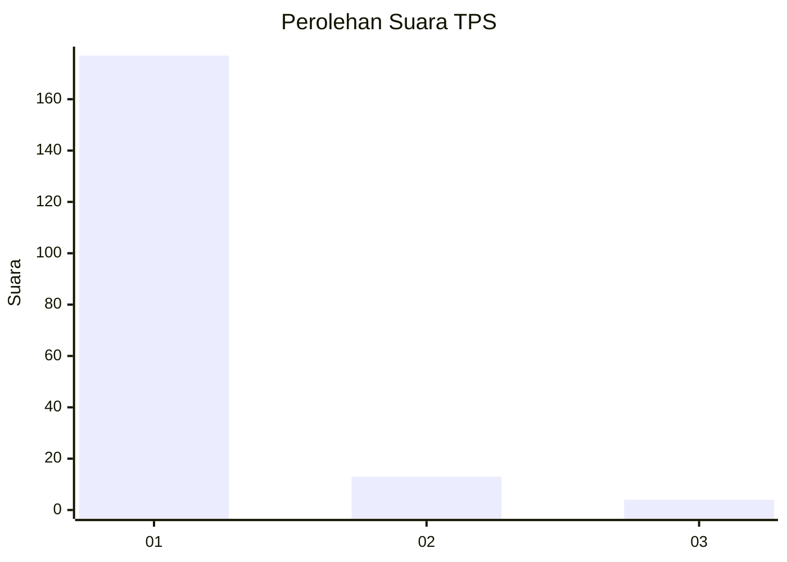
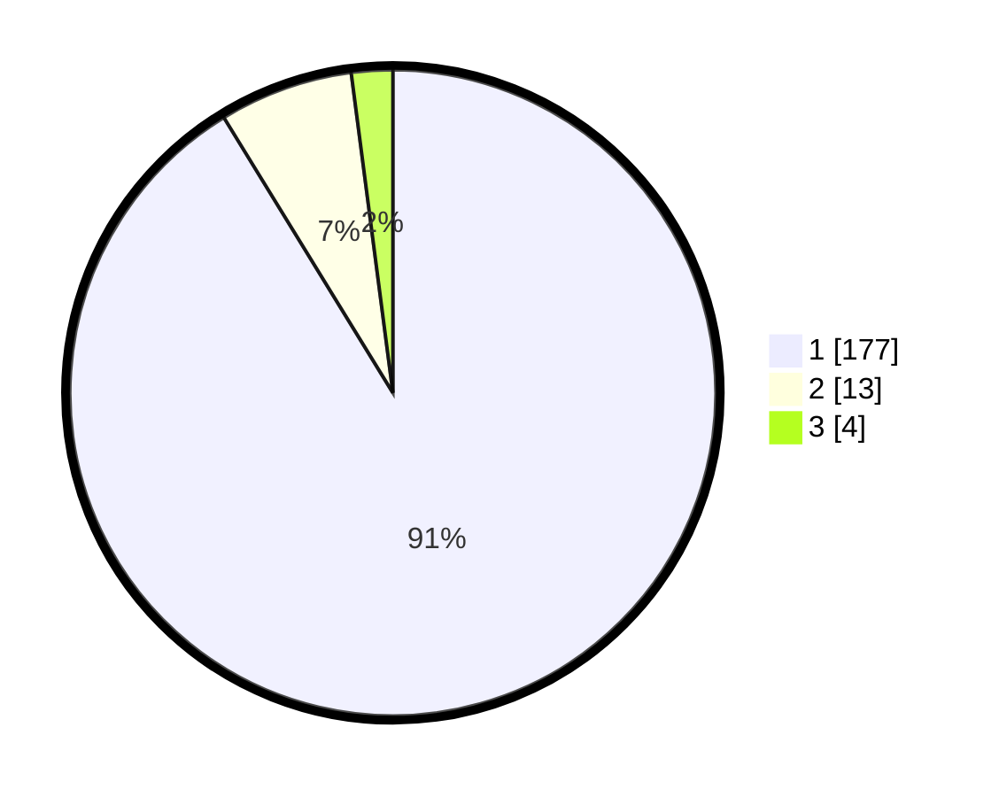

# Hasil

## Grafik

## Tabel

| No. | Nama Paslon    | Suara | Suara (raw) | Persentase |
|:--- |:-------------- | -----:| -----------:| ----------:|
| 1   | ANIES MUHAIMIN | 177   | [177][p-1]  | 91,24      |
| 2   | PRABOWO GIBRAN | 13    | [13][p-2]   | 6,70       |
| 3   | GANJAR MAHFUD  | 4     | [4][p-3]    | 2,06       |

[p-1]: https://github.com/gigit-pemilu/pemilu-2024-11-aceh/blob/main/pilpres/hitung-suara/sub/11-aceh/sub/71-kota-banda-aceh/sub/07-banda-raya/sub/2010-lampeuot/sub/002-tps/sub/paslon-1.txt
[p-2]: https://github.com/gigit-pemilu/pemilu-2024-11-aceh/blob/main/pilpres/hitung-suara/sub/11-aceh/sub/71-kota-banda-aceh/sub/07-banda-raya/sub/2010-lampeuot/sub/002-tps/sub/paslon-2.txt
[p-3]: https://github.com/gigit-pemilu/pemilu-2024-11-aceh/blob/main/pilpres/hitung-suara/sub/11-aceh/sub/71-kota-banda-aceh/sub/07-banda-raya/sub/2010-lampeuot/sub/002-tps/sub/paslon-3.txt

## Foto C Plano

https://sirekap-obj-formc.kpu.go.id/f22d/pemilu/ppwp/11/71/07/20/10/1171072010002-20240216-091959--0f395132-f8c1-490b-9d5f-c9d1cfb36b3e.jpg

https://sirekap-obj-formc.kpu.go.id/f22d/pemilu/ppwp/11/71/07/20/10/1171072010002-20240216-092423--c8239fd8-7da2-4b0c-bbdf-fd4e3ca19002.jpg

https://sirekap-obj-formc.kpu.go.id/f22d/pemilu/ppwp/11/71/07/20/10/1171072010002-20240216-092545--d806c0f7-44ca-4d08-8655-70841613608c.jpg

## Metadata

| Key        | Value               |
| ---------- | ------------------- |
| Time Stamp | 2024-02-16 16:25:10 |

