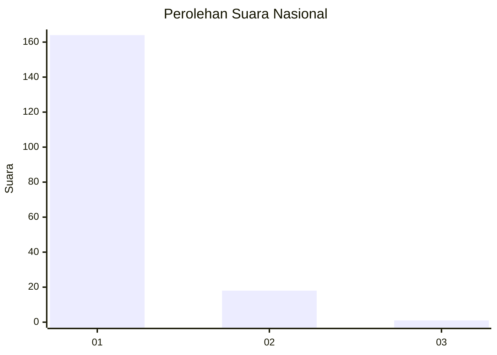
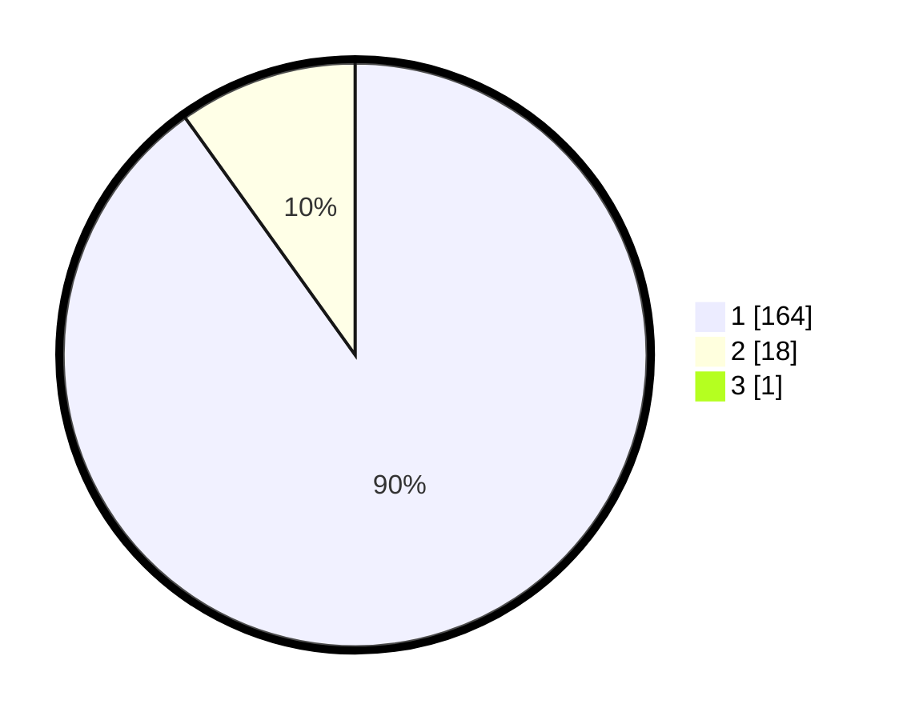

# Hasil

## Grafik

## Tabel

| No. | Nama Paslon    | Suara | Suara (raw) | Persentase |
|:--- |:-------------- | -----:| -----------:| ----------:|
| 1   | ANIES MUHAIMIN | 164   | [164][p-1]  | 89,62      |
| 2   | PRABOWO GIBRAN | 18    | [18][p-2]   | 9,84       |
| 3   | GANJAR MAHFUD  | 1     | [1][p-3]    | 0,55       |

[p-1]: https://github.com/gigit-pemilu/pemilu-2024/blob/main/pilpres/hitung-suara/sub/11-aceh/sub/71-kota-banda-aceh/sub/07-banda-raya/sub/2010-lampeuot/sub/003-tps/sub/paslon-1.txt
[p-2]: https://github.com/gigit-pemilu/pemilu-2024/blob/main/pilpres/hitung-suara/sub/11-aceh/sub/71-kota-banda-aceh/sub/07-banda-raya/sub/2010-lampeuot/sub/003-tps/sub/paslon-2.txt
[p-3]: https://github.com/gigit-pemilu/pemilu-2024/blob/main/pilpres/hitung-suara/sub/11-aceh/sub/71-kota-banda-aceh/sub/07-banda-raya/sub/2010-lampeuot/sub/003-tps/sub/paslon-3.txt

## Foto C Plano

https://sirekap-obj-formc.kpu.go.id/30f4/pemilu/ppwp/11/71/07/20/10/1171072010003-20240215-055203--bc520b52-b032-4427-b119-9c9a8a73c7ab.jpg

https://sirekap-obj-formc.kpu.go.id/30f4/pemilu/ppwp/11/71/07/20/10/1171072010003-20240215-055243--e1ef925b-ac98-44eb-893f-7f7db31f7460.jpg

https://sirekap-obj-formc.kpu.go.id/30f4/pemilu/ppwp/11/71/07/20/10/1171072010003-20240215-055321--77fbe996-64f8-4eac-9e3a-5bb50e3f163f.jpg

## Metadata

| Key        | Value               |
| ---------- | ------------------- |
| Time Stamp | 2024-02-15 20:30:46 |

