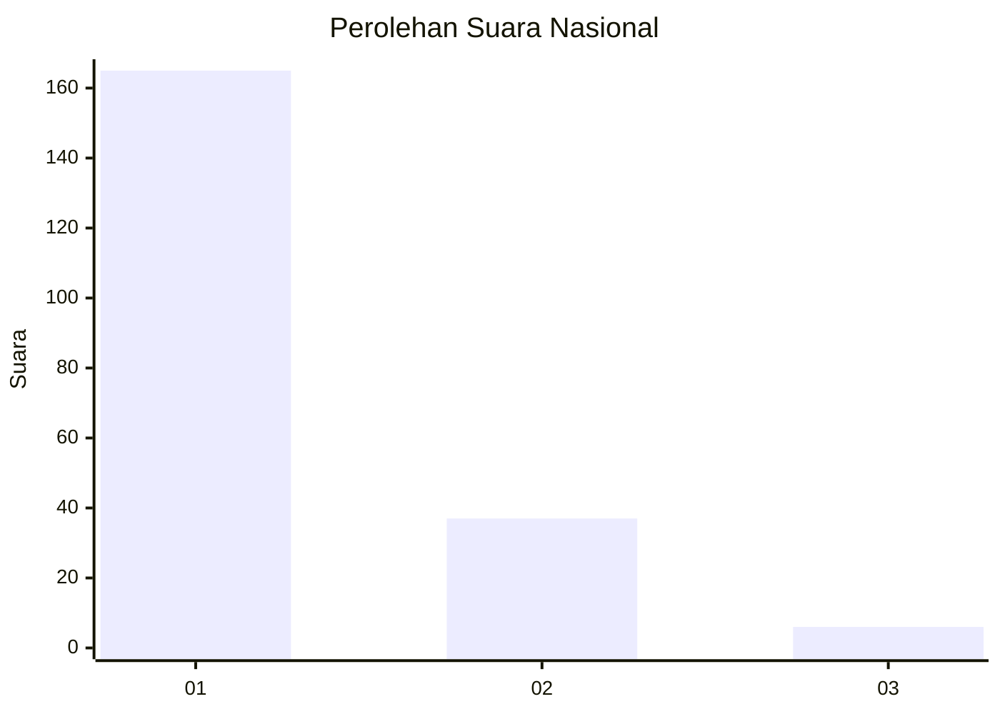
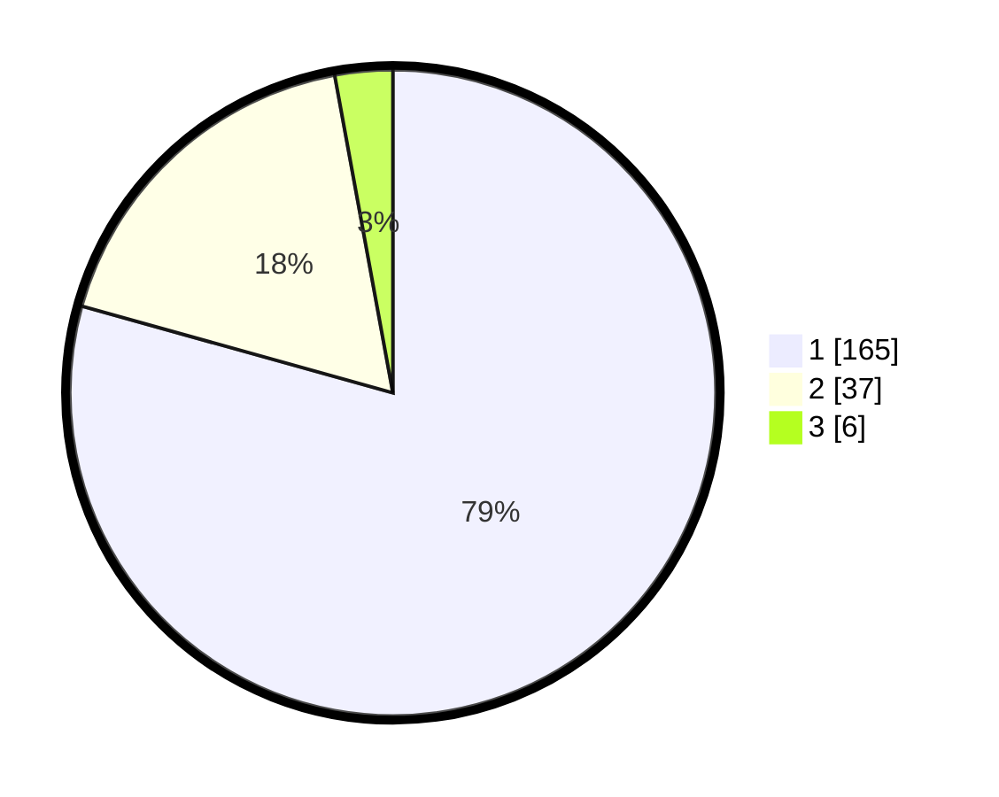

# Hasil

## Grafik

## Tabel

| No. | Nama Paslon    | Suara | Suara (raw) | Persentase |
|:--- |:-------------- | -----:| -----------:| ----------:|
| 1   | ANIES MUHAIMIN | 165   | [165][p-1]  | 79,33      |
| 2   | PRABOWO GIBRAN | 37    | [37][p-2]   | 17,79      |
| 3   | GANJAR MAHFUD  | 6     | [6][p-3]    | 2,88       |

[p-1]: https://github.com/gigit-pemilu/pemilu-2024/blob/main/pilpres/hitung-suara/sub/11-aceh/sub/71-kota-banda-aceh/sub/08-jaya-baru/sub/2001-punge-blang-cut/sub/004-tps/sub/paslon-1.txt
[p-2]: https://github.com/gigit-pemilu/pemilu-2024/blob/main/pilpres/hitung-suara/sub/11-aceh/sub/71-kota-banda-aceh/sub/08-jaya-baru/sub/2001-punge-blang-cut/sub/004-tps/sub/paslon-2.txt
[p-3]: https://github.com/gigit-pemilu/pemilu-2024/blob/main/pilpres/hitung-suara/sub/11-aceh/sub/71-kota-banda-aceh/sub/08-jaya-baru/sub/2001-punge-blang-cut/sub/004-tps/sub/paslon-3.txt

## Foto C Plano

https://sirekap-obj-formc.kpu.go.id/03bd/pemilu/ppwp/11/71/08/20/01/1171082001004-20240218-105347--6da75386-c48d-41fd-a068-5ba2ec6d897e.jpg

https://sirekap-obj-formc.kpu.go.id/03bd/pemilu/ppwp/11/71/08/20/01/1171082001004-20240218-105349--46d825ec-1e76-47c3-8c18-2e9f51fdb87e.jpg

https://sirekap-obj-formc.kpu.go.id/03bd/pemilu/ppwp/11/71/08/20/01/1171082001004-20240218-105348--6a7ef1b7-4afd-4a1e-ac0b-0429a259e993.jpg

## Metadata

| Key        | Value               |
| ---------- | ------------------- |
| Time Stamp | 2024-02-19 06:16:00 |

## DATA PEMILIH TETAP

Jumlah pemilih dalam DPT: **279**.
 * L: **138**.
 * P: **141**.

## DATA PENGGUNA HAK PILIH

Jumlah pengguna hak pilih dalam DPT: **198**.
 * L: **94**.
 * P: **104**.

Jumlah pengguna hak pilih dalam DPTb: **1**.
 * L: **0**.
 * P: **1**.

Jumlah pengguna hak pilih dalam DPK: **11**.
 * L: **6**.
 * P: **5**.

Jumlah pengguna hak pilih: **210**.
 * L: **100**.
 * P: **110**.

## JUMLAH SUARA SAH DAN TIDAK SAH

JUMLAH SELURUH SUARA SAH: **208**.

JUMLAH SUARA TIDAK SAH: **2**.

JUMLAH SELURUH SUARA SAH DAN SUARA TIDAK SAH: **210**.

