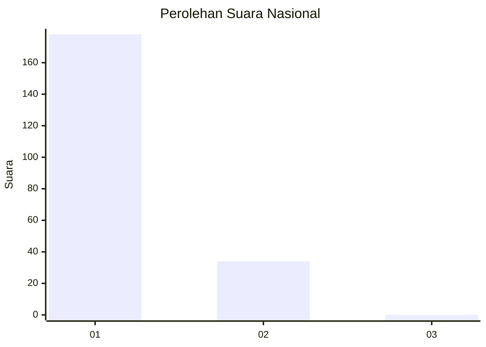
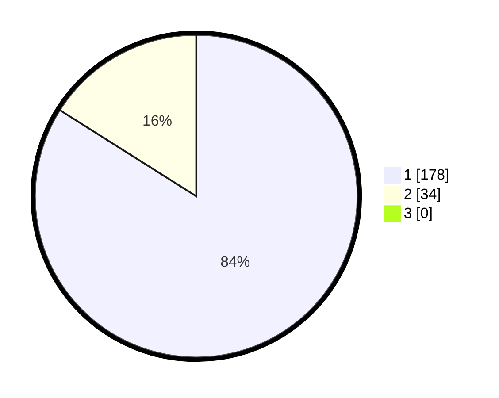

# Hasil

## Grafik

## Tabel

| No. | Nama Paslon    | Suara | Suara (raw) | Persentase |
|:--- |:-------------- | -----:| -----------:| ----------:|
| 1   | ANIES MUHAIMIN | 178   | [178][p-1]  | 83,96      |
| 2   | PRABOWO GIBRAN | 34    | [34][p-2]   | 16,04      |
| 3   | GANJAR MAHFUD  | 0     | [0][p-3]    | 0,00       |

[p-1]: https://github.com/gigit-pemilu/pemilu-2024/blob/main/pilpres/hitung-suara/sub/11-aceh/sub/71-kota-banda-aceh/sub/08-jaya-baru/sub/2001-punge-blang-cut/sub/006-tps/sub/paslon-1.txt
[p-2]: https://github.com/gigit-pemilu/pemilu-2024/blob/main/pilpres/hitung-suara/sub/11-aceh/sub/71-kota-banda-aceh/sub/08-jaya-baru/sub/2001-punge-blang-cut/sub/006-tps/sub/paslon-2.txt
[p-3]: https://github.com/gigit-pemilu/pemilu-2024/blob/main/pilpres/hitung-suara/sub/11-aceh/sub/71-kota-banda-aceh/sub/08-jaya-baru/sub/2001-punge-blang-cut/sub/006-tps/sub/paslon-3.txt

## Foto C Plano

https://sirekap-obj-formc.kpu.go.id/d80b/pemilu/ppwp/11/71/08/20/01/1171082001006-20240214-195930--6ed58b24-0884-4904-8185-7d80af7f3b45.jpg

https://sirekap-obj-formc.kpu.go.id/d80b/pemilu/ppwp/11/71/08/20/01/1171082001006-20240214-195935--f4ca10ac-4c46-4c11-8ffe-f5a8efc973fd.jpg

https://sirekap-obj-formc.kpu.go.id/d80b/pemilu/ppwp/11/71/08/20/01/1171082001006-20240214-195941--021297c0-7add-4b75-9ad4-164c84126c07.jpg

## Metadata

| Key        | Value               |
| ---------- | ------------------- |
| Time Stamp | 2024-02-15 12:00:28 |

## DATA PEMILIH TETAP

Jumlah pemilih dalam DPT: **282**.
 * L: **128**.
 * P: **154**.

## DATA PENGGUNA HAK PILIH

Jumlah pengguna hak pilih dalam DPT: **200**.
 * L: **84**.
 * P: **116**.

Jumlah pengguna hak pilih dalam DPTb: **0**.
 * L: **0**.
 * P: **0**.

Jumlah pengguna hak pilih dalam DPK: **14**.
 * L: **5**.
 * P: **9**.

Jumlah pengguna hak pilih: **214**.
 * L: **89**.
 * P: **125**.

## JUMLAH SUARA SAH DAN TIDAK SAH

JUMLAH SELURUH SUARA SAH: **212**.

JUMLAH SUARA TIDAK SAH: **2**.

JUMLAH SELURUH SUARA SAH DAN SUARA TIDAK SAH: **214**.

