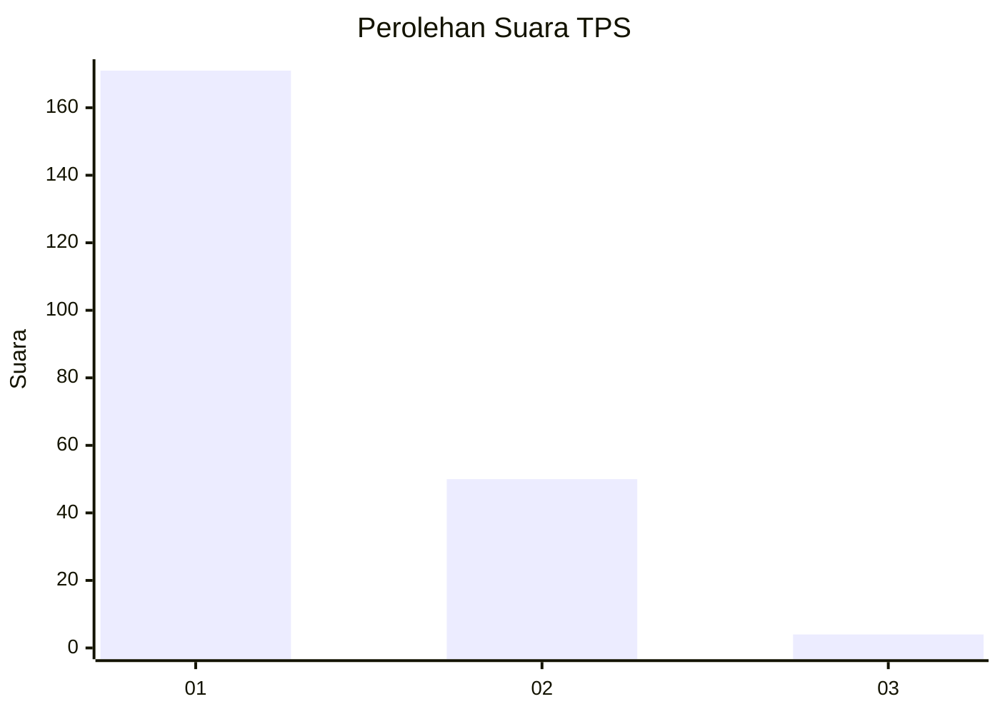
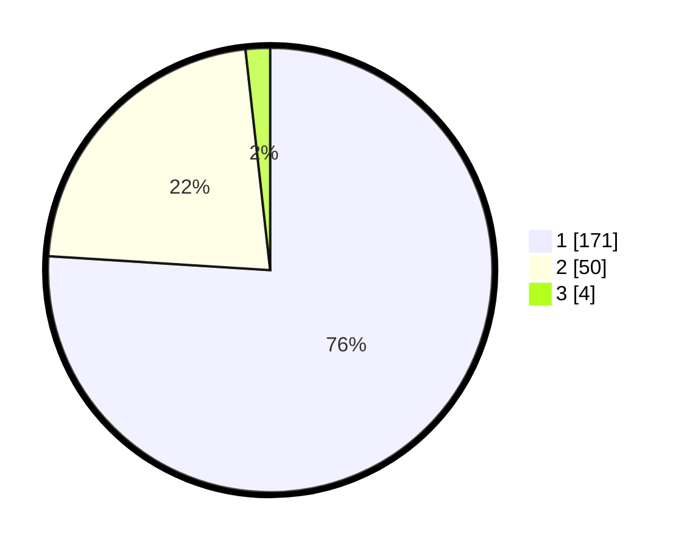

# Hasil

## Grafik

## Tabel

| No. | Nama Paslon    | Suara | Suara (raw) | Persentase |
|:--- |:-------------- | -----:| -----------:| ----------:|
| 1   | ANIES MUHAIMIN | 171   | [171][p-1]  | 76,00      |
| 2   | PRABOWO GIBRAN | 50    | [50][p-2]   | 22,22      |
| 3   | GANJAR MAHFUD  | 4     | [4][p-3]    | 1,78       |

[p-1]: https://github.com/gigit-pemilu/pemilu-2024-11-aceh/blob/main/pilpres/hitung-suara/sub/11-aceh/sub/71-kota-banda-aceh/sub/08-jaya-baru/sub/2001-punge-blang-cut/sub/012-tps/sub/paslon-1.txt
[p-2]: https://github.com/gigit-pemilu/pemilu-2024-11-aceh/blob/main/pilpres/hitung-suara/sub/11-aceh/sub/71-kota-banda-aceh/sub/08-jaya-baru/sub/2001-punge-blang-cut/sub/012-tps/sub/paslon-2.txt
[p-3]: https://github.com/gigit-pemilu/pemilu-2024-11-aceh/blob/main/pilpres/hitung-suara/sub/11-aceh/sub/71-kota-banda-aceh/sub/08-jaya-baru/sub/2001-punge-blang-cut/sub/012-tps/sub/paslon-3.txt

## Foto C Plano

https://sirekap-obj-formc.kpu.go.id/ca8a/pemilu/ppwp/11/71/08/20/01/1171082001012-20240215-002923--81c08f3b-3e19-41d6-9233-097eb53b2dbf.jpg

https://sirekap-obj-formc.kpu.go.id/ca8a/pemilu/ppwp/11/71/08/20/01/1171082001012-20240215-003131--1dffe2ff-9cc8-4ba3-9b42-0ec067532082.jpg

https://sirekap-obj-formc.kpu.go.id/ca8a/pemilu/ppwp/11/71/08/20/01/1171082001012-20240215-003043--30836c68-40e1-41c5-9ee6-75c3a7e6d007.jpg

## Metadata

| Key        | Value               |
| ---------- | ------------------- |
| Time Stamp | 2024-02-15 22:30:27 |

