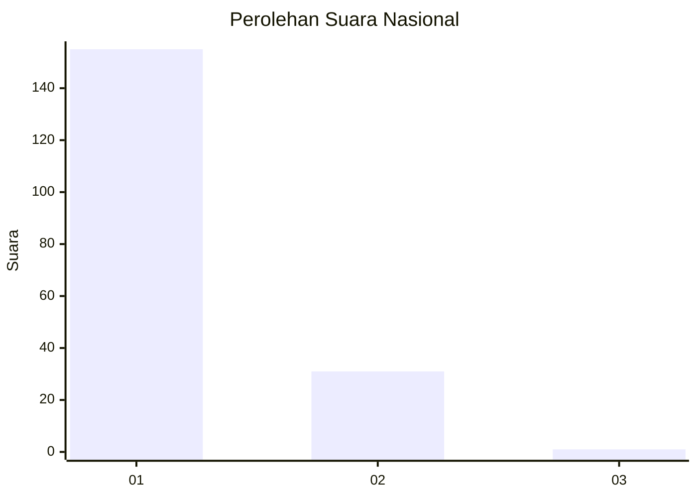
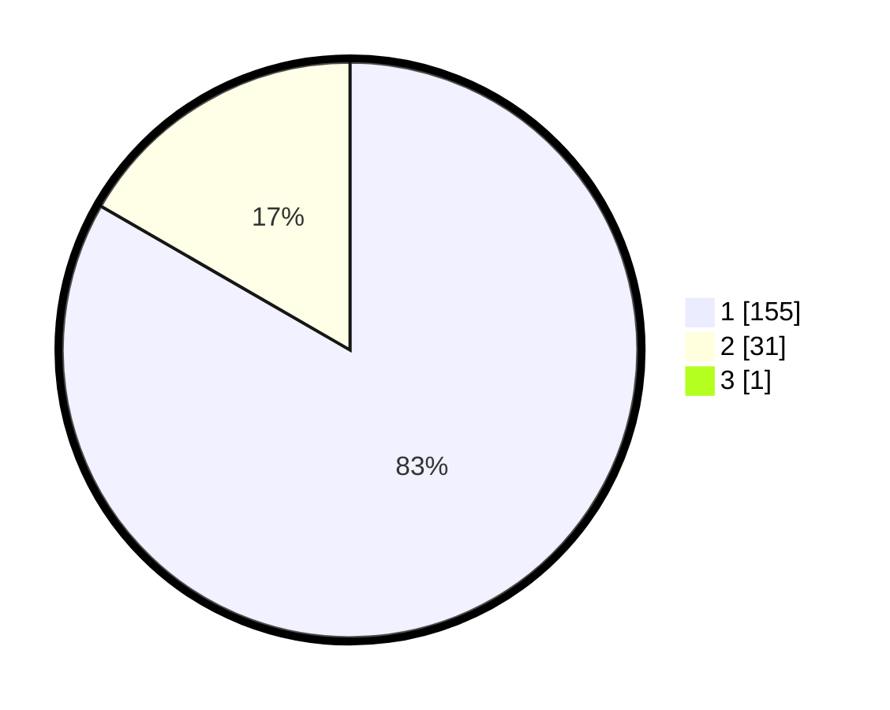

# Hasil

## Grafik

## Tabel

| No. | Nama Paslon    | Suara | Suara (raw) | Persentase |
|:--- |:-------------- | -----:| -----------:| ----------:|
| 1   | ANIES MUHAIMIN | 155   | [155][p-1]  | 82,89      |
| 2   | PRABOWO GIBRAN | 31    | [31][p-2]   | 16,58      |
| 3   | GANJAR MAHFUD  | 1     | [1][p-3]    | 0,53       |

[p-1]: https://github.com/gigit-pemilu/pemilu-2024/blob/main/pilpres/hitung-suara/sub/11-aceh/sub/71-kota-banda-aceh/sub/08-jaya-baru/sub/2004-ulee-pata/sub/002-tps/sub/paslon-1.txt
[p-2]: https://github.com/gigit-pemilu/pemilu-2024/blob/main/pilpres/hitung-suara/sub/11-aceh/sub/71-kota-banda-aceh/sub/08-jaya-baru/sub/2004-ulee-pata/sub/002-tps/sub/paslon-2.txt
[p-3]: https://github.com/gigit-pemilu/pemilu-2024/blob/main/pilpres/hitung-suara/sub/11-aceh/sub/71-kota-banda-aceh/sub/08-jaya-baru/sub/2004-ulee-pata/sub/002-tps/sub/paslon-3.txt

## Foto C Plano

https://sirekap-obj-formc.kpu.go.id/ba6b/pemilu/ppwp/11/71/08/20/04/1171082004002-20240215-014315--7a374c4e-277e-4f8e-8d55-9d9f72ddeaae.jpg

https://sirekap-obj-formc.kpu.go.id/ba6b/pemilu/ppwp/11/71/08/20/04/1171082004002-20240215-014331--18d5b02c-a679-4b9a-a433-c0c1215af3bc.jpg

https://sirekap-obj-formc.kpu.go.id/ba6b/pemilu/ppwp/11/71/08/20/04/1171082004002-20240215-014352--3c18e2f0-6e23-4925-91a4-3894b847ddb8.jpg

## Metadata

| Key        | Value               |
| ---------- | ------------------- |
| Time Stamp | 2024-02-15 15:00:29 |

