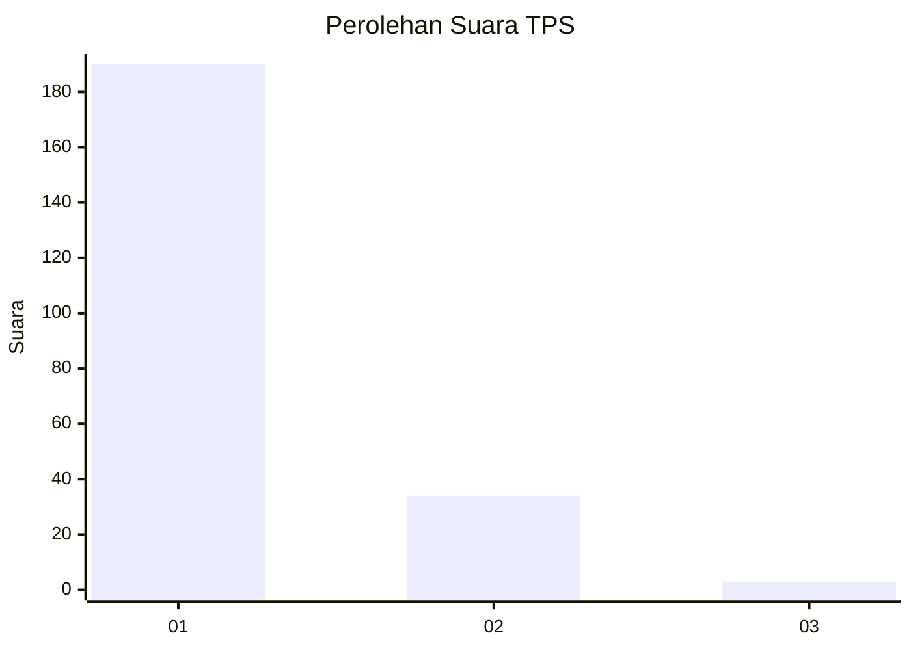
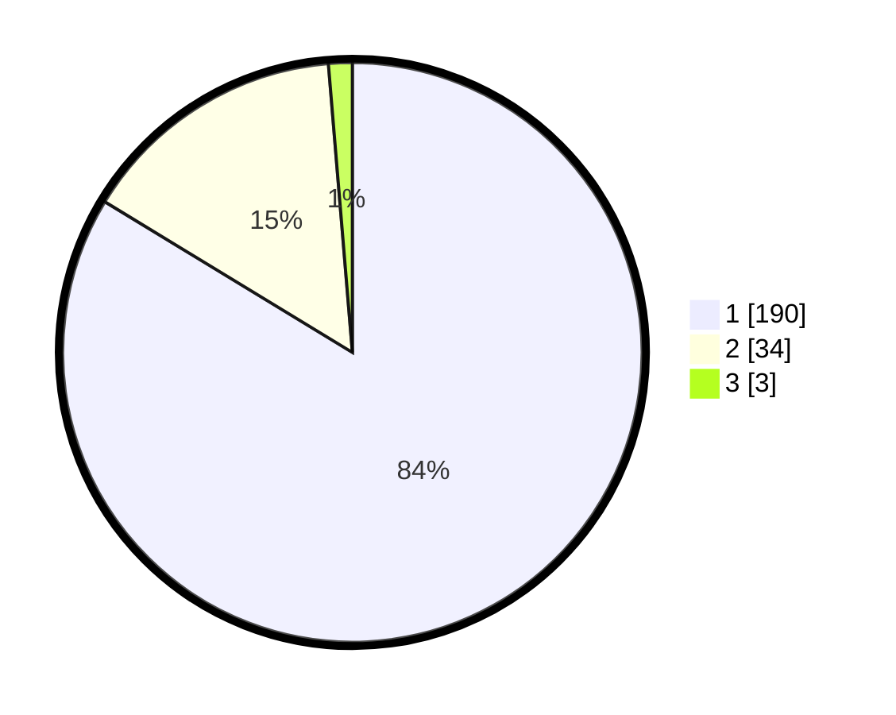

# Hasil

## Grafik

## Tabel

| No. | Nama Paslon    | Suara | Suara (raw) | Persentase |
|:--- |:-------------- | -----:| -----------:| ----------:|
| 1   | ANIES MUHAIMIN | 190   | [190][p-1]  | 83,70      |
| 2   | PRABOWO GIBRAN | 34    | [34][p-2]   | 14,98      |
| 3   | GANJAR MAHFUD  | 3     | [3][p-3]    | 1,32       |

[p-1]: https://github.com/gigit-pemilu/pemilu-2024-11-aceh/blob/main/pilpres/hitung-suara/sub/11-aceh/sub/71-kota-banda-aceh/sub/09-ulee-kareng/sub/2001-lambhuk/sub/012-tps/sub/paslon-1.txt
[p-2]: https://github.com/gigit-pemilu/pemilu-2024-11-aceh/blob/main/pilpres/hitung-suara/sub/11-aceh/sub/71-kota-banda-aceh/sub/09-ulee-kareng/sub/2001-lambhuk/sub/012-tps/sub/paslon-2.txt
[p-3]: https://github.com/gigit-pemilu/pemilu-2024-11-aceh/blob/main/pilpres/hitung-suara/sub/11-aceh/sub/71-kota-banda-aceh/sub/09-ulee-kareng/sub/2001-lambhuk/sub/012-tps/sub/paslon-3.txt

## Foto C Plano

https://sirekap-obj-formc.kpu.go.id/dcbf/pemilu/ppwp/11/71/09/20/01/1171092001012-20240214-200755--a050332b-2e8b-4240-8110-b64c016cc88a.jpg

https://sirekap-obj-formc.kpu.go.id/dcbf/pemilu/ppwp/11/71/09/20/01/1171092001012-20240214-200825--40e6efa0-6c72-4855-8350-a5617666c85e.jpg

https://sirekap-obj-formc.kpu.go.id/dcbf/pemilu/ppwp/11/71/09/20/01/1171092001012-20240214-200856--64aad9d8-c031-4396-a68e-ec11273f04c9.jpg

## Metadata

| Key        | Value               |
| ---------- | ------------------- |
| Time Stamp | 2024-02-15 15:30:25 |

