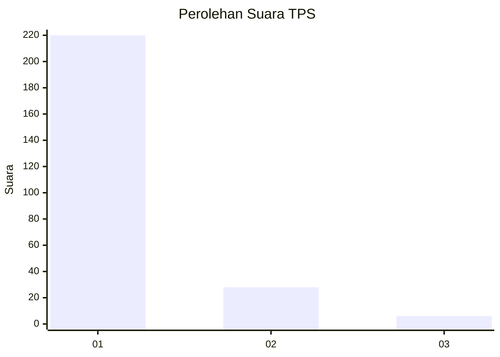
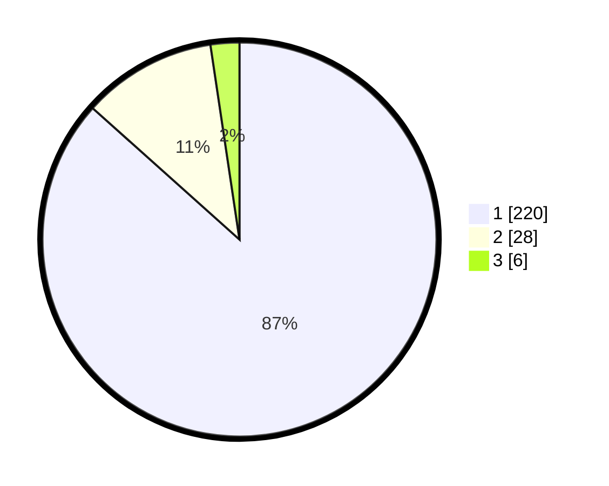

# Hasil

## Grafik

## Tabel

| No. | Nama Paslon    | Suara | Suara (raw) | Persentase |
|:--- |:-------------- | -----:| -----------:| ----------:|
| 1   | ANIES MUHAIMIN | 220   | [220][p-1]  | 86,61      |
| 2   | PRABOWO GIBRAN | 28    | [28][p-2]   | 11,02      |
| 3   | GANJAR MAHFUD  | 6     | [6][p-3]    | 2,36       |

[p-1]: https://github.com/gigit-pemilu/pemilu-2024-11-aceh/blob/main/pilpres/hitung-suara/sub/11-aceh/sub/71-kota-banda-aceh/sub/09-ulee-kareng/sub/2006-ceurih/sub/002-tps/sub/paslon-1.txt
[p-2]: https://github.com/gigit-pemilu/pemilu-2024-11-aceh/blob/main/pilpres/hitung-suara/sub/11-aceh/sub/71-kota-banda-aceh/sub/09-ulee-kareng/sub/2006-ceurih/sub/002-tps/sub/paslon-2.txt
[p-3]: https://github.com/gigit-pemilu/pemilu-2024-11-aceh/blob/main/pilpres/hitung-suara/sub/11-aceh/sub/71-kota-banda-aceh/sub/09-ulee-kareng/sub/2006-ceurih/sub/002-tps/sub/paslon-3.txt

## Foto C Plano

https://sirekap-obj-formc.kpu.go.id/4f1e/pemilu/ppwp/11/71/09/20/06/1171092006002-20240214-223919--8d2196db-5194-4a49-8892-0d528c087404.jpg

https://sirekap-obj-formc.kpu.go.id/4f1e/pemilu/ppwp/11/71/09/20/06/1171092006002-20240214-190300--235fa81e-499b-4ec3-9981-f99d2abb629a.jpg

https://sirekap-obj-formc.kpu.go.id/4f1e/pemilu/ppwp/11/71/09/20/06/1171092006002-20240214-224134--901abb65-4189-46e2-b2ff-104760bb6728.jpg

## Metadata

| Key        | Value               |
| ---------- | ------------------- |
| Time Stamp | 2024-02-15 12:00:28 |

