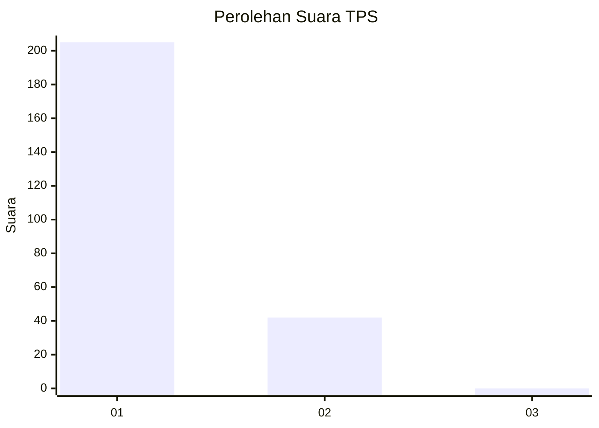
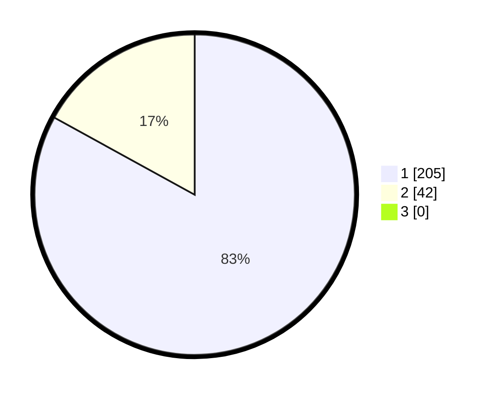

# Hasil

## Grafik

## Tabel

| No. | Nama Paslon    | Suara | Suara (raw) | Persentase |
|:--- |:-------------- | -----:| -----------:| ----------:|
| 1   | ANIES MUHAIMIN | 205   | [205][p-1]  | 83,00      |
| 2   | PRABOWO GIBRAN | 42    | [42][p-2]   | 17,00      |
| 3   | GANJAR MAHFUD  | 0     | [0][p-3]    | 0,00       |

[p-1]: https://github.com/gigit-pemilu/pemilu-2024-11-aceh/blob/main/pilpres/hitung-suara/sub/11-aceh/sub/71-kota-banda-aceh/sub/09-ulee-kareng/sub/2006-ceurih/sub/008-tps/sub/paslon-1.txt
[p-2]: https://github.com/gigit-pemilu/pemilu-2024-11-aceh/blob/main/pilpres/hitung-suara/sub/11-aceh/sub/71-kota-banda-aceh/sub/09-ulee-kareng/sub/2006-ceurih/sub/008-tps/sub/paslon-2.txt
[p-3]: https://github.com/gigit-pemilu/pemilu-2024-11-aceh/blob/main/pilpres/hitung-suara/sub/11-aceh/sub/71-kota-banda-aceh/sub/09-ulee-kareng/sub/2006-ceurih/sub/008-tps/sub/paslon-3.txt

## Foto C Plano

https://sirekap-obj-formc.kpu.go.id/2c87/pemilu/ppwp/11/71/09/20/06/1171092006008-20240214-205346--ba6dbb2f-f865-4875-a005-831d07b1382c.jpg

https://sirekap-obj-formc.kpu.go.id/2c87/pemilu/ppwp/11/71/09/20/06/1171092006008-20240214-205540--dd3a8e81-a53f-4700-8095-a3c9ae215b52.jpg

https://sirekap-obj-formc.kpu.go.id/2c87/pemilu/ppwp/11/71/09/20/06/1171092006008-20240214-205724--8ebd2ecb-bf0e-49fe-8208-4a5a1251224f.jpg

## Metadata

| Key        | Value               |
| ---------- | ------------------- |
| Time Stamp | 2024-02-15 22:30:27 |

