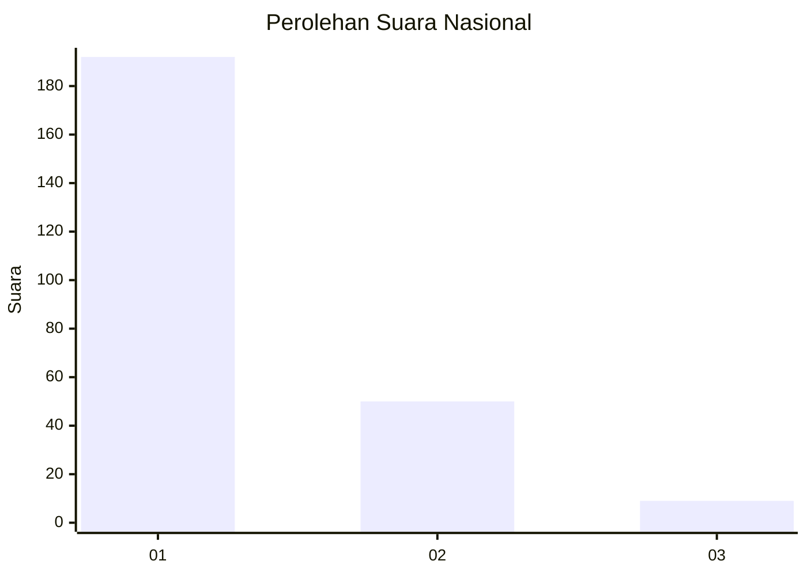
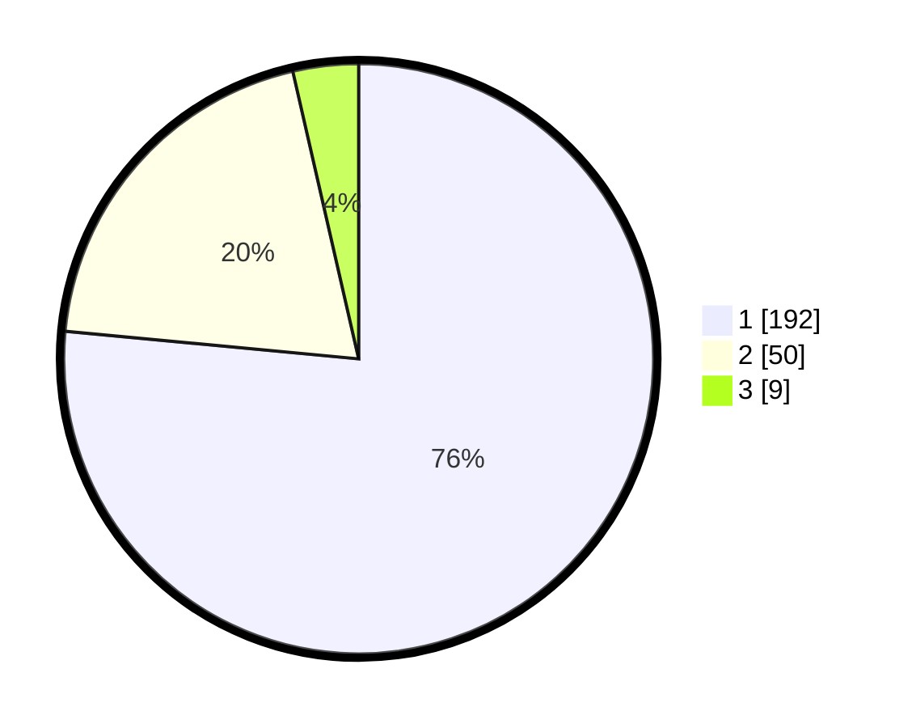

# Hasil

## Grafik

## Tabel

| No. | Nama Paslon    | Suara | Suara (raw) | Persentase |
|:--- |:-------------- | -----:| -----------:| ----------:|
| 1   | ANIES MUHAIMIN | 192   | [192][p-1]  | 76,49      |
| 2   | PRABOWO GIBRAN | 50    | [50][p-2]   | 19,92      |
| 3   | GANJAR MAHFUD  | 9     | [9][p-3]    | 3,59       |

[p-1]: https://github.com/gigit-pemilu/pemilu-2024/blob/main/pilpres/hitung-suara/sub/11-aceh/sub/72-kota-sabang/sub/01-sukakarya/sub/2004-krueng-raya/sub/002-tps/sub/paslon-1.txt
[p-2]: https://github.com/gigit-pemilu/pemilu-2024/blob/main/pilpres/hitung-suara/sub/11-aceh/sub/72-kota-sabang/sub/01-sukakarya/sub/2004-krueng-raya/sub/002-tps/sub/paslon-2.txt
[p-3]: https://github.com/gigit-pemilu/pemilu-2024/blob/main/pilpres/hitung-suara/sub/11-aceh/sub/72-kota-sabang/sub/01-sukakarya/sub/2004-krueng-raya/sub/002-tps/sub/paslon-3.txt

## Foto C Plano

https://sirekap-obj-formc.kpu.go.id/d861/pemilu/ppwp/11/72/01/20/04/1172012004002-20240214-194503--ce514729-6917-469c-8ad2-46225daf512c.jpg

https://sirekap-obj-formc.kpu.go.id/d861/pemilu/ppwp/11/72/01/20/04/1172012004002-20240214-200517--13677158-0628-4df9-bea3-8133f1814e6e.jpg

https://sirekap-obj-formc.kpu.go.id/d861/pemilu/ppwp/11/72/01/20/04/1172012004002-20240214-193949--74536c56-71db-4e43-bd16-13003920d818.jpg

## Metadata

| Key        | Value               |
| ---------- | ------------------- |
| Time Stamp | 2024-02-16 05:00:26 |

## DATA PEMILIH TETAP

Jumlah pemilih dalam DPT: **292**.
 * L: **137**.
 * P: **155**.

## DATA PENGGUNA HAK PILIH

Jumlah pengguna hak pilih dalam DPT: **260**.
 * L: **120**.
 * P: **140**.

Jumlah pengguna hak pilih dalam DPTb: **3**.
 * L: **2**.
 * P: **1**.

Jumlah pengguna hak pilih dalam DPK: **3**.
 * L: **3**.
 * P: **0**.

Jumlah pengguna hak pilih: **266**.
 * L: **125**.
 * P: **141**.

## JUMLAH SUARA SAH DAN TIDAK SAH

JUMLAH SELURUH SUARA SAH: **251**.

JUMLAH SUARA TIDAK SAH: **15**.

JUMLAH SELURUH SUARA SAH DAN SUARA TIDAK SAH: **266**.

